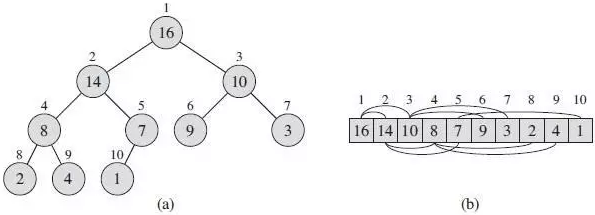
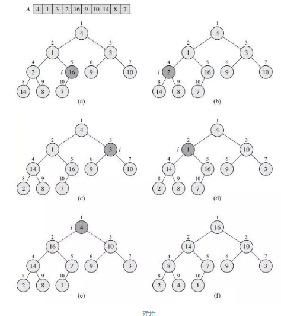
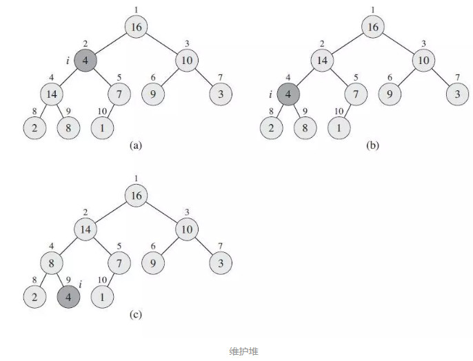
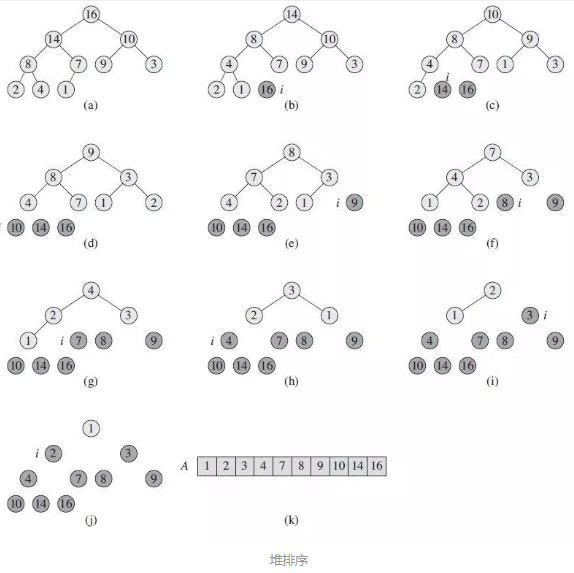

# 堆排序

>堆排序不像插入排序和归并排序那样直观，它利用了一种称为堆的数据结构。

# 最大堆和最小堆概念

堆是一个数组，它可以被看成一个近似的完全二叉树，树上的每一个结点对应数组中的一个元素。除了最底层外，该树是完全充满的，而且是从左向右填充。

下图分别为以二叉树和数组形式展现的一个最大堆。

最大堆中的每一个结点都比它的两个孩子结点大（如果孩子结点存在的话）。显然，整个二叉树的根结点是堆中所有元素的最大值。类似地，最小堆的每一个结点都比它的两个孩子结点小。无论是最大堆还是最小堆，它们的工作原理都是一样的，因此本文以最大堆为例，因为使用最大堆排序得到的恰好是递增序列。

    堆具有两个重要操作：建堆和维护堆。

## 建堆

>建堆是将一个无序的数组建立成满足堆性质的数组，即上图(b)所示的数组。
建堆的过程如下图所示：

先将无序数组按从上到下、从左到右的顺序建立二叉树，如图(a)。然后从后向前找到第一个不是叶子结点的结点(即图(a)中的16)，对该结点执行维护堆操作，完成后该结点对应的子树就满足了堆的性质。继续向前遍历所有的结点，重复维护堆操作，直到根结点对应的堆（即完整的堆）满足堆的性质。

## 维护堆

维护堆(使不满足堆性质的变成满足堆性质)的过程如下图所示：

若要维护结点 i，则将结点i与它的两个孩子结点比较。若 i 比它们大，那么 i 子树已经满足的最大堆的性质，不需要做任何操作。若 i 比它们小，那么需要找出其中最大的一个孩子，将 i 与它交换，交换后，这三个元素就满足了最大堆的性质，但 i 还要继续与现在的两个孩子比较，因为 i 仍然有可能破坏了当前位置的最大堆性质。如此下去，直到 i 的两个孩子都比它小，维护堆的过程宣告结束。

## 使用堆实现一个排序算法

由于最大堆的根结点保存了数组的最大值，因此可以每次将根结点的值从数组中取出，再令剩下的元素重新形成堆，如此往复，就可以依次从大到小取出数组中的所有元素。

下图所示为堆排序的完整流程。

图(a)为建堆后的结果(还未使用堆实现排序)。从(a)到(b)的具体过程为：取出根结点16放到末尾，然后把最后一个叶子结点1放到根结点的位置（注意此时堆的元素少了一个），执行一次“维护堆”操作，结果就成了图(b)所示的样子。不断重复这个过程，直到所有结点都离开了堆，堆排序算法就结束了。结果是一个从小到大的数组。

>堆排序是原址排序，不需要额外的内存空间，因为堆中元素只存在交换位置的操作，数组在原有地址里排序。

## 性能分析

考虑堆排序的时间复杂度。最开始的建堆操作时间复杂度不太容易看出来，但可以证明这个操作的时间复杂度是O(n)，愿意深究的朋友请参考《算法导论》6.3节。排序过程中，需要取出n个数，每取出一个数就要执行一次“维护堆”操作，每次维护堆操作的时间与堆的高度（即lgn）成正比，因此排序过程时间复杂度为O(nlgn)。总时间复杂度也是O(nlgn)。
堆排序与之后将要介绍的快速排序相比，优点在于最坏情况时间复杂度也是O(nlgn)，而快速排序则是Θ(n2)。

参考来源: [https://www.jianshu.com/p/7710ab0dd965](https://www.jianshu.com/p/7710ab0dd965)