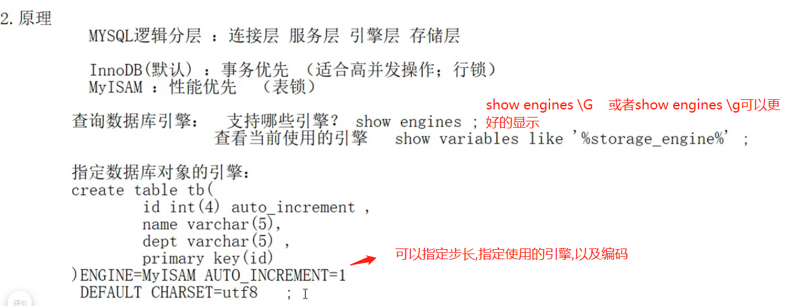

# MySql引擎

    RDBMS: Relational database management system

* InnoDB：支持事务,事务优先(适合高并发操作,事务可以防止高并发造成的混乱),效率没有MyISAM高,使用的是行锁,一次锁一行数据,意味着每一行都要上锁,自然行锁的性能降低了,但是适合高并发.不容易出错.
* MyISAM：性能优先,MySQL早期集成的默认数据库引擎，不支持事务,由于不支持事务,所以效率高.使用的是表锁.一次锁一个表的数据.表锁一张表只用上一次锁,所以效率高

```sql
-- 显示存储引擎的状态信息
SHOW ENGINES;
```




>现在最常用的存储引擎是 InnoDB，它从 MySQL 5.5.5 版本开始就被当做默认存储引擎了.

如果你不知道应该采用哪种引擎，记住总是选择InnoDB就好了.(支持事务)

>注意:最新的mysql8.0已经把MyISAM引擎去掉了,而且官网说,8.0是5.7速度的2倍,也就是说8.0的InnoDB虽然支持事务,但是效率也提高了,速度更快了.而且8.0的mysql是支持原生分布式数据库解决方案的.(5.5,5.6就不要使用了,5.7效率也还可以,不过还是尽快切换到8.0)

    5.7直接跨到8.0,没有中间6开头和7开头的版本,所以语义上跨度大,一般表示的是底层架构发生了重大变化.


