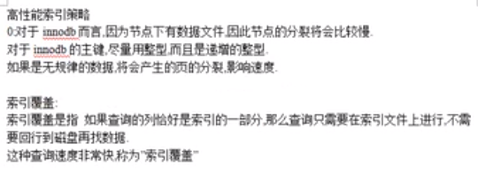
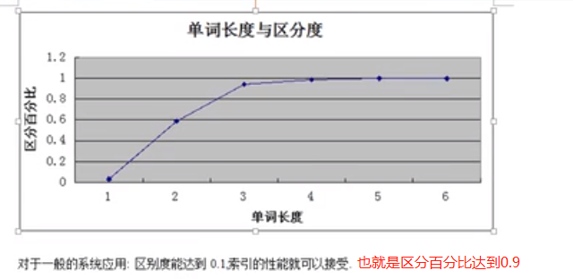
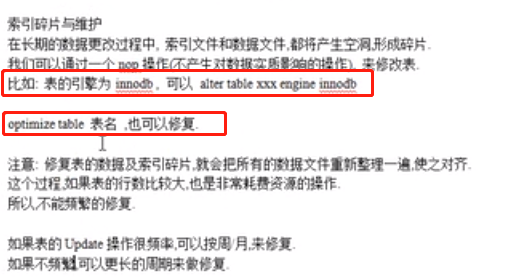

# 高性能索引策略

- 查询频繁
- 区分度高
- 长度小
- 尽量能覆盖常用查询字段



    是什么表,Innodb还是myisam,是聚簇索引还是非聚簇索引?能不能索引覆盖,如果某几个列经常一起查询,那就建立联合索引.索引的长度建立多少,等等.

# 索引长度和区分度的折中选择


    索引长度越小,在内存中占用空间越小,排序越快.但是长度越小,区分度降低了.区分度低了,就没法根据索引定位元素了,建立这个索引就没意义了
    所以在索引的长度和区分度之间达到平衡.
    


```sql
-- 用word的4个字符来建立索引,而不是全部字符.
-- 因为4个字符可以在长度和区分度之间达到平衡

alter table table_name add index word(word(4));
-- 整型建立索引的时候不用指定长度,
-- 因为int固定占4个字节.上面的主要是针对varchar类型.
```

# 伪哈希函数降低索引长度


```sql
create table t9(
    id int primary key auto_increment,
    url varchar(30) not null default '',
    crc_url int unsigned not null default 0
)engine innodb charset utf8;

insert into t9 (url) values("http://www.baidu.com"),("http://www.aaa.com");

-- 用crc函数来构造伪hash列,把字符串的列转换成整型,来降低索引的长度,从而提高查询效率.
update t9 set crc_url=crc32(url);

alter table t9 add index url(url(16));
alter table t9 add index crc_url(crc_url);

-- 观察key_len
explain select * from t9 where url = 'http://www.baidu.com';
-- 注意查询的时候,crc函数的转换要在业务代码中做
explain select * from t9 where crc_url = 3500265894;
-- 
```

# 大数据量分页优化

    问题: 网页往后翻,翻到1万多页,翻过了好几十万条,这时候速度非常慢,这时候你该怎么办?


>第一种方法: 优先从业务上考虑      

    既然你需要后面的数据,就直接使用条件过滤出来,而不是使用offset,
    比如百度搜索引擎.你要200页以后的数据,就应该精确指定搜索条件搜索到,而不是一页页往后翻


```sql
create table emp
(
eid int(5) primary key,
ename varchar(20) not null default '',
job varchar(20) not null default '',
deptno int(5) not null default 0
)engine=innodb default charset=utf8;

-- 插入1000万条数据(使用常见优化方法及慢查询sql排查.md中的存储过程和函数来插入)

-- 把缓存清理一下
reset query cache;
set profiling=on;

select eid, ename from emp limit 0, 10;
select eid, ename from emp limit 10000, 10;
select eid, ename from emp limit 100000, 10;
select eid, ename from emp limit 1000000, 10;
select eid, ename from emp limit 3000000, 10;
select eid, ename from emp limit 5000000, 10;
select eid, ename from emp limit 9000000, 10;

-- limit offset, N; 当offset非常大的时候,效率极低
-- 原因: mysql并不是先跳过offset行,再取N行,而是取offset+N行,然后放弃前offset行,返回N行
-- limit 100w,10: 先把100w+10条数据取出来,然后丢掉前100w行,然后拿剩下的10条.

-- 看一下时间都花在哪里了
show profiles;
show profile for query query_id;
-- sending data: 发数据用的时间最长
```

>第二种: 如果业务上不能优化(不限制查询的页数),也就是要求必须可以查询几百页的数据:

```sql
-- 可以使用条件查询
select eid, ename from emp limit 9000000, 10;
-- 改成
select eid, ename from emp where eid > 9000000 limit 10;
-- 这样速度比较快,因为id是主键索引,可以迅速找到eid大于900w的这一小块数据,然后从这里面拿10条,这样速度肯定快.(索引发挥了作用)
-- 但是有一个问题,这种要求eid是从1开始是连续的,如果数据库中的数据被删除过了,比如把前100w条数据删除了,
-- 那么上面的语句拿到相当于是从第800w条数据起始的10条数据.
-- 所以我们一般情况下,大网站的数据不会物理删除,而是逻辑删除,也就是增加一个is_delete字段,用这个字段表示这行数据是否被删除
```

>第三种: 必须要物理删除,而且要允许看1万页的数据,怎么办?

```sql
-- 延迟关联(疑惑:自己做实验发现速度并没有变快,可能是因为自己使用的是innodb,而不是myisam)
-- 直接这么拿数据比较慢
select eid,ename from emp limit 5000000, 10;
-- eid是索引,所以可以先通过索引拿到eid,然后再通过eid,拿对应的数据
select eid from emp limit 5000000, 10;
-- 延迟关联: 先查eid,然后延迟关联中间表的eid和原表的eid
select e.eid,e.ename from emp e inner join (select eid from emp limit 5000000,10) as tmp on e.eid = tmp.eid;
```

# 重复索引和冗余索引

    重复索引: 要避免.影响更新速度.
    
    冗余索引: 比如我给price添加了索引,在某些业务场景下,我们也会同时查询type和price,所以可以给type和price
    同时添加联合索引,对于price就是索引冗余了,但是这种是允许的,没有关系.


# 索引碎片与修复

    碎片修复花资源和时间,所以要在夜间执行.而且一般几个月/半年修复一次即可.

    如果原来是innodb,再次执行这个命令即可: alter table xxx engine innodb;
    
    或者: optimize table xxx;



# in

```sql
-- 给emp表的deptno添加索引
alter table emp add index deptno_index(deptno);

-- 给我们的错觉是先select dno from dept,然后再根据第一步的结果找到eid和ename
-- 但是我们explain后,看到emp表type为all,也就是全表扫描的.rows扫描了1000w行
-- 也就是并不是按照我们的 感觉来查找的,而是把emp中的每一行数据都扫描一遍,然后一一 和in子查询dept中的数据比较,所以效率比较低
-- 也就是说并不是先执行子查询,然后然后拿着子查询的数据来过滤的.这个就是in子查询的陷阱,emp表越大,就越慢.
explain select eid,ename from emp where deptno in (select dno from dept);
+----+--------------------+-------+-----------------+---------------+---------+---------+------+----------+-------------+
| id | select_type        | table | type            | possible_keys | key     | key_len | ref  | rows     | Extra       |
+----+--------------------+-------+-----------------+---------------+---------+---------+------+----------+-------------+
|  1 | PRIMARY            | emp   | ALL             | NULL          | NULL    | NULL    | NULL | 10000374 | Using where |
|  2 | DEPENDENT SUBQUERY | dept  | unique_subquery | PRIMARY       | PRIMARY | 4       | func |        1 | Using index |
+----+--------------------+-------+-----------------+---------------+---------+---------+------+----------+-------------+

explain select eid,ename from emp where deptno in (10,11,12);
-- 这个和上面结果相同,但是type为range,只扫描了59w行数据.
+----+-------------+-------+-------+---------------+--------------+---------+------+--------+-------------+
| id | select_type | table | type  | possible_keys | key          | key_len | ref  | rows   | Extra       |
+----+-------------+-------+-------+---------------+--------------+---------+------+--------+-------------+
|  1 | SIMPLE      | emp   | range | deptno_index  | deptno_index | 4       | NULL | 596264 | Using where |
+----+-------------+-------+-------+---------------+--------------+---------+------+--------+-------------+

-- 改进:改成连接查询(也就是in查询改进成连接查询)
select eid,ename from emp inner join dept on emp.deptno = dept.dno;
```

# exists

```sql

```