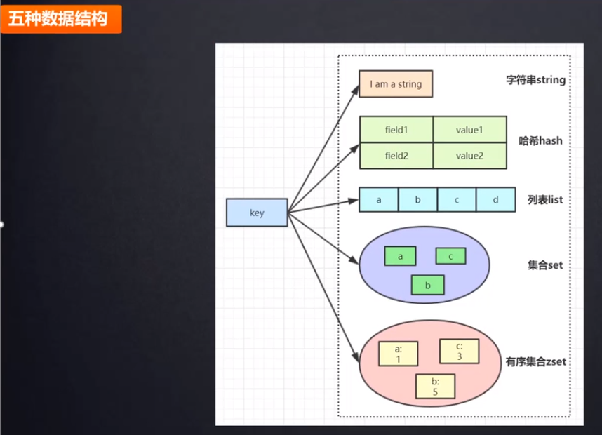

# redis数据类型

Redis是一种Key-Value型的NoSQL(Not Only SQL)，Redis是REmote DIctionary Server(远程字典服务器）的缩写，是一个用C 语言开发的一个开源的高性能键值对（key-value）数据库，并允许其他应用通过`TCP协议读写字典中的内容`。

Redis常用数据类型如下：

1. 字符串类型
2. 散列类型
3. 列表类型
3. 集合类型
4. 有序集合类型

# Redis 的应用场景

- 缓存（数据查询、短连接、新闻内容、商品内容等等）
- 分布式集群架构中的 session 分离
- 聊天室的在线好友列表
- 任务队列（秒杀、抢购、12306 等等）,了解就好,一般不这么用
- 应用排行榜
- 网站访问统计
- 数据过期处理（可以精确到毫秒）

>我们不用redis做任务队列,我们用专门的消息队列来做.因为redis的主营业务是缓存.即使redis可以用作消息队列,我们也不会用redis来做消息队列.

## 内存存储与持久化

Redis的所有数据都存储在内存中。在一台普通的笔记本电脑上，Redis可以在一秒内读写超过十万个键值。

>不过,将数据存储在内存中也有问题，程序退出后内存中的数据会丢失。不过 Redis提供了对持久化的支持，即可以将内存中的数据异步写入到硬盘中，同时不影响继续提供服务。

## Redis支持多种功能的原因

Redis虽然作为数据库开发的，但还有其他功能:

- `缓存`:Redis可以为每个键设置`生存时间(Time To Live，TTL）`，生存时间到期后键会自动被删除。这一功能配合出色的性能让Redis可以作为缓存系统来使用，而且由于Redis支持`持久化`和丰富的数据类型，使其成为了`另一个非常流行的缓存系统Memcached的有力竞争者`。
- `队列系统`(Redis的列表类型键可以用来实现队列，并且支持阻塞式读取，可以很容易地实现一个高性能的优先级队列。同时在更高层面上，Redis还支持“发布/订阅”的消息模式，可以基于此构建聊天室等系统).-但是谨慎这样使用,消息队列不是redis的设计初衷.
- LRU: Redis还可以限定数据占用的最大内存空间，在数据达到空间限制后可以按照一定的规则自动淘汰不需要的键、

# 命令文档

- [http://doc.redisfans.com/index.html](http://doc.redisfans.com/index.html)
- [https://redis.io/commands](https://redis.io/commands)
- [https://www.redis.net.cn/tutorial/3524.html](https://www.redis.net.cn/tutorial/3524.html)