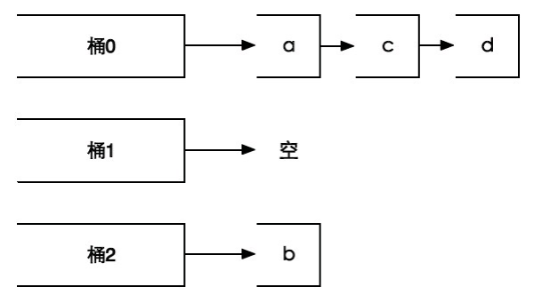

# 集合类型

## 概念和特点

集合是使用hash来实现的,只不过value为NULL.

集合中的元素不重复，且没有顺序。一个集合类型（set）键可以存储至多2^32-1个字符串。

如果set中的元素都是整数的话,redis会以intset的形式存储,intset是一个有序的整型数组,为了节省内存.

常用操作是加入或删除元素、判断某个元素是否存在等，由于集合类型在Redis内部是使用值为空的散列表（hash table）实现的，所以这些操作的时间复杂度都是0(1)

```shell
# 增加元素,SADD命令如果键不存在则会自动创建
# 因为在一个集合中不能有相同的元素，所以如果要加入的元素已经存在于集合中就会忽略这个元素。本命令的返回值是成功加入的元素数量.
SADD key member [member …]

# 删除元素
# SREM命令用来从集合中删除一个或多个元素，并返回删除成功的个数
# 如果元素不存在，就只删除存在的元素，返回实际删除的元素的数量
SREM key member [member …]

# 获得集合中元素个数
SCARD key

# 获得集合中的所有元素
SMEMBERS key

# 判断元素是否在集合中,时间复杂度为0(1)
# 无论集合中有多少个元素，SISMEMBER命令始终可以极快地返回结果。当值存在时SISMEMBER命令返回1，当值不存在或键不存在时返回0
SISMEMBER key member

# 集合间运算

# 差集
# 集合A与集合B的差集表示为A-B，代表属于A且不属于B的元素构成的集合
SDIFF key [key …]

# 先计算setA-setB，再计算结果与setC的差集
SDIFF setA setB setC

# 交集运算,{1, 2, 3}∩{2, 3, 4}={2, 3}
SINTER key [key …]

# SINTER命令同样支持同时传入多个键key
SINTER setA setB setC

# 并集运算,{1, 2, 3}∪{2, 3, 4}={1, 2, 3, 4}
SUNION key [key …]

# SUNION命令同样支持同时传入多个键
SUNION setA setB setC

# 进行集合运算并将结果存储到destination。
SDIFFSTORE destination key [key …]
SINTERSTORE destination key [key …]
SUNIONSTORE destination key [key …]

# 随机从集合中获取一个元素，传递count参数来一次随机获得多个元素
SRANDMEMBER key [count]

# 当count为正数时，SRANDMEMBER会随机从集合里获得count个不重复的元素
# 如果count的值大于集合中的元素个数，则SRANDMEMBER会返回集合中的全部元素。
# 当count为负数时，SRANDMEMBER会随机从集合里获得|count|个的元素，这些元素有可能相同。

# 从集合中弹出一个元素，由于集合类型的元素是无序的，所以SPOP会从集合中随机选择一个元素弹出
SPOP key
```

# 应用场景

- 去重(通过sadd全部添加,然后再获取)
- 求交集,并集,差集

兴趣组A代表篮球,兴趣组B代表足球,里面存储用户id,可以用sinter可以得出即喜欢篮球,又喜欢足球的用户,也可以求并集,再归类一个大点的体育,喜欢篮球和喜欢足球都是体育类的,用sunion获取出来.只喜欢足球活着只喜欢篮球的用户,是没有共同兴趣爱好的,这个就是差集sdiff.

# 为什么元素所在的桶中的元素数量越少，其被随机选中的可能性就越大?

>集合类型采用hash的存储结构。散列表使用散列函数将元素映射到不同的存储位置（桶）上以实现0(1)时间复杂度的元素查找，举个例子，当使用散列表存储元素b时，使用散列函数计算出b的散列值是0，所以将b存入编号为0 的桶（bucket）中，下次要查找b时就可以用同样的散列函数再次计算b的散列值并直接到相应的桶中找到b。当两个不同的元素的散列值相同时会出现冲突，Redis使用拉链法来解决冲突，即将散列值冲突的元素以链表的形式存入同一桶中，查找元素时先找到元素对应的桶，然后再从桶中的链表中找到对应的元素。使用SRANDMEMBER命令从集合中获得一个随机元素时，Redis首先会从所有桶中随机选择一个桶，然后再从桶中的所有元素中随机选择一个元素，所以元素所在的桶中的元素数量越少，其被随机选中的可能性就越大,因为每个非空的桶被选中的几率是相同的.

Redis会先从3个桶中随机挑一个非空的桶，然后再从桶中随机选择一个元素，所以选中元素b的概率会大一些，如图: