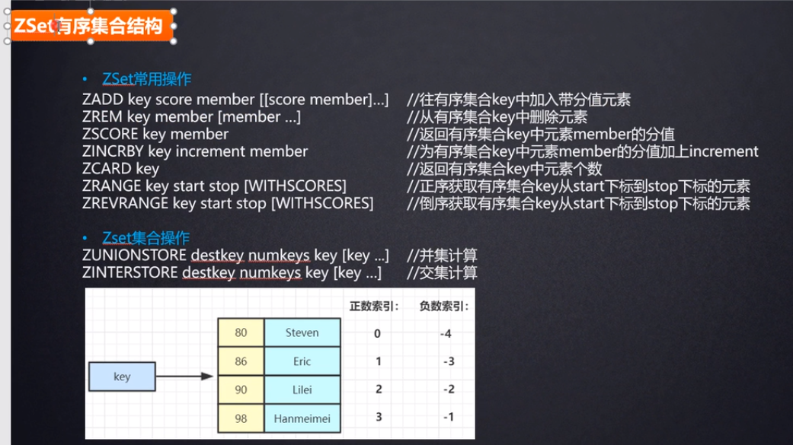

# 有序集合类型(sorted set)

`在集合类型的基础上`有序集合类型为集合中的每个元素都`关联了一个分数`.

能够获得分数最高（或最低）的前N个元素、获得指定分数范围内的元素等与分数有关的操作。集合中元素是不同的，但分数却可以相同.



# 有序集合 vs 列表

- 二者都是有序的,当然列表类型的顺序不是元素大小的顺序，而是元素的插入顺序.
- 二者都可以获得某一范围的元素
- 列表类型是通过双向链表实现的，获取靠近两端的数据速度极快，而当元素增多后，访问中间数据的速度会较慢，所以它更加适合实现如“新鲜事”这样很少访问中间元素的应用
- 有序集合类型是使用散列表和跳跃表（Skip list）实现的，所以即使读取位于中间部分的数据速度也很快（时间复杂度是O(log(N))）
- 列表中不能简单地调整某个元素的位置，但是有序集合可以（通过更改这个元素的分数）
- 有序集合要比列表类型更耗费内存

# 应用场景


```shell script
# 在直播系统中，直播间在线用户列表，
# 
# 各种礼物排行榜，弹幕消息（可以理解为按消息维度的消息排行榜）等信息，适合使用Redis中的SortedSet结构进行存储。
```

# 常用命令

```shell
# 向有序集合中加入一个元素和该元素的分数，如果该元素已经存在则会用新的分数替换原有的分数,
# 返回值是新加入到集合中的元素个数（不包含之前已经存在的元素）
ZADD key score member [score member …]

# 获得元素的分数
ZSCORE key member

# 修改分数
ZADD scoreboard 76 Peter

# 分数不仅可以是整数，还支持双精度浮点数
ZADD testboard 17E+307 a
ZADD testboard 1.5 b

# 获得排名在某个范围的元素列表
# ZRANGE命令会按照元素分数从小到大的顺序返回索引从start到stop之间的所有元素（包含两端的元素）
# 索引是从0开始，负数代表从后向前查找（-1表示最后一个元素）
# 获得元素的分数的话可以在ZRANGE命令的尾部加上WITHSCORES参数
# ZRANGE命令的时间复杂度为0(logn+m)（其中n为有序集合的基数，m为返回的元素个数）
# 如果两个元素的分数相同，Redis会按照字典顺序（即"0"＜"9"＜"A"＜"Z"＜"a"＜"z"这样的顺序）来进行排列
ZRANGE key start stop [WITHSCORES]

# 元素的值是中文怎么处理顺序呢？取决于中文的编码方式，如使用UTF-8编码
ZADD chineseName 0 马华 0 刘墉 0 司马光 0 赵哲
# 此时Redis依然按照字典顺序排列这些元素
ZRANGE chineseName 0 -1

# 从大到小的顺序给出结果
ZREVRANGE key start stop [WITHSCORES]

# 获得指定分数范围的元素（包含min和max）
# LIMIT offset count可以学习myslq的分页查询,limit表示限制,也就是要限制取出的数量,offset表示从结果集的第几个偏移开始取.
ZRANGEBYSCORE key min max [WITHSCORES] [LIMIT offset count]

# 如果希望分数范围不包含端点值，可以在分数前加上“(”符号:
ZRANGEBYSCORE scoreboard 80 (100

# +inf和-inf分别表示正无穷和负无穷
ZADD testboard +inf c
ZADD testboard -inf d

# min和max还支持无穷大，-inf 和+inf表示负无穷和正无穷
# 得到所有分数高于80分（不包含80分）的人的名单，你不知道最高分是多少,这时就可以用上+inf了：
ZRANGEBYSCORE scoreboard (80 +inf

# LIMIT offset count:即在获得的元素列表的基础上向后偏移offset个元素，并且只获取前count个元素
ZADD scoreboard 56 Jerry 92 Wendy 67 Yvonne 40 aaa 30 bbb 37 ccc 45 ddd
ZRANGE scoreboard 0 -1 WITHSCORES

# 获得高于60分的从第二个人开始的3个人:
ZRANGEBYSCORE scoreboard 60 +inf LIMIT 1 3

# 获取分数低于或等于100分的前3个人怎么办呢？这时可以借助ZREVRANGEBYSCORE命令实现
# 需要注意的是ZREVRANGEBYSCORE命令是按照元素分数从大往小的顺序给出结果的，而且它的min和max参数的顺序和ZRANGEBYSCORE命令是相反的:
ZREVRANGEBYSCORE scoreboard 100 0 LIMIT 0 3

# 增加某个元素的分数,返回值是更改后的分数
ZINCRBY key increment member

# increment也可以是个负数表示减分
ZINCRBY scoreboard -4 Jerry

# 如果指定的元素不存在，Redis在执行命令前会先建立它并将它的分数赋为0再执行操作。

# 获得集合中元素的数量
ZCARD key

# 获得指定分数范围內的元素个数(min和max参数的特性与ZRANGEBYSCORE命令一样)
ZCOUNT key min max

# 删除一个或多个元素,返回值是成功删除的元素数量（不包含本来就不存在的元素）
ZREM key member [member …]

# 按照排名范围删除元素,start和stop代表索引
# 按照元素分数从小到大的顺序(即索引0表示最小的值)删除处在指定排名范围内的所有元素，并返回删除的元素数量
ZREMRANGEBYRANK key start stop

# 按照分数范围删除元素,min和max代表分数,参数min和max的特性和ZRANGEBYSCORE命令中的一样。返回值是删除的元素数量
ZREMRANGEBYSCORE key min max

# 获得元素的排名
# ZRANK命令会按照元素分数从小到大的顺序获得指定的元素的排名（从0开始，即分数最小的元素排名为0）
ZRANK key member
# 即: 分数最大的元素排名为0
ZREVRANK key member

# 计算多个有序集合的交集并将结果存储在destination键中,（同样以有序集合类型存储）,返回值为destination键中的元素个数
ZINTERSTORE destination numkeys key [key …] [WEIGHTS weight [weight …]]
[AGREGATE SUM|MIN|MAX]

# destination键中元素的分数是由AGGREGATE参数决定的。
# 当AGGREGATE是SUM时（也就是默认值），destination键中元素的分数是每个参与计算的集合中该元素分数的和
ZADD sortedSets1 1 a 2 b
ZADD sortedSets2 10 a 20 b
# 下面的2表示numkeys,键的数量.
ZINTERSTORE sortedSetsResult 2 sortedSets1 sortedSets2
ZRANGE sortedSetsResult 0 -1 WITHSCORES

# 当AGGREGATE是MIN时，destination键中元素的分数是每个参与计算的集合中该元素分数的最小值
ZINTERSTORE sortedSetsResult 2 sortedSets1 sortedSets2 AGGREGATE MIN
ZRANGE sortedSetsResult 0 -1 WITHSCORES

# 当AGGREGATE是MAX时，destination键中元素的分数是每个参与计算的集合中该元素分数的最大值
ZINTERSTORE sortedSetsResult 2 sortedSets1 sortedSets2 AGGREGATE MAX
ZRANGE sortedSetsResult 0 -1 WITHSCORES

# ZINTERSTORE命令还能够通过WEIGHTS参数设置每个集合的权重，每个集合在参与计算时元素的分数会被乘上该集合的权重：
# sortedSets1的权重为1,sortedSets2权重为0.1
ZINTERSTORE sortedSetsResult 2 sortedSets1 sortedSets2 WEIGHTS 1 0.1
ZRANGE sortedSetsResult 0 -1 WITHSCORES

# ZUNIONSTORE计算集合间的并集，用法ZINTERSTORE一样，不在赘述.
```

# 有序集合的命令为什么以Z开头?

>Z is as in XYZ, 因此一种说法是: 有序集合sorted set是集合set的另一种维度(dimension),相当于第三维，也就是Z.
