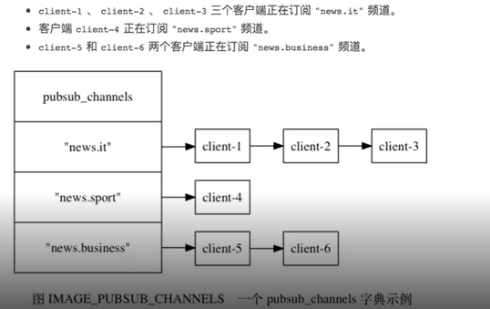
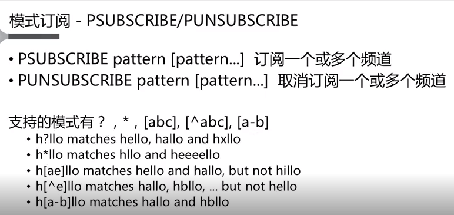
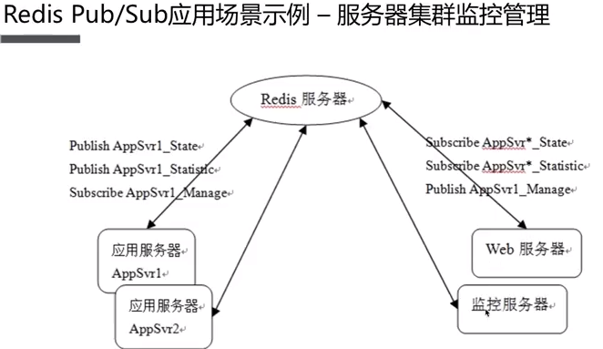

## 消息通知

### 使用场景

给博客加入邮件订阅功能，这样当发布新文章后订阅的用户就可以收到通知邮件了.用户提交自己的邮箱地址后,将该地址存入一个集合类型键中（使用集合类型是为了保证同一邮箱地址不会存储多个）。每当发布新文章时，就向收集到的邮箱地址发送通知邮件。

### 遇到的问题

输入邮箱地址提交后，由于发送邮件需要连接到一个远程的邮件发送服务器，网络好的情况下也得花上2秒左右的时间，赶上网络不好10秒都未必能发完。
导致页面需要很久时间才能载入完，所以每次用户提交邮箱后页面都要等待程序发送完邮件才能加载出来，而加载出来的页面上显示的内容只是提示用户查看自己的邮箱单击确认链接。“完全可以等页面加载出来后再发送邮件，这样用户就不需要等了。

### 任务队列(传递任务的队列)

当页面需要进行如发送邮件、复杂数据运算等耗时较长的操作时会阻塞页面的渲染。为了避免用户等待太久，应该使用独立的线程来完成这类操作。不过一些编程语言或框架不易实现多线程，这时很容易就会想到通过其他进程来实现。设想有一个进程能够完成发邮件的功能，那么在页面中只需要想办法通知这个进程向指定的地址发送邮件就可以了。通知的过程可以借助任务队列来实现。

与任务队列进行交互的实体有两类，一类是生产者（producer），一类是消费者（consumer）。生产者会将需要处理的任务放入任务队列中，而消费者则不断地从任务队列中读取任务并执行。对于发邮件这个操作来说`页面程序就是生产者`，而`发邮件的进程就是消费者`。当需要发送邮件时，页面程序会将收件地址、邮件主题和邮件正文组装成一个任务后存入任务队列中。同时发邮件的进程会不断检查任务队列，一旦发现有新的任务便会将其从队列中取出并执行。由此实现了进程间的通信。

**任务队列的好处**

1. 松耦合。生产者和消费者无需知道彼此的实现细节，只需要约定好任务的描述格式.
2. 易于扩展,消费者可以有多个，而且可以分布在不同的服务器中,可以轻易地降低单台服务器的负载。

### Redis实现任务队列

使用列表类型的LPUSH和RPOP命令实现队列，让生产者将任务使用LPUSH命令加入到某个键中，另一边让消费者不断地使用RPOP命令从该键中取出任务即可。

>完成发邮件的任务需要知道`收件地址、邮件主题和邮件正文`。生产者需要将这三个信息`组成对象并序列化成字符串`，然后将其加入到任务队列中。而消费者则循环从队列中拉取任务:

```shell
# 无限循环读取任务队列中的内容
loop
task=RPOR queue
if task
# 如果任务队列中有任务则执行它
execute( task)
else
# 如果没有则等待1秒以免过于频繁地请求数据
wait 1 second
```

当任务队列中没有任务时消费者每秒都会调用一次RPOP命令查看是否有新任务。`如果可以实现一旦有新任务加入任务队列就通知消费者就好了`。其实借助`BRPOP`命令就可以实现这样的需求。BRPOP命令和RPOP命令相似，唯一的区别是当列表中没有元素时BRPOP命令会一直阻塞住连接，直到有新元素加入:

```shell
loop
# 如果任务队列中没有新任务，BRPOP 命令会一直阻塞，不会执行execute()。
# BRPOP命令接收两个参数，第一个是键名，第二个是超时时间，单位是秒。
# 当超过了此时间仍然没有获得新元素的话就会返回nil。超时时间为“0”，表示不限制等待的时间，
# 即如果没有新元素加入列表就会永远阻塞下去。
task=BRPOP queue, 0
# 返回值是一个数组，数组第二个元素是我们需要的任务
# 当获得一个元素后BRPOP命令返回两个值，分别是键名和元素值
execute(task[1])
```

为了测试BRPOP命令，我们可以打开两个redis-cli实例，：

```shell
# 在实例A中,键入回车后实例B会处于阻塞状态
BRPOP queue 0

# 这时在实例B中向queue中加入一个元素
# 在LPUSH命令执行后实例A马上就返回了结果
# LPUSH queue task

# 同时会发现queue中的元素已经被取走
LLEN queue
```

>除了BRPOP命令外，Redis还提供了BLPOP，和BRPOP的区别在与从队列取元素时BLPOP会从队列左边取

### 优先级队列

#### 优先级队列使用场景

在发布文章的时候向每个订阅者发送通知邮件,这可以使用任务队列实现(发送`通知邮件`的任务).由于要执行的任务和发送确认邮件一样，所以二者可以共用一个消费者。然而设想这样的情况：假设订阅小白博客的用户有1000人，那么当发布一篇新文章后博客就会向任务队列中添加1000个发送通知邮件的任务。如果每发一封邮件需要10秒，全部完成这1000个任务就需要近3个小时。`问题来了，假如这期间有新的用户想要订阅小白博客，当他提交完自己的邮箱并看到网页提示他查收确认邮件时，他并不知道向自己发送确认邮件的任务被加入到了已经有1000个任务的队列中。要收到确认邮件，他不得不等待近3个小时。多么糟糕的用户体验！`而另一方面发布新文章后通知订阅用户的任务并不是很紧急，大多数用户并不要求有新文章后马上就能收到通知邮件，甚至延迟一天的时间在很多情况下也是可以接受的。所以可以得出结论当`发送确认邮件`和`发送通知邮件`两种任务同时存在时，应该优先执行前者。为了实现这一目的，我们需要实现一个优先级队列。

>BRPOP命令可以同时接收多个键，其完整的命令格式为`BRPOP key [key …]timeout`，如BRPOP queue:1 queue:2 0。意义是同时检测多个键，如果所有键都没有元素则阻塞，如果其中有一个键有元素则会从该键中弹出元素。

```shell
# 打开两个redis-cli实例，在实例A中：
BLPOP queue:1 queue:2 queue:3 0

# 在实例B中：
LPUSH queue:2 task2
# 则实例A中会返回："queue:2", "task2"
# 如果多个键都有元素则按照从左到右的顺序取第一个键中的一个元素。我们先在queue:2和queue:3中各加入一个元素：
LPUSH queue:2 task2
LPUSH queue:3 task3

# 然后执行BRPOP命令会得到"queue:2"，"task2"
BRPOP queue:1 queue:2 queue:3 0

# 借此特性可以实现区分优先级的任务队列。
# 我们分别使用queue:confirmation.email和queue:notification.email两个
# 键存储发送确认邮件和发送通知邮件两种任务，然后将消费者的代码改为：

loop
task =BRPOP queue:confirmation.email，queue:notification.email，0
execute( task[1])

这时一旦发送确认邮件的任务被加入到queue:confirmation.email队列中，
无论queue:notification.email还有多少任务，消费者都会优先完成发送确认邮件的任务。
```

# “发布/订阅”模式(Pub/Sub)

在pub/sub模式里面存在发布者和订阅者两种角色,发布者向特定的频道发送消息,而不用管有哪些订阅者订阅了这个频道,不用管订阅者订阅这个频道干什么.订阅者只管订阅频道,不用管这个频道中的消息是谁发送的.通过这种模式可以将这两个模块完全解耦开来,不仅在代码上可以解耦,而且也可以在物理部署上完全解耦.这样可以给我们的系统带来很大的灵活性.

# Redis的Pub/Sub实现

Redis提供了一组命令可以让开发者实现“发布/订阅”（publish/subscribe）模式。“发布/订阅”模式同样可以实现进程间的消息传递.

订阅者可以订阅一个或若干个频道（channel），而发布者可以向指定的频道发送消息，所有订阅此频道的订阅者都会收到此消息。 

>每个channel中维护着订阅这个channel的client的集合(不重复),key表示channel的名字,所以发布订阅的数据结构就是集合(字典结构/hash,value为NULL)



```shell
# 发布消息的命令是PUBLISH，用法是PUBLISH channel名字 message，如向channel.1说一声“hi”,这样消息就发出去了:
PUBLISH channel.1 hi

# PUBLISH命令的返回值表示接收到这条消息的订阅者数量。因为此时没有客户端订阅channel.1，所以返回0。

# 发出去的消息不会被持久化，也就是说当有客户端订阅channel.1后只能收到后续发布到该频道的消息，之前发送的就收不到了。

# 订阅频道的命令是SUBSCRIBE，可以同时订阅多个频道，用法是SUBSCRIBE channel [channel …]。

# 现在新开一个redis-cli实例A，用它来订阅channel.1：
SUBSCRIBE channel.1
# 执行SUBSCRIBE命令后客户端会进入订阅状态，处于此状态下客户端不能使用
```

进入订阅状态后客户端可能收到三种类型的回复。每种类型的回复都包含3个值，第一个值是消息的类型，
根据消息类型的不同，第二、三个值的含义也不同。消息类型可能的取值有：

1. Subscribe。表示订阅成功的反馈信息。第二个值是订阅成功的频道名称，第三个值是当前客户端订阅的频道数量。
2. message。这个类型的回复是我们最关心的，它表示接收到的消息。第二个值表示产生消息的频道名称，第三个值是消息的内容。
3. unsubscribe。表示成功取消订阅某个频道。第二个值是对应的频道名称，第三个值是当前客户端订阅的频道数量，当此值为0时客户端会退出订阅状态，之后就可以执行其他非“发布/订阅”模式的命令了。

>使用UNSUBSCRIBE命令可以取消订阅指定的频道，用法为UNSUBSCRIBE [channel [channel …]]，如果不指定频道则会取消订阅所有频道① .
注释：①由于redis-cli的限制我们无法在其中测试UNSUBSCRIBE命令。

#### 按照模式(Pattern)订阅

除了可以使用SUBSCRIBE命令订阅指定名称的频道外，还可以使用PSUBSCRIBE(Pattern Subscribe)命令指定的模式(规则)。



```shell
# 规则channel.?*可以匹配channel.1和channel.10，但不会匹配channel.
PSUBSCRIBE channel.?*

# 在实例B中发布消息：
PUBLISH channel.1 hi!
# 返回值第一个值表示这条消息是通过PSUBSCRIBE命令订阅频道而收到的，
# 第二个值表示订阅时使用的通配符，第三个值表示实际发布消息的频道，第四个值则是消息内容
1) "pmessage"
2) "channel.?*"
3) "channel.1"
4) "hi!"
```

>提示:使用PSUBSCRIBE命令可以重复订阅一个频道，如某客户端执行了PSUBSCRIBE channel.? channel.?*，`这时向channel.2发布消息后该客户端会收到两条消息，而同时PUBLISH命令返回的值也是2而不是1`。同样的，如果有另一个客户端执行了SUBSCRIBE channel.10，和PSUBSCRIBE channel.?*的话，向channel.10发送命令该客户端也会收到两条消息（但是是两种类型，message 和pmessage），同时PUBLISH命令会返回2。

>PUNSUBSCRIBE命令可以退订指定的规则，用法是PUNSUBSCRIBE [pattern[pattern …]]，如果没有参数则会退订所有规则。
 
    注意 使用PUNSUBSCRIBE命令只能退订通过PSUBSCRIBE命令订阅的规则，不会影响直接通过SUBSCRIBE命令订阅的频道；同样UNSUBSCRIBE命令也不会影响通过PSUBSCRIBE命令订阅的规则。另外容易出错的一点是使用PUNSUBSCRIBE命令退订某个规则时不会将其中的通配符展开，而是进行严格的字符串匹配，所以PUNSUBSCRIBE *无法退订channel.*规则，而是必须使用PUNSUBSCRIBE channel.*才能退订。

# 查询订阅状态 - PUBSUB

- PUBSUB CHANNELS [pattern] (返回符合模式(未指定情况下返回所有)的频道)    
- PUBSUB NUMSUB [channel1 ... channelN] (返回指定的频道的订阅数)
- PUBSUB NUMPAT [返回服务器中被订阅的模式数目]  

# Redis Pub/Sub应用场景示例 - 服务器集群监控管理

我需要知道当前所有应用服务器的运行状态,是不是有哪些服务器已经挂了,是不是都在正常提供服务,或者一台服务器上有多个app,需要知道每个app占用的内存,cpu使用率等信息,再进一步可以给服务器发送管理的命令,比如我想重启等,这些都可以通过redis的pub/sub实现.

