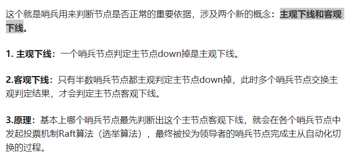

# Redis HA(High Available) 高可用方案

    微服务做的就是高可用，高性能，高并发.
    
    你搭建的所有服务器都要做到高可用，有了高可用，你才能做到高性能，高并发.
    
    高可用就是服务一直可用,也就是要解决单点故障问题,解决了单点故障问题,也就实现了高可用.

# Redis HA方案

>官方推荐sentinel做redis的高可用解决方案,通过Sentinel监控redis实例，自动进行故障恢复.(每个redis会注册到sentinel上,类似于zk和eureka的自动注册与发现,说白了sentinel和zk/eureka都是一个东西,只不过实现方式不一样)

>sentinel是解决高可用问题/单点故障问题的，cluster是解决sharding(分片)问题以及主从复制问题的，不重复，并且经常一起用.

# redis-sentinel(哨兵)

每一个服务器上,既要装redis,又要装一个sentinel,这两个是同时运行在一台服务器上的.sentinel用于监控redis.而且上图中的3个sentinel之间也要实现自注册,类似于eureka的自注册,这样就能达到sentinel本身的高可用,然后再去监控redis的这些服务.

当redis主节点出现故障时，由Redis Sentinel自动完成故障发现和转移，实现redis的高可用.

# 主观下线和客观下线

# Redis数据复制(Replication)
   
Redis为了解决单点数据库问题，会把数据复制多个副本(多个slave)部署到其他节点上，通过复制，实现对数据的备份，保证数据和服务的高度可靠性

# 哨兵用来判断节点是否正常的重要依据

- 同时哨兵节点之间也互相通信，交换对redis节点的监控状况
- 每隔1秒每个哨兵会向整个集群：Master主服务器+Slave从服务器+其他Sentinel（哨兵）进程，发送一次ping命令做一次心跳检测

# Sentinel的分布式特性

Redis Sentinel是一个分布式系统，Sentinel运行在有`许多Sentinel进程互相合作`的环境下，它本身就是这样被设计的。Sentinel进程互相合作的优点如下:

1. 当多个Sentinel同意一个master不再可用的时候，就执行故障检测。这明显降低了错误概率。
2. 即使并非全部的Sentinel都在工作，Sentinel也可以正常工作，这种特性，让系统非常的健康。
3. 所有的Sentinels，Redis实例，连接到Sentinel和Redis的客户端，本身就是一个有着特殊性质的大型分布式系统

# Redis sentinel和Redis cluster数据分片的区别

sentinel group健康一个主节点，多个从节点，不同节点的数据是一样的.

cluster数据分片是为了解决单机Redis容量有限的问题，将数据按一定的规则分配到多台机器。cluster的分片(sharding): 一个key通过hash算法分配到不同的slot上，不同节点存储的数据是不一样的

sentinel着眼于高可用，Cluster提高并发量。

主从复制是为了数据备份,负载均衡，读写分离,一个Master可以有多个Slaves,sentinel发现master挂了后，就会从slave中重新选举一个master
