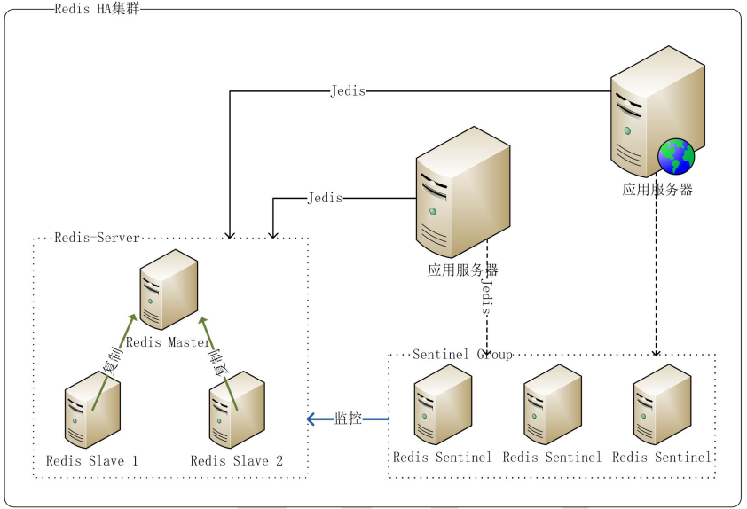
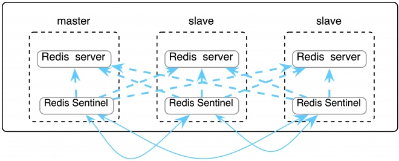

# Redis HA(High Available) 方案

>微服务做的就是高可用，高性能，高并发.你搭建的所有服务器都要做到高可用，有了高可用，你才能做到高性能，高并发.

`HA-高可用`，就是一直可用,要解决单点故障问题.

## Redis HA方案：

- keepalived(之前的老技术，可以先不用看)： 通过 keepalived 的虚拟 IP，提供主从的统一访问，在主出现问题时， 通过 keepalived 运行脚本将从提升为主，待主恢复后先同步后自动变为主，该方案的好处是主从切换后，应用程序不需要知道(因为访问的虚拟 IP 不变)，坏处是引入 keepalived 增加部署复杂性，在有些情况下会导致数据丢失
- zookeeper： 通过 zookeeper 来监控主从实例， 维护最新有效的 IP， 应用通过 zookeeper 取得 IP，对 Redis 进行访问，`该方案需要编写大量的监控代码,这就是这种方案的问题.zookeeper不是为你redis服务的，它是一个分布式协调技术解决方案，解决方案给你了，代码要你自己写。`
- sentinel(`官方推荐做redis的高可用`)： 通过 Sentinel(`专门为redis服务的单点故障解决方案`) 监控主从实例，自动进行故障恢复.

注意：sentinel 是解决 HA 问题的，cluster(集群)是解决主从复制问题的，不重复，并且经常一起用

## redis-sentinel(哨兵)

Redis 集群可以在一组 redis 节点之间实现高可用性。在redis集群中会有 1 个 master 和多个 slave 节点。当 master 节点失效时，应选举出一个 slave 节点作为新的 master。然而 Redis 本身没有实现自动故障发现并进行主备切换的能力，需要`外部的监控方案(Redis Sentinel)`来实现自动故障恢复。

>Redis Sentinel 是官方推荐的高可用性解决方案(当然也可以使用zookeeper，但是需要自己编写代码)。它是 Redis 集群的监控管理工具，可以提供节点监控、通知、自动故障恢复和客户端配置发现服务(注册与发现，类似于尤里卡)。

>Redis Sentinel为Redis提供了高可用解决方案。这意味着使用Redis Sentinel可以部署一套Redis，在没有人为干预的情况下去应付各种各样的失败事件。Sentinel
也构成一个集群，首先Sentinel与Sentinel之间自注册(类似于Eureka)，能够达到Sentinel本身的高可用，然后再去监控Redis的服务。

Redis Sentinel同时提供了一些其他的功能，例如：监控、通知,并为client提供配置等功能,下面是Sentinel的功能列表:

1. 监控(Monitoring): Sentinel不断的去检查你的主从实例是否按照预期在工作。
2. 通知(Notification)：Sentinel可以通过一个api来通知系统管理员或者另外的应用程序，被监控的Redis实例有一些问题。
3. 自动故障转移(Automatic failover)：如果一个主节点没有按照预期工作，Sentinel会开始故障转移过程，把一个`从节点`提升为`主节点`，`并重新配置其他的从节点使用新的主节点`，使用Redis服务的应用程序在连接的时候也被通知新的地址。
4. 配置提供者(Configuration provider)：Sentinel给客户端的服务发现`提供来源`：对于一个给定的服务，客户端连接到Sentinels来寻找当前主节点的地址。当故障转移发生的时候，Sentinels将报告新的地址。

## Sentinel的分布式特性

Redis Sentinel是一个分布式系统，Sentinel运行在有`许多Sentinel进程互相合作`的环境下，它本身就是这样被设计的。有许多Sentinel进程互相合作的优点如下:

1. 当多个Sentinel同意一个master不再可用的时候，就执行故障检测。这明显降低了错误概率。
2. 即使并非全部的Sentinel都在工作，Sentinel也可以正常工作，这种特性，让系统非常的健康。
3. 所有的Sentinels，Redis实例，连接到Sentinel和Redis的客户端，本身就是一个有着特殊性质的大型分布式系统
