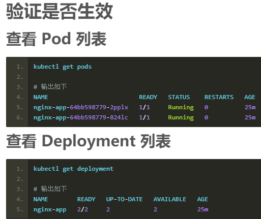
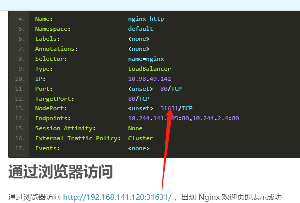
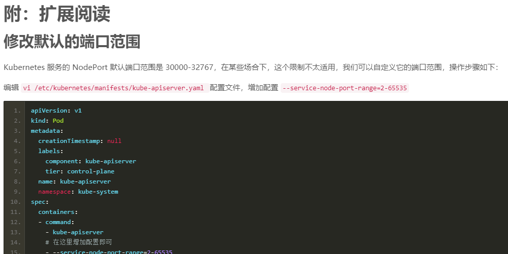

## 创建 YAML 配置文件

    创建一个名为 nginx.yml 的配置文件

```yaml
# API 版本号
apiVersion: apps/v1
# 类型，如：Pod/ReplicationController/Deployment/Service/Ingress
# 意思就是我部署的是一个Deployment
kind: Deployment
# 元数据
metadata:
  # deployment的名称
  name: nginx-app
spec:
  selector:
    matchLabels:
      app: nginx
  # 部署的实例数量
  replicas: 2
  template:
    metadata:
      labels:
        # 容器标签的名字，expose发布 Service 时，selector 需要和这里对应
        app: nginx
    spec:
      # 配置容器，数组类型，说明可以配置多个容器
      containers:
      # 容器名称
      - name: nginx
        # 容器镜像,k8s必须指定标签,不能再使用latest了
        image: nginx:1.17
        # 只有镜像不存在时，才会进行镜像拉取
        imagePullPolicy: IfNotPresent
        # 暴露端口
        ports:
        # Pod 端口
        - containerPort: 80
---
# API 版本号
apiVersion: v1
# 类型，如：Pod/ReplicationController/Deployment/Service/Ingress
kind: Service
# 元数据
metadata:
  # deployment 的名称
  name: nginx-http
spec:
  # 暴露端口
  ports:
    ## Service 暴露的端口
    - port: 80
      ## Pod 上的端口，这里是将 Service 暴露的端口转发到 Pod 端口上
      targetPort: 80
  # 类型
  type: LoadBalancer
  # 标签选择器
  selector:
    # 需要和上面部署的 Deployment 标签名对应
    app: nginx
```

```shell script
# 部署
kubectl create -f nginx.yml

# 删除
kubectl delete -f nginx.yml
```







