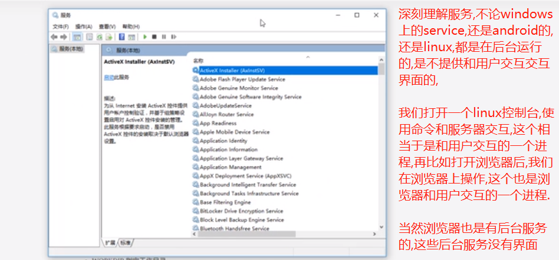

## 容器

image镜像文件生成的容器实例(container)，本身也是一个文件，称为容器文件。也就是说，一旦容器生成，就会同时存在两个文件： image 文件和容器文件.

docker命令也这么分，分成对image的操作和对container的操作。而且关闭容器并不会删除容器文件，只是容器停止运行而已。

```shell script
# 列出本机正在运行的容器
$ docker container ls
# 查看正在运行的运行容器
docker ps

# 列出本机所有容器，包括终止运行的容器
$ docker container ls --all
# 查看所有的容器
# 解释PORTS一列: PORTS: 0.0.0.0:3306->3306/tcp ,其中左边是宿主机端口,右边是容器端口.
docker ps -a

# 上面命令的输出结果包括容器的ID。很多地方都需要提供这个 ID，比如终止容器运行的命令
# kill命令相当于向容器里面的主进程发出 SIGKILL 信号
docker container kill [containerID]

# 新建容器，每运行一次，就会新建一个容器。同样的命令运行两次，就会生成两个一模一样的容器文件
docker container run

# 如果希望重复使用容器，就要使用start命令，它用来启动已经生成或者已经停止运行的容器文件
docker container start [containerID]

# docker container stop命令也是用来终止容器运行，
# 相当于向容器里面的主进程发出 SIGTERM 信号，然后过一段时间再发出 SIGKILL 信号。
# 这两个信号的差别是，应用程序收到 SIGTERM 信号以后，可以自行进行收尾清理工作，
# 但也可以不理会这个信号。如果收到 SIGKILL 信号，就会强行立即终止，那些正在进行中的操作会全部丢失。
docker container stop <containerID>

# 终止运行的"容器文件"，依然会占据硬盘空间，可以使用docker container rm命令删除
docker container rm [containerID]

# 或者使用以下命令删除容器
docker rm [-f] containerID
# 删除所有容器(谨慎使用!!!)
docker rm $(docker ps -a -q)

#运行上面的命令之后，再使用docker container ls --all命令，就会发现被删除的容器文件已经消失了。

# 查看容器的日志
docker logs container_name

# 一直监听日志文件的变化
docker logs -f container_name

# 停止运行容器
docker stop container_id

# 用来查看 docker 容器的输出，即容器里面 Shell 的标准输出。
# 如果使用docker run命令运行容器的时候，没有使用-it参数，就要用这个命令查看输出。
docker container logs [containerID]

# 进入一个正在运行的 docker 容器。
# 如果docker run命令运行容器的时候，没有使用-it参数，就要用这个命令进入容器。
# 一旦进入了容器，就可以在容器的 Shell 执行命令了。
docker container exec -it [containerID] /bin/bash

# 用于从正在运行的 Docker 容器里面，将文件拷贝到本机。下面是拷贝到当前目录的写法。
docker container cp [containID]:[/path/to/file] .

# 我们也可以通过操作容器的名字来管理容器
docker start containerName/id.
docker restart containerName/id
docker stop containerName

# 从宿主机复制文件到容器
docker cp host_path containerID:container_path
# 从容器复制文件到宿主机
docker cp containerID:container_path host_path
```

# 进入容器

docker attach或docker exec,我们一般使用docker exec命令，因为使用attach进入容器后,如果exit了,会导致容器的停止.

## exec 命令

- -i表示interactive,交互式的,-t代表termination,表示终端.所以当使用-i -t 参数一起使用时，就可以使用命令进行操作.
- -d 容器启动后，在后台运行
- -p 指定端口映射:左边是宿主机端口,右边是容器端口
- -P 大p指的是使用宿主机上的随机的端口.
- --name wordpress：容器的名字叫做wordpress,如果启动容器的时候没有指定容器的名字,就会有一个随机的名字
- --env MYSQL_ROOT_PASSWORD=123456：向容器进程传入一个环境变量MYSQL_ROOT_PASSWORD，该变量会被用作 MySQL 的根密码
- -e: 设置环境变量.



```shell script
# 直接从image运行创建一个容器,这里是创建了一个新的容器,并且把容器启动起来
# 注意,run命令只要不加containerID,就会新创建一个容器.
# bash表示直接进入这个容器的终端
# --rm: 是一个可选参数,表示使用exit退出容器后，自动删除容器文件
# run -it: 以交互的方式启动一个容器,并进入容器
# 省略tag默认为latest
docker run [-it] [--rm] image-name[:tag] bash

# 启动一个基于tomcat image的,叫xzj的,映射端口为8080的容器
# docker run -p 8080:8080 --name xzj tomcat

# 守护态运行tomcat这个镜像,也就是后台运行.
# docker run -p 8080:8080 --name xzj -d tomcat

# 使用随机端口启动tomcat,tomcat容器默认expose的是8080端口,我们启动后可以通过docker ps看到,
# 有一个随机的宿主机的port映射到了tomcat容器里面的8080.假设是37862端口,所以外界要通过37862访问tomcat容器.
# 也可以看到容器化部署本身就提供了一种安全性.
# 这里,大p指的是使用宿主机上的随机的端口来映射tomcat默认expose的8080端口.
docker run -P tomcat

# 以交互的方式 进入一个已经存在的容器
$ docker exec -it containerID/containerName bash

# 进入容器后列出目录
ls -al
```