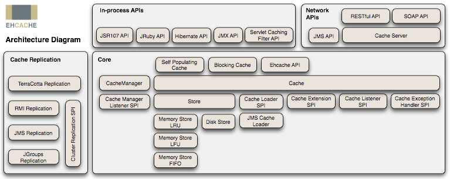

# 本地缓存

- EhCache
- Guava Cache

## Ehcache

Ehcache是现在最流行的纯Java开源缓存框架,功能强大，是一个非常轻量级的缓存实现，我们常用的Hibernate里面就集成了它相关缓存功能

Ehcache的核心定义主要包括：

1. cache manager：缓存管理器，以前是只允许单例的，不过现在也可以多实例了。
2. cache：缓存管理器内可以放置若干cache，存放实际数据，`所有cache都实现了Ehcache接口`，这是一个真正使用的缓存实例；`通过缓存管理器的模式，可以在单个应用中轻松隔离多个缓存实例`，独立服务于不同业务场景需求，缓存数据物理隔离，同时需要时又可共享使用。
3. element：单条缓存数据的组成单位。
4. system of record（SOR）：可以取到真实数据的组件，可以是真正的业务逻辑、外部接口调用、存放真实数据的数据库等，缓存就是从SOR中读取或者写入到SOR中去的。

整体上看，Ehcache的使用还是相对简单便捷的，提供了完整的各类API接口。需要注意的是，虽然Ehcache支持磁盘的持久化，但是由于存在两级缓存介质，在一级内存中的缓存，如果没有主动的刷入磁盘持久化的话，在应用异常down机等情形下，依然会出现缓存数据丢失.

为此可以根据需要将缓存刷到磁盘，`将缓存条目刷到磁盘的操作可以通过cache.flush()方法来执行`，需要注意的是，对于对象的磁盘写入，前提是要将对象进行序列化`。

### Ehcache主要特性：

- 快速，针对大型高并发系统场景，Ehcache的多线程机制有相应的优化改善。
- 简单，很小的jar包，简单配置就可直接使用，单机场景下无需过多的其他服务依赖。
- 支持多种的缓存策略，灵活。
- 缓存数据有两级：内存和磁盘，与一般的本地内存缓存相比，有了磁盘的存储空间，将可以支持更大量的数据缓存需求。
- 具有缓存和缓存管理器的侦听接口，能更简单方便的进行缓存实例的监控管理。
- 支持多缓存管理器实例，以及一个实例的多个缓存区域。

>注意：Ehcache的超时设置主要是针对整个cache实例设置整体的超时策略，`而没有较好的处理针对单独的key的个性的超时设置（有策略设置，但是比较复杂，就不描述了）`，因此，在使用中要注意过期失效的缓存元素无法被GC回收，时间越长缓存越多，内存占用也就越大，内存泄露的概率也越大。

## Guava Cache

我们这里主要讨论Guava的讨论缓存。
