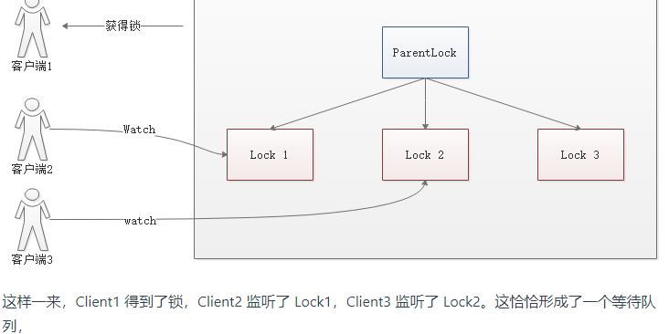
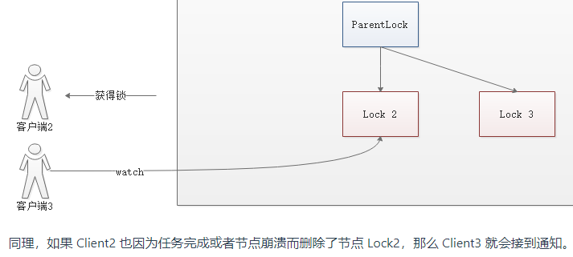
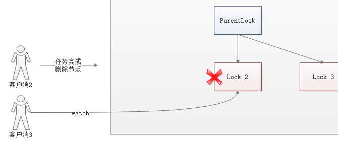

# ZooKeeper应用场景

    Zookeeper是一个分布式协调组件,主要功能有2个:
    
    - 分布式锁: 分布式数据一致性解决方案
    - 充当服务注册与发现中心: 担任服务生产者和服务消费者的注册中心(通过watch事件通知机制).


# ZooKeeper特性

- 低延迟和高性能: ZooKeeper将数据保存在内存中，这也就保证了低延迟（但是内存限制了能够存储的容量不太大，此限制也是保持znode中存储的数据量较小的进一步原因）,在“读”多于“写”的应用程序中尤其地高性能.Zookeeper 是为读多写少的场景所设计
- 实时性：ZooKeeper 不能保证两个客户端同时得到刚更新的数据，如果需要最新数据，应该在读数据之前调用sync()接口

# Znode

Zookeeper将所有数据存储在内存中，所以并不是用来存储大规模业务数据，而是用于存储少量的状态和配置信息，每个节点的数据最大不能超过 1MB.ZNode是ZooKeeper中数据的最小单元,znode用由斜杠分割的路径表示，例如/foo/path1

>在Zookeeper中的node可以分为4类:

- 持久节点: 默认的节点类型,创建节点的客户端与 Zookeeper 断开连接后，该节点依旧存在.除非主动进行ZNode的移除操作.
- 持久节点顺序节点: 在创建节点时，Zookeeper 根据创建的时间顺序给该节点名称进行编号.也就是这些节点是有顺序的.
- 临时节点: 当创建节点的客户端与 Zookeeper 断开连接后，临时节点会被删除
- 临时顺序节点: 在创建节点时，Zookeeper 根据创建的时间顺序给该节点名称进行编号；当创建节点的客户端与 Zookeeper 断开连接后，临时节点会被删除.

>Zookeeper 分布式锁恰恰应用了临时顺序节点.









>Zookeeper 和 Redis 分布式锁的比较


# ZNode的结构

每个 ZNode 由2部分组成:

- stat：包含 Znode 的各种元数据，比如事务 ID、版本号、时间戳、大小等等。
- data：zookeeper相对于redis的好处
- ACL：记录 Znode 的访问权限，即哪些人或哪些 IP 可以访问本节点。
- child：当前节点的子节点引用

通过 get 命令来获取根目录下的 dubbo 节点的内容:

```shell
[zk: 127.0.0.1:2181(CONNECTED) 6] get /dubbo    
# 该数据节点关联的数据内容为空
null
# 下面是该数据节点的一些状态信息，其实就是 Stat 对象的格式化输出
cZxid = 0x2
ctime = Tue Nov 27 11:05:34 CST 2018
mZxid = 0x2
mtime = Tue Nov 27 11:05:34 CST 2018
pZxid = 0x3
cversion = 1
dataVersion = 0
aclVersion = 0
ephemeralOwner = 0x0
dataLength = 0
numChildren = 1
```

这些状态信息其实就是 Stat 对象的格式化输出。Stat 类中包含了一个数据节点的所有状态信息的字段，包括事务ID、版本信息和子节点个数等，如下图所示:


# Znode基本操作

- 创建节点: create
- 删除节点: delete
- 判断节点是否存在: exists
- 获得一个节点的数据: getData
- 设置一个节点的数据: setData
- 获取节点下的所有子节点: getChildren

>这其中，exists，getData，getChildren 属于读操作。Zookeeper 客户端在请求读操作的时候，可以选择是否设置 Watch

# Zookeeper 的事件通知


---
    事件通知机制是通过客户端和服务器之间建立的TCP长连接。客户端启动的时候，首先会与服务器建立一个 TCP 连接，从第一次连接建立开始，会话的生命周期也开始了。通过这个连接，客户端能够通过心跳检测与服务器保持有效的会话，也能够向Zookeeper服务器发送请求并接受响应，同时还能够通过该连接接收来自服务器的Watch事件通知.
    
    Session的`sessionTimeout`值用来设置一个客户端会话的超时时间。当由于服务器压力太大、网络故障或是客户端主动断开连接等各种原因导致客户端连接断开时，**只要在`sessionTimeout`规定的时间内能够重新连接上集群中任意一台服务器，那么之前创建的会话仍然有效。**
    
    在为客户端创建会话之前，服务端首先会为每个客户端都分配一个sessionID。由于 sessionID 是 Zookeeper 会话的一个重要标识，许多与会话相关的运行机制都是基于这个 sessionID 的，因此，无论是哪台服务器为客户端分配的 sessionID，都务必保证全局唯一。
---

# Zookeeper通过集群实现高可用

---
    Zookeeper身为分布式系统协调服务，如果zk单机挂了如何怎么办？我们可以实现zk的高可用.只要半数以上节点存活那么 ZooKeeper 本身仍然是可用的
    
    为了实现zk的高可用,Zookeeper维护了一个集群.那么高可用集群之间的数据同步问题(不同zk实例,数据要保证一样)如何解决?


    Zookeeper Service 集群是一主多从结构:除非主节点被显式配置,否则主节点是不接受客户端连接的.
    
    在更新数据时，首先更新到主节点（这里的节点是指服务器，不是 Znode），再同步到从节点
    
    在读取数据时，直接读取任意从节点
    
    为了保证主从节点的数据一致性，Zookeeper 采用了 ZAB 协议，这种协议非常类似于一致性算法 Paxos 和 Raft。
---


>为什么在Zookeeper集群中Server 数目一般为奇数？

---
    在Zookeeper中当多数 Server 写成功，则任务数据写成功。 
    ①如果有3个Server，则最多允许1个Server 挂掉。 
    ②如果有4个Server，则同样最多允许1个Server挂掉。 
    既然3个或者4个Server，同样最多允许1个Server挂掉，那么它们的可靠性是一样的，所以选择奇数个ZooKeeper Server即可，这里选择3个Server。
    
    综上，何必增加那一个不必要的zookeeper呢？
---

# ZAB协议

Zookeeper Atomic Broadcast，有效解决了2个问题:

- 主从同步数据的问题
- Zookeeper集群崩溃恢复


## ZAB解决 主从同步数据的问题

>主节点负责处理数据更新操作，一个更新操作成功的标志是当且仅当半数以上节点在内存中成功修改数据(每个节点内存中都维护了一份数据)


对于client的每一个事务请求，ZooKeeper都会为其分配一个全局唯一的事务ID（Zookeeper Transaction Id）,用 ZXID 来表示,每一个ZXID对应一次更新操作，从这些 ZXID 中可以间接地识别出Zookeeper处理这些更新操作请求的顺序(zk数据同步是顺序一致性).说白了就是一个自增事务id.最大的zxid的数据就是最新的.

集群奔溃恢复选取主节点的过程就用到了这个zxid,各个节点之间通过比较zxid来决定把票投给zxid最大的那个节点,这样票数最多的就是zxid最大的,最后这个节点成为主节点.

## ZAB解决集群崩溃恢复


