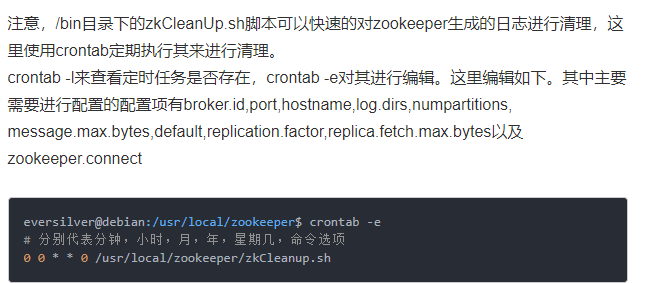

# ZooKeeper要求的预配置

JDK >= 1.6,由于ZooKeeper将数据保存在内存中以实现高吞吐量和低延迟(high throughput and low latency)，因此生产系统最适合使用8GB内存。 太小的内存可能导致JVM交换，这可能导致ZooKeeper服务器延迟。 高ZooKeeper服务器延迟可能导致客户端会话超时等问题，从而对系统功能产生负面影响.

# 安装ZooKeeper单机

0. 把ZooKeeper包下载到/opt下: cd /opt
1. 从http://mirror.bit.edu.cn/apache/zookeeper/上下载,建议下载stable:
3. tar -zxvf zookeeper-3.4.14.tar.gz
4. 使用`ln`命令创建符号链接: ln -s zookeeper-3.4.14 zookeeper
5. 为zookeeper创建一个目录存放data: mkdir -p /data/zookeeper

## 配置ZooKeeper

>配置文件存在于zookeeper/conf目录中，此目录包含ZooKeeper附带的示例配置文件zoo_sample.cfg，包含最常见配置参数:

- tickTime：以毫秒为单位,作为Zookeeper服务器之间或客户端与服务器之间维持心跳的时间间隔,也就是每个tickTime时间就会发送一个心跳.最小会话超时是tickTime的两倍。也是下面initLimit,syncLimit的计时单位.
- dataDir：保存数据快照和myid的目录,默认情况下事务日志(log)也保存在这个目录里.注意日志不要保存在这个目录下,会影响zk的性能.
- dataLogDir: 保存事务日志的目录,一般很多，需要定期的去清理，否则产生很多垃圾，拖慢响应速度.
- clientPort：这个端口就是客户端（应用程序）连接Zookeeper服务器的端口,Zookeeper会监听这个端口接受客户端的访问请求。
- maxClientCnxns：限制最大客户端连接数
- initLimit=10: 这个时间内，集群中的机器都要启动,这个配置项是用来配置Zookeeper接受客户端（这里所说的客户端不是用户连接Zookeeper服务器的客户端,而是Zookeeper服务器集群中连接到Leader的Follower服务器）初始化连接时最长能忍受多少个心跳时间间隔数。当已经超过10个心跳的时间（也就是tickTime）长度后 Zookeeper 服务器还没有收到客户端的返回信息,那么表明这个客户端连接失败。总的时间长度就是 10*2000=20 秒。
- syncLimit=5: 标识Leader与Follower之间请求和应答的时间长度(leader和follower之间的心跳超时时间),最长不能超过多少个tickTime的时间长度,总的时间长度就是5*2000=10秒。

>在zookeeper/conf下创建zoo.cfg(注意名字不能错了,因为zookeeper默认就是使用这个配置文件)，下面是最简单的配置:

```shell
# tickTime为2000毫秒是被建议的心跳之间的间隔。 较短的间隔可能导致系统开销，但收益有限(system overhead with limited benefits)。 
tickTime=2000

# 这里指向的是/data/zookeeper,可以指向一个相对路径
# 如果是相对路径,例如"./data",就是相对于当前所在的目录(pwd命令的目录)下寻找dataDir,然后找myid注意这个很重要,自己踩过坑.
# 注意这里不是相对于zkServer.sh后面的配置文件所在的目录寻找的.
dataDir=/data/zookeeper

# 通常，ZooKeeper使用端口2181来侦听客户端连接
clientPort=2181
# 在大多数情况下，60个允许的客户端连接足以进行开发和测试。
maxClientCnxns=60
```


---
小提示：

在Zookeeper官方文档中给了一个关于性能优化的小经验，就是有几个其他配置参数可以大大提高性能：

    为了获得更新时的低延迟，重要的是有一个专用的事务日志目录。 默认情况下，事务日志与数据快照和myid文件放在同一目录中。 dataLogDir参数指示用于事务日志的不同目录。

意思就是说，最好将属具目录和日志目录分离开来，从而提高数据的读取更新效率。

---

## 启动ZooKeeper并测试

0. bin/zkServer.sh -help可以查看zkServer.sh支持的命令
1. 启动ZooKeeper：bin/zkServer.sh start ./zk.cfg (最好要加上配置文件路径,默认是使用../conf/zoo.cfg)
2. 查看当前 zookeeper 状态: zkServer.sh status ./zk.cfg (查看status一定要加上配置文件,否则不知道要看server的status,注意后面的./zk.cfg要加上点./,否则伪集群搭建的时候容易启动不了),或者通过  输入jps命令查看进程：1456QuorumPeerMain,其中，QuorumPeerMain是zookeeper进程，说明启动正常
3. 连接到本地ZooKeeper服务器：bin/zkCli.sh -server 127.0.0.1:2181, 将看到CONNECTED的提示(此时相当于在client)，这表示已成功安装standalone的ZooKeeper
4. 在此提示符上键入`help`以获取可以从客户端执行的命令列表:

## 从client执行命令

- 以下命令都是在上面连接成功后,在zk client中执行的
- 输入help可以查看帮助
- 查看节点: ls /
- 创建一个新的znode叫/zk_test,数据data是"my_data": create /zk_test "my_data"
- 创建一个新的znode叫/apps,数据data是"this is app": create /apps "this is app"
- 创建一个新的znode叫/apps/app1,数据data是"this is app1": create /apps/app1 "this is app1"
- 发出另一个命令"ls /",查看目录的样子(查看节点), 通过 stat 命令查看节点状态: stat /zookeeper
- 查看节点数据 "get 节点的路径path": get /zk_test
- 更新和节点关联的数据,We can change the data associated with zk_test by issuing the set command, as in: `set /zk_test junk`
- 删除节点: delete /zk_test (需要注意的一点是如果你要删除某一个节点，那么这个节点必须无子节点才行)
- 输入quit来关闭client session, 关闭客户端会话后，ZooKeeper Server将继续运行
- 关闭ZooKeeper服务: bin/zkServer.sh stop
- ls2 命令返回的信息包括2部分：子节点列表 + 当前节点的stat信息: ls2 /zookeeper

## 日志清理



# 参考

- [https://zhuanlan.zhihu.com/p/67140930](https://zhuanlan.zhihu.com/p/67140930)