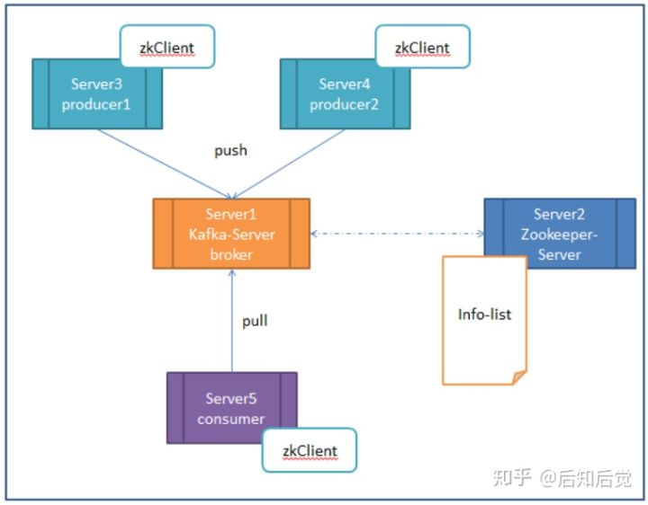
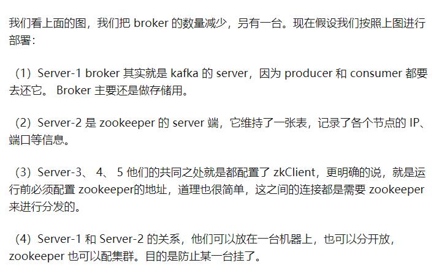

# 简介

Apache Kafka是一种高吞吐量的分布式"发布-订阅消息系统",使用Scala开发,Kafka借鉴了JMS规范的思想，但是确并没有完全遵循JMS规范,同时也借鉴了AMQP,

# Kafka基本架构

它的架构包括以下组件：Topic,producer，broker(服务代理/中间人/掮客/经纪人)，consumer,

Consumer：可以订阅一个或多个topic，并从Broker上批量拉数据，从而消费这些已发布的消息,无消息确认机制.

上图中可以看出，生产者将数据发送到Broker代理，Broker代理有多个话题topic，消费者从Broker获取数据。

多个 broker 协同合作，producer 和 consumer 部署在各个业务逻辑中被频繁的调用，三者通过 zookeeper管理协调请求和转发。这样一个高性能的分布式消息发布订阅系统就完成了。

图上有个细节需要注意，producer 到 broker 的过程是 push，也就是有数据就推送到 broker，而 consumer 到 broker 的过程是 pull，是通过 consumer 主动去拉数据的，而不是 broker 把数据主懂发送到 consumer 端的。

# Zookeeper在kafka的作用

无论是kafka集群，还是producer和consumer都依赖于zookeeper来保证系统可用性,Kafka使用zookeeper作为其分布式协调框架，通过使用zookeeper，kafka能够生产者、消费者和broker在内的所以组件在无状态的情况下，建立起生产者和消费者的关系，并实现生产者与消费者的负载均衡.

  

  

# Kafka的特性

1. 高吞吐量、低延迟：kafka每秒可以处理几十万条消息，消息处理的效率很高。它的延迟最低只有几毫秒(内部使用zero-copy机制)，每个topic可以分多个partition, consumer group 对partition进行consume操作；
2. 可扩展性：kafka集群支持热扩展；
3. 持久性、可靠性：消息被持久化到本地磁盘，并且支持数据备份防止数据丢失；
4. 容错性：允许集群中节点失败（若副本数量为n,则允许n-1个节点失败）；
5. 高并发：支持数千个客户端同时读写；
6. 支持实时在线处理和离线处理：可以使用Storm这种实时流处理系统对消息进行实时进行处理，同时还可以使用Hadoop这种批处理系统进行离线处理；
  
### 在应用场景方面

消息发布订阅系统,它主要用于处理活跃的流式数据,大数据量的数据处理上。

# Kafka的使用场景

1. 日志收集：一个公司可以用Kafka收集各种服务的日志，通过kafka以统一接口服务的方式开放给各种consumer，例如Hadoop、Hbase、Solr等；
2. 消息系统：解耦和生产者和消费者、缓存消息等；
3. 用户活动跟踪：Kafka经常被用来记录web用户或者app用户的各种活动，如浏览网页、搜索、点击等活动，这些活动信息被各个服务器发布到kafka的topic中，然后订阅者通过订阅这些topic来做实时的监控分析，或者装载到Hadoop、数据仓库中做离线分析和挖掘；
4. 运营指标：Kafka也经常用来记录运营监控数据。包括收集各种分布式应用的数据，生产各种操作的集中反馈，比如报警和报告；

# 进一步了解Kafak的特性

https://www.cnblogs.com/likehua/p/3999538.html