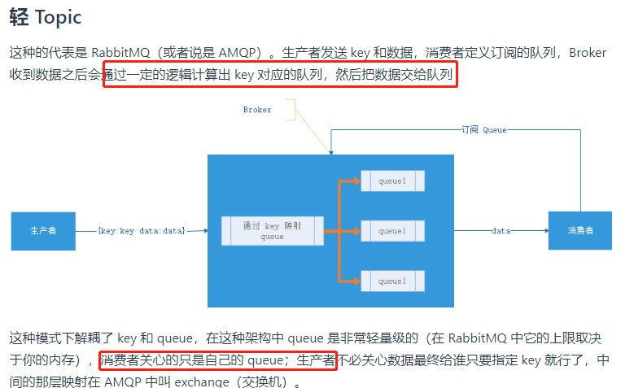
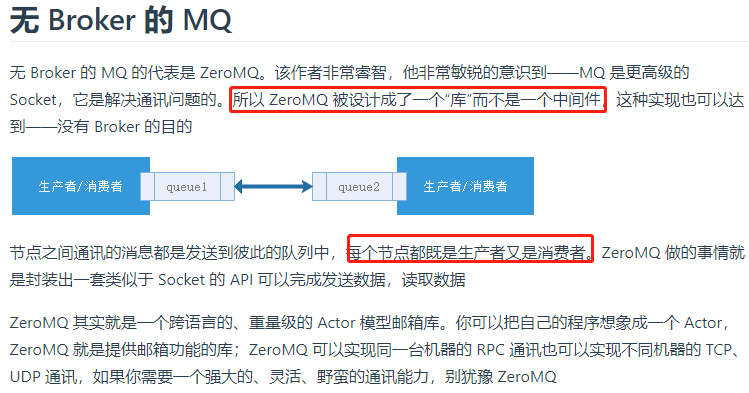

# 为什么要使用消息队列?

虽然rest设计非常流行 ,但他是同步的,会造成阻塞,因此部分基于微服务的架构可能会选择消息队列替代rest请求和响应.

# 消息队列分类

- 有 Broker 的 MQ
- 无 Broker 的 MQ

# 消息队列的好处

## 通过异步处理提高系统性能（削峰、减少响应所需时间）

　　**在不使用消息队列服务器的时候，用户的请求数据直接写入数据库，在高并发的情况下数据库压力剧增，使得响应速度变慢。但是在使用消息队列之后，用户的请求数据发送给消息队列之后立即 返回，再由消息队列的消费者进程从消息队列中获取数据，异步写入数据库。由于消息队列服务器处理速度快于数据库（消息队列也比数据库有更好的伸缩性），因此响应速度得到大幅改善。**

　　通过以上分析我们可以得出**消息队列具有很好的削峰作用的功能**—即**通过异步处理，将短时间高并发产生的事务消息存储在消息队列中，从而削平高峰期的并发事务。** 举例：在电子商务一些秒杀、促销活动中，合理使用消息队列可以有效抵御促销活动刚开始大量订单涌入对系统的冲击。

　　因为**用户请求数据写入消息队列之后就立即返回给用户了，但是请求数据在后续的业务校验、写数据库等操作中可能失败**。因此使用消息队列进行异步处理之后，需要**适当修改业务流程进行配合**，比如**用户在提交订单之后，订单数据写入消息队列，不能立即返回用户订单提交成功，需要在消息队列的订单消费者进程真正处理完该订单之后，甚至出库后，再通过电子邮件或短信通知用户订单成功**，以免交易纠纷。这就类似我们平时手机订火车票和电影票。

## 降低系统耦合性,而且消息队列伸缩性更好

使用消息队列可以将功能模块化，降低各个功能模块的耦合,这样会提高系统的可扩展性.

**消息队列使利用发布-订阅模式工作，消息发送者（生产者）发布消息，一个或多个消息接受者（消费者）订阅消息。消息发送者（生产者）和消息接受者（消费者）之间没有直接耦合**，消息发送者将消息发送至分布式消息队列即结束对消息的处理，消息接受者从分布式消息队列获取该消息后进行后续处理，并不需要知道该消息从何而来。**对新增业务，只要对该类消息感兴趣，即可订阅该消息，对原有系统和业务没有任何影响，从而实现网站业务的可扩展性设计**。

**另外为了避免消息队列服务器宕机造成消息丢失，会将成功发送到消息队列的消息存储在消息生产者服务器上，等消息真正被消费者服务器处理后才删除消息。在消息队列服务器宕机后，生产者服务器会选择分布式消息队列服务器集群中的其他服务器发布消息。**   

**备注：** 不要认为消息队列只能利用发布-订阅模式工作，只不过在解耦这个特定业务环境下是使用发布-订阅模式的。**除了发布-订阅模式，还有点对点订阅模式（一个消息只有一个消费者），我们比较常用的是发布-订阅模式。** 

# 使用消息队列带来的一些问题(缺点/弊端)

- **系统可用性降低：** 系统可用性在某种程度上降低，为什么这样说呢？在加入MQ之前，你不用考虑消息丢失或者说MQ挂掉等等的情况，但是，引入MQ之后你就需要去考虑了！
- **系统复杂性提高：** 加入MQ之后，你需要保证消息没有被重复消费、处理消息丢失的情况、保证消息传递的顺序性等等问题！
- **一致性问题：** 我上面讲了消息队列可以实现异步，消息队列带来的异步确实可以提高系统响应速度。但是，万一消息的真正消费者并没有正确消费消息怎么办？这样就会导致数据不一致的情况了!

队列 Queue 是一种先进先出的数据结构，所以消费消息时也是按照顺序来消费的。比如生产者发送消息1,2,3...对于消费者就会按照1,2,3...的顺序来消费。但是偶尔也会出现消息被消费的顺序不对的情况，比如某个消息消费失败又或者一个 queue 多个consumer 也会导致消息被消费的顺序不对，我们一定要保证消息被消费的顺序正确

除了上面说的消息消费顺序的问题，使用消息队列，我们还要考虑如何保证消息不被重复消费？如何保证消息的可靠性传输（如何处理消息丢失的问题）？......等等问题。所以说使用消息队列也不是十全十美的，使用它也会让系统可用性降低、复杂度提高，另外需要我们保障一致性等问题。
