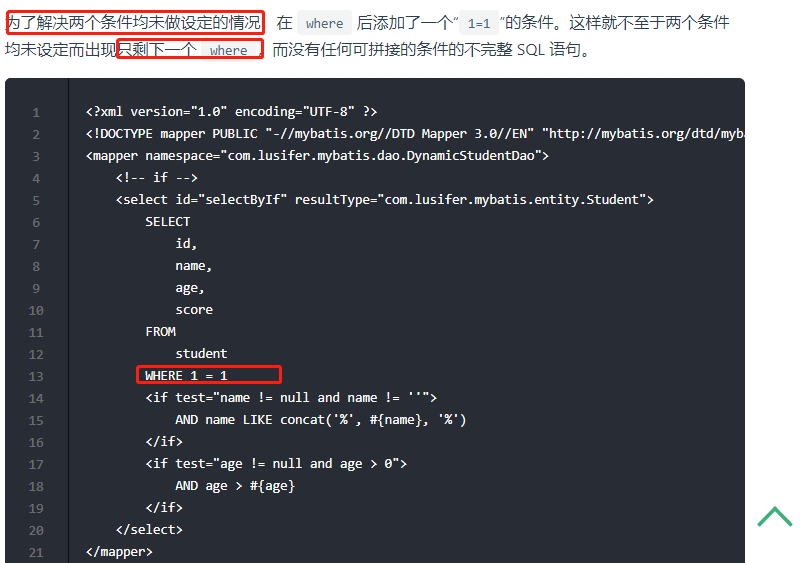
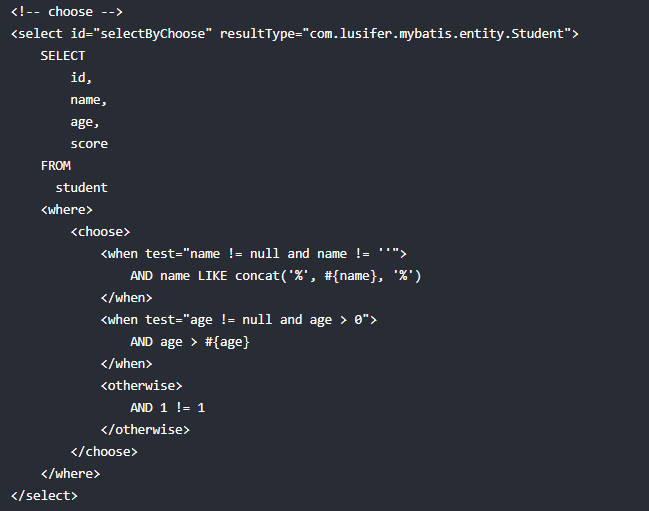
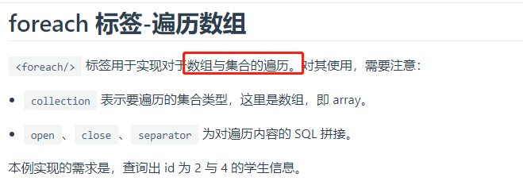
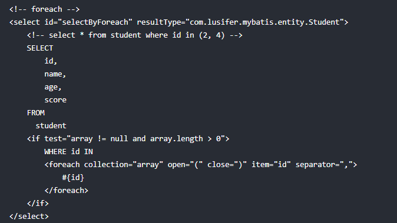
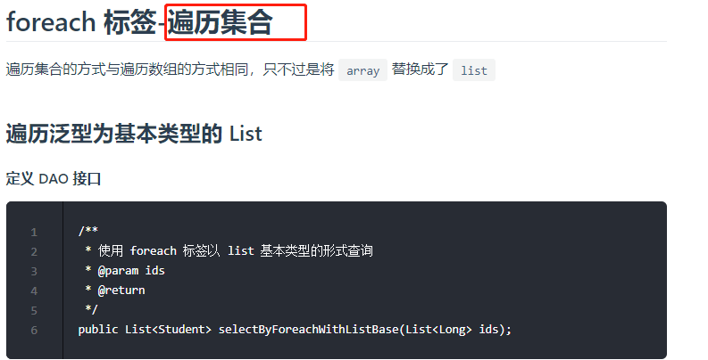
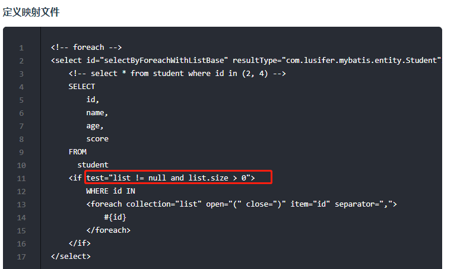
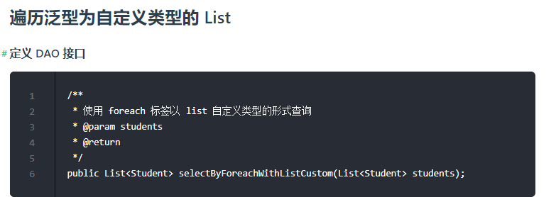
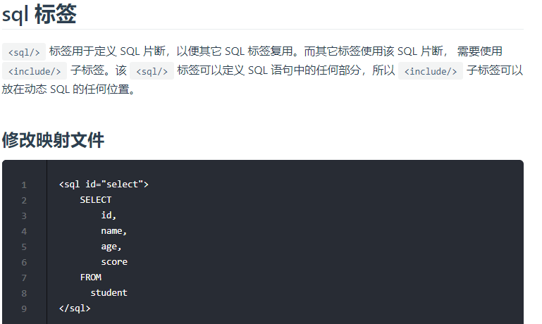
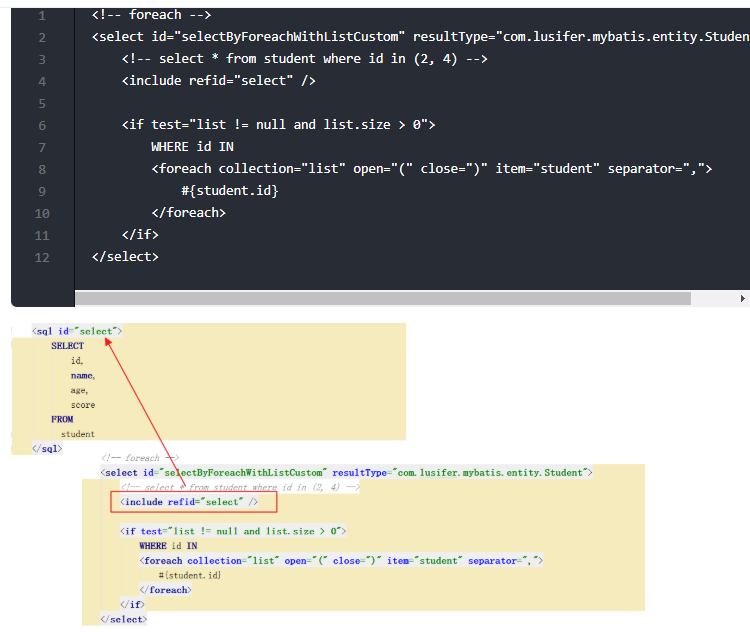

## 如果数据库中的字段和类中的属性不一致怎么办?

User中的用户名是userName,而表中是user_name:

```xml
<select id="selectAll" resultType="User">
  SELECT 
    a.id, 
    a.user_name AS a.userName // 把下划线变成类中的驼峰,好让表中的user_name匹配上类中的userName
   FROM t_user AS a;
</select>
```

# MyBatis的动态SQL

MyBatis 的强大特性之一便是它的动态 SQL, 如下

- if
- choose (里面只可以包含when, otherwise)
- trim (where, set)
- foreach
















# if

对于该标签的执行，当 test 的值为 true 时，会将其包含的 SQL 片断拼接到其所在的 SQL 语句中。

```xml
<select id="findActiveBlogWithTitleLike"
     resultType="Blog">
  SELECT * FROM BLOG 
  WHERE state = ‘ACTIVE’ 
  <if test="title != null">
    AND title like #{title}
  </if>
</select>
```

## choose，when，otherwise

有时我们不想应用到所有的条件语句，而只想从中择其一项 ，如下

```xml
<select id="findActiveBlogLike" resultType="Blog">
  SELECT * FROM BLOG WHERE state = ‘ACTIVE’
  <choose>
    <when test="title != null">
      AND title like #{title}
    </when>
    <when test="author != null and author.name != null">
      AND author_name like #{author.name}
    </when>
    <otherwise>
      AND featured = 1
    </otherwise>
  </choose>
</select>
```

## trim, where, set

在前面，如果所有的条件都是动态sql,那么可能会出现以下情况：

```sql
SELECT * FROM BLOG WHERE
SELECT * FROM BLOG WHERE AND title like ‘someTitle’
```

出现以上错误的sql语句，MyBatis提供了一种解决方式

```xml
<select id="findActiveBlogLike" resultType="Blog">
  SELECT * FROM BLOG 
  <where> 
    <if test="state != null">
         state = #{state}
    </if> 
    <if test="title != null">
        AND title like #{title}
    </if>
    <if test="author != null and author.name != null">
        AND author_name like #{author.name}
    </if>
  </where>
</select>
```

*where* 元素只会在至少有一个子元素的条件返回 SQL 子句的情况下才去插入“WHERE”子句。而且，若语句的开头为“AND”或“OR”，*where* 元素也会将它们去除 。**注意：WHERE只会去掉开头第一个AND或OR**

**使用where会出错的情况，And放在后面**

```xml
<select id="findActiveBlogLike" resultType="Blog">
  SELECT * FROM BLOG 
  <where> 
    <if test="state != null">
         state = #{state}  AND
    </if> 
    <if test="title != null">
        title like #{title} AND
    </if>
    <if test="author != null and author.name != null">
        author_name like #{author.name}
    </if>
  </where>
</select>
```

另外一种解决办法就是使用<trim>标签，使用where，也可能造成最后一个and，使用trim方法如下

```xml
<trim prefix="WHERE" prefixOverrides="AND |OR ">
  ... 
</trim>
```

*prefixOverrides* 属性会忽略通过管道分隔的文本序列（注意此例中的空格也是必要的）。它的作用是移除所有指定在 *prefixOverrides* 属性中的内容（移除前面多余的AND 或者OR），并且插入 *prefix* 属性中指定的内容。 使用suffixOverrides会移除后面多余的AND或者OR。

**set标签与if结合实现动态更新**

```xml
<update id="updateAuthorIfNecessary">
  update Author
    <set>
      <if test="username != null">username=#{username},</if>
      <if test="password != null">password=#{password},</if>
      <if test="email != null">email=#{email},</if>
      <if test="bio != null">bio=#{bio}</if>
    </set>
  where id=#{id}
</update>
```

这里，*set* 元素会动态前置 SET 关键字，同时也会删掉无关的逗号，因为用了条件语句之后很可能就会在生成的 SQL 语句的后面留下这些逗号,也可以使用trim，注意这里我们删去的是后缀值，同时添加了前缀值。 

```xml 
<trim prefix="SET" suffixOverrides=",">
  ...
</trim>
```

## foreach

动态 SQL 的另外一个常用的操作需求是对一个集合进行遍历，通常是在构建 IN 条件语句的时候。比如： 

```xml
<select id="selectPostIn" resultType="domain.blog.Post">
  SELECT *
  FROM POST P
  WHERE ID in
  <foreach item="item" index="index" collection="list"
      open="(" separator="," close=")" index="i">
        #{item}
  </foreach>
</select>
```

**说明:**

- collection：指定要遍历的集合
- item：将当前遍历的每一个元素赋给指定的变量
- separator：每一个元素之间的分隔符
- open：遍历出所有的结果拼接一个开始的字符
- close：遍历出所有的结果拼接一个结束的字符
- index：遍历list的就是索引，遍历map的时候就是map的key,item是map的值

## Mysql下的批量插入

```java
public void addEmp(@Param("emps") List<Employee> emps);
```

```xml
<insert id="addEmp">
	INSERT into employee(name,age)values
  <foreach item="emp" index="index" collection="emps"
      open="(" separator="," close=")" index="i">
        #{emp.name}, #{emp.age}
  </foreach>
</insert>
```

## bind

`bind` 元素可以从 OGNL 表达式中创建一个变量并将其绑定到上下文。比如 

```xml
<select id="selectBlogsLike" resultType="Blog">
  <bind name="pattern" value="'%' + _parameter.getTitle() + '%'" />
  SELECT * FROM BLOG
  WHERE title LIKE #{pattern}
</select>
```

如果是模糊查询，使用下面的方式是行不通的，如下

```xml
<select>
    select * from person
    <if test="lastName != null">
        where lastName like '%#{lastName}%'
    </if>
</select>
```

解决方式之一，可以使用$符号(不安全)

```xml
<select>
    select * from person
    <if test="lastName != null">
        where lastName like '%${lastName}%'
    </if>
</select>
```

解决方式之二，使用bind标签

```xml
<select>
    <bind name="_lastName" value="'%'+lastName+'%'"></bind>
    select * from person
    <if test="lastName != null">
        where lastName like #{_lastName}
    </if>
</select>
```

```xml
<bind name="_lastName" value="'_'+lastName+'%'"></bind><!--表示以什么开始，后面是参数的模糊查询-->
```

## Select查询

查询语句是 MyBatis 中最常用的元素之一 ，简单查询的 select 元素是非常简单的。比如 

<select id="selectPerson" parameterType="int" resultType="hashmap">
  SELECT * FROM PERSON WHERE ID = #{id}
</select>
```

该查询接受一个 int（或 Integer）类型的参数，返回一个 HashMap 类型的对象，键是列名，值是结果行中的对应值。 

select 元素有很多属性允许你配置，来决定每条语句的作用细节 ，如下

```xml
<select
  id="selectPerson"
  parameterType="int"
  parameterMap="deprecated"
  resultType="hashmap"
  resultMap="personResultMap"
  flushCache="false"
  useCache="true"
  timeout="10000"
  fetchSize="256"
  statementType="PREPARED"
  resultSetType="FORWARD_ONLY">
```

| 属性            | 描述                                                         |
| --------------- | ------------------------------------------------------------ |
| `id`            | 在命名空间中唯一的标识符，可以被用来引用这条语句。           |
| parameterMap    | 这是引用外部 parameterMap 的已经被废弃的方法。使用内联参数映射和 parameterType 属性。 |
| `resultType`    | 从这条语句中返回的期望类型的类的完全限定名或别名。注意如果是集合情形，那应该是集合可以包含的类型，而不能是集合本身。使用 resultType 或 resultMap，但不能同时使用。 |
| `resultMap`     | 外部 resultMap 的命名引用。结果集的映射是 MyBatis 最强大的特性，对其有一个很好的理解的话，许多复杂映射的情形都能迎刃而解。使用 resultMap 或 resultType，但不能同时使用。 |
| `flushCache`    | 将其设置为 true，任何时候只要语句被调用，都会导致本地缓存和二级缓存都会被清空，默认值：false。 |
| `useCache`      | 将其设置为 true，将会导致本条语句的结果被二级缓存，默认值：对 select 元素为 true。 |
| `timeout`       | 这个设置是在抛出异常之前，驱动程序等待数据库返回请求结果的秒数。默认值为 unset（依赖驱动）。 |
| `fetchSize`     | 这是尝试影响驱动程序每次批量返回的结果行数和这个设置值相等。默认值为 unset（依赖驱动）。 |
| `statementType` | STATEMENT，PREPARED 或 CALLABLE 的一个。这会让 MyBatis 分别使用 Statement，PreparedStatement 或 CallableStatement，默认值：PREPARED。 |
| `resultSetType` | FORWARD_ONLY，SCROLL_SENSITIVE 或 SCROLL_INSENSITIVE 中的一个，默认值为 unset （依赖驱动）。 |
| `databaseId`    | 如果配置了 databaseIdProvider，MyBatis 会加载所有的不带 databaseId 或匹配当前 databaseId 的语句；如果带或者不带的语句都有，则不带的会被忽略。 |
| `resultOrdered` | 这个设置仅针对嵌套结果 select 语句适用：如果为 true，就是假设包含了嵌套结果集或是分组了，这样的话当返回一个主结果行的时候，就不会发生有对前面结果集的引用的情况。这就使得在获取嵌套的结果集的时候不至于导致内存不够用。默认值：`false`。 |
| `resultSets`    | 这个设置仅对多结果集的情况适用，它将列出语句执行后返回的结果集并每个结果集给一个名称，名称是逗号分隔的。 |

## insert update delete

数据变更语句 insert，update 和 delete 的实现非常接近 ,如下

```xml
<insert
  id="insertAuthor"
  parameterType="domain.blog.Author"
  flushCache="true"
  statementType="PREPARED"
  keyProperty=""
  keyColumn=""
  useGeneratedKeys=""
  timeout="20">

<update
  id="updateAuthor"
  parameterType="domain.blog.Author"
  flushCache="true"
  statementType="PREPARED"
  timeout="20">

<delete
  id="deleteAuthor"
  parameterType="domain.blog.Author"
  flushCache="true"
  statementType="PREPARED"
  timeout="20">
```

**属性说明**

| `id`               | 命名空间中的唯一标识符，可被用来代表这条语句。               |
| ------------------ | ------------------------------------------------------------ |
| `parameterType`    | 将要传入语句的参数的完全限定类名或别名。这个属性是可选的，因为 MyBatis 可以通过 TypeHandler 推断出具体传入语句的参数，默认值为 unset。 |
| `flushCache`       | 将其设置为 true，任何时候只要语句被调用，都会导致本地缓存和二级缓存都会被清空，默认值：true（对应插入、更新和删除语句）。 |
| `timeout`          | 这个设置是在抛出异常之前，驱动程序等待数据库返回请求结果的秒数。默认值为 unset（依赖驱动）。 |
| `statementType`    | STATEMENT，PREPARED 或 CALLABLE 的一个。这会让 MyBatis 分别使用 Statement，PreparedStatement 或 CallableStatement，默认值：PREPARED。 |
| `useGeneratedKeys` | （仅对 insert 和 update 有用）这会令 MyBatis 使用 JDBC 的 getGeneratedKeys 方法来取出由数据库内部生成的主键（比如：像 MySQL 和 SQL Server 这样的关系数据库管理系统的自动递增字段），默认值：false。 |
| `keyProperty`      | （仅对 insert 和 update 有用）唯一标记一个属性，MyBatis 会通过 getGeneratedKeys 的返回值或者通过 insert 语句的 selectKey 子元素设置它的键值，默认：`unset`。如果希望得到多个生成的列，也可以是逗号分隔的属性名称列表。 |
| `keyColumn`        | （仅对 insert 和 update 有用）通过生成的键值设置表中的列名，这个设置仅在某些数据库（像 PostgreSQL）是必须的，当主键列不是表中的第一列的时候需要设置。如果希望得到多个生成的列，也可以是逗号分隔的属性名称列表。 |
| `databaseId`       | 如果配置了 databaseIdProvider，MyBatis 会加载所有的不带 databaseId 或匹配当前 databaseId 的语句；如果带或者不带的语句都有，则不带的会被忽略。 |

**示例**

```xml
<insert id="insertAuthor">
  insert into Author (id,username,password,email,bio)
  values (#{id},#{username},#{password},#{email},#{bio})
</insert>

<update id="updateAuthor">
  update Author set
    username = #{username},
    password = #{password},
    email = #{email},
    bio = #{bio}
  where id = #{id}
</update>

<delete id="deleteAuthor">
  delete from Author where id = #{id}
</delete>
```

**多行插入**

```xml
<insert id="insertAuthor" useGeneratedKeys="true"
    keyProperty="id">
  insert into Author (username, password, email, bio) values
  <foreach item="item" collection="list" separator=",">
    (#{item.username}, #{item.password}, #{item.email}, #{item.bio})
  </foreach>
</insert>
```

**自动生成主键**

```xml
<insert id="insertAuthor" useGeneratedKeys="true"
    keyProperty="id">
  insert into Author (username,password,email,bio)
  values (#{username},#{password},#{email},#{bio})
</insert>
```


## 映射文件小结

- Mybatis允许增删改直接定义的返回值：Integer，Long，Boolean,返回的是改变数据库表的记录数和true和false
- 支持自动生成主键的字段，设置 useGeneratedKeys=”true”，然后再把 keyProperty 设置到目标属性上就OK了。
- 数据库还支持多行插入, 你也可以传入一个数组或集合，并返回自动生成的主键 

## 映射文件参数处理

- 单个参数：MyBatis不会做特殊处理，#{参数名/任意名}：取出参数值
- 多个参数：MyBatis会做特殊处理，多个参数被封装为一个map,key：param1...param10或者参数的索引
- 命名参数，多个参数使用#{param1}来取值导致错乱，故使用命名参数，明确指定封装map的key,如下

```java
public Person getPerson(@Param("id") Integer id,@Param("name") String laseName);
```

这个时候在xml文件中可以使用#{id}和#{name}来取值

- 如果传入多个参数正好是POJO：可以使用#{属性名}直接获取。
- 如果传入多个参数不是POJO,为了方便，我们可以传入map,如下

```java
public Person getPerson(Map<String,Object> map);
```

这个时候也就可以在xml文件中使用#{key}直接取出传入map的key对应的值

- 如果传入多个参数不是POJO,但是查询频率高，使用map不方便，可以编写一个TO(数据传输对象)
- 如果传入了一个Collection（list，set）类型或者数组，也会特殊处理，也是吧list或者数组封装到map中，传入的类型不一样，对应的key如下：Collection（collection）,List（list），数组（array）,示例如下

```java
public Person get(List<Integer> ids);
```

传入的是一个list集合，在xml文件中，我们如果需要取出list中的第一个元素为：#{list[0]}

## #和$取值区别

- 取值的方式#{}是以预编译的形式，将参数设置到sql语句中；PreparedStatement；防止sql注入
- ${}:取出的值直接拼装在sql语句中；会有安全问题；大多情况下，我们去参数的值都应该去使用#{}；
- 原生jdbc不支持占位符的地方我们就可以使用${}进行取值比如分表、排序。；按照年份分表拆分

```sql
select * from ${year}_salary where xxx;
select * from tbl_employee order by ${f_name} ${order}
```

## select查询返回类型

- 返回一个集合：resultType写集合中元素的类型
- 返回一条记录的map，key为列名，value为列对应的值，例如

```java
public Map<String ,Object> getPersonByMap(Integer id);
```

```xml
<select id = "getPersonByMap" resultType="map">
  select * from person where id = #{id}
</select>
```

- 返回多条记录封装的一个map，Map<Integer,Person>:key是这条记录的主键，值是记录封装后的pojo,如下

```java
@MapKey("id")
public Map<Integer,Person> getPersonByName(String name);
```

```xml
<select id = "getPersonByName" resultType="com.test.Person">
  select * from person where last_name like #{name}
</select>
```

@MapKey("id")注解表示使用那个属性作为返回结果map的key。

## resultMap自定义结果集

**示例**

```xml
<restMap id="baseMap" type="com.test.Person">
  <id column="id" property="id"/>
    <result column="last_name" property="lastName" ></result>
</restMap>
<select id="getPerson" restMap="baseMap">
  select * from person
</select>
```

**resultMap关联属性_级联属性封装结果集**

例如：员工有部门属性，联合查询返回封装结果

```xml
<restMap id="baseMap" type="com.test.Person">
  <id column="id" property="id"/>
    <result column="last_name" property="lastName" ></result>
     <result column="dept_id" property="dept.id" ></result>
     <result column="dept_name" property="dept.name" ></result>
</restMap>
```

**使用association指定联合的java对象**

```xml
<restMap id="baseMap" type="com.test.Person">
  <id column="id" property="id"/>
    <result column="last_name" property="lastName" ></result>
    <association property="dept" javaType="com.test.DepartMent">
         <id column="dept_id" property="id"/>
       <result column="dept_name" property="name" ></result>
    </association>
</restMap>
```

**使用collection定义关联集合的封装规则**

例如，查询部门的时候，查询出当前部门下的所有员工

```xml
<restMap id="baseMap" type="com.test.DepartMent">
  <id column="dept_id" property="id"/>
    <result column="dept_name" property="name" ></result>
    <collection property="persons" javaType="com.test.Person">
         <id column="id" property="id"/>
       <result column="last_name" property="lastName" ></result>
    </collection>
</restMap>
```

## sql标签

这个元素可以被用来定义可重用的 SQL 代码段，可以包含在其他语句中。它可以被静态地(在加载参数) 参数化. 不同的属性值通过包含的实例变化. 比如： 

```xml
<sql id="userColumns"> ${alias}.id,${alias}.username,${alias}.password </sql>
```

这个 SQL 片段可以被包含在其他语句中，例如： 

```xml
<select id="selectUsers" resultType="map">
  select
    <include refid="userColumns"><property name="alias" value="t1"/></include>,
    <include refid="userColumns"><property name="alias" value="t2"/></include>
  from some_table t1
    cross join some_table t2
</select>
```