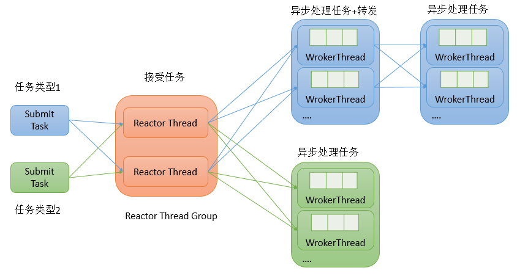

## Reactor线程模型

首先要需要说明的是，reactor线程模型并不是netty所独有，其是一种并发编程模型，更确切的或者说一种思想，其具有的是指导意义，开发者需要在这种编程模型思想的指导下，结合自己的实际场景，来进行合理的设计。在不同的场景下，可能设计出来的reactor线程模型是不一样的，例如scala中的akka框架，就是基于reactor线程模型的思想设计的。换句话说，netty只是结合了nio网络编程的特点，合理的应用了reactor线程模型。关于netty是如何合理的利用reactor线程模型，将在之后讲解。

现在我们还是需要简单的介绍一下有哪些典型的reactor线程模型设计方式。回顾串行工作者模型和并行工作者模型，它们主要的关注点是：划分任务的接受阶段与任务的处理阶段。也正是因为如此，我们通常将`接受任务的线程称之为Accept Thread`。而任务的处理过程都是一个线程(worker thread)内完成的。

reactor线程模型关注的是：任务接受之后，对处理过程继续进行切分，划分为多个不同的步骤，每个步骤用不同的线程来处理，也就是原本由一个线程处理的任务现在由多个线程来处理，每个线程在处理完自己的步骤之后，还需要将任务转发到线程继续进行处理。为了进行区分，在reactor线程模型中，处理任务并且分发的线程，不再称之为worker thread，而是reactor thread。

### 单线程reactor线程模型

下图演示了单线程reactor线程模型，之所以称之为单线程，还是`因为只有一个accept Thread接受任务`，之后转发到reactor线程中进行处理。两个黄色框表示的是`Reactor Thread Group`，里面有多个Reactor Thread。一个Reactor Thread Group中的Reactor Thread功能都是相同的`，例如第一个黄色框中的Reactor Thread都是处理拆分后的任务的第一阶段，第二个黄色框中的Reactor Thread都是处理拆分后的任务的第二步骤。任务具体要怎么拆分，要结合具体场景，下图只是演示作用。一般来说，都是以比较耗时的操作(例如IO)为切分点。

    特别的，如果我们在任务处理的过程中，不划分为多个阶段进行处理的话，那么单线程reactor线程模型就退化成了并行工作和模型。事实上，可以认为并行工作者模型，就是单线程reactor线程模型的最简化版本。

### 多线程reactor线程模型

所谓多线程reactor线程模型，无非就是`有多个accept线程`，如下图中的虚线框中的部分:

### 混合型reactor线程模型

 混合型reactor线程模型，实际上最能体现reactor线程模型的本质：

>将任务处理切分成多个阶段进行，每个阶段处理完自己的部分之后，转发到下一个阶段进行处理。不同的阶段之间的执行是异步的，可以认为每个阶段都有一个独立的线程池。

不同的类型的任务，有着不同的处理流程，划分时需要划分成不同的阶段。如下图蓝色是一种任务、绿色是另一种任务，两种任务有着不同的执行流程

