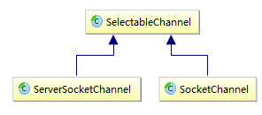

# Netty中的Channel

Netty中的Channel(通道)是对java原生网络编程api的封装，Netty中顶级接口是`io.netty.channel.Channel`.

以TCP编程为例 ，在java中，有两种方式：

1. 基于BIO，JDK1.4之前，我们通常使用java.net包中的`ServerSocket和Socket`来代表服务端和客户端。
2. 基于NIO，Jdk1.4引入nio编程之后，我们使用`java.nio.channels包中的ServerSocketChannel和SocketChannel`来代表服务端与客户端。

在Netty中，对java中的BIO、NIO编程api都进行了封装，分别：

1. 使用了`OioServerSocketChannel，OioSocketChannel`对java.net包中的ServerSocket与Socket进行了封装
2. 使用`NioServerSocketChannel和NioSocketChannel`对java.nio.channels包中的ServerSocketChannel和SocketChannel进行了封装。

**Netty中TCP编程的Channel类图继承关系如下：**


>很容易可以看出，图中左半部分与右半部分是相互对应的：

- 左半部分代表的是客户端：都实现了`io.netty.channel.socket.SocketChannel`接口
- 右半部分代表的是服务端：都实现了`io.netty.channel.ServerChannel`接口，这是一个标记接口。

特别需要注意的是，虽然Netty使用通道的概念，对java原生BIO、NIO编程api都进行了封装，但是通道的概念其实是在java 1.4之后引入nio编程才出现的，因此只有NioServerSocketChannel和NioSocketChannel才有对应的java通道，可以看到这二者都继承自`AbstractNioChannel`，其维护了netty中的channel与java nio中channel的对应关系，并提供了`javaChannel()`方法获取对应的java 中的channel：

```java
public abstract class AbstractNioChannel extends AbstractChannel {
 ...
private final SelectableChannel ch;
 ...
 protected SelectableChannel javaChannel() {//获取对应的java通道
    return ch;
 }
}
```

上述代码片段中`SelectableChannel`是java nio中的类，`java.nio.channels.SocketChannel`、`java.nio.channels.ServerSocketChannel`都是其子类



**NioSocketChannel和NioServerSocketChannel对AbstractNioChannel的javaChannel()进行了覆写，如下：**

```java
// io.netty.channel.socket.nio.NioServerSocketChannel#javaChannel

@Override
protected ServerSocketChannel javaChannel() {//返回java.nio.channels.ServerSocketChannel
  return (ServerSocketChannel) super.javaChannel();
}
```

```java
//io.netty.channel.socket.nio.NioSocketChannel#javaChannel

@Override
protected SocketChannel javaChannel() {//返回java.nio.channels.SocketChannel
    return (SocketChannel) super.javaChannel();
}
```

**对于OioSocketChannel和OioServerSocketChannel，是直接继承自AbstractChannel，内部直接维护了对应的`java.net.Socket`和`java.net.ServerSocket`**

```java
public class OioSocketChannel extends OioByteStreamChannel
                              implements SocketChannel {
...
private final Socket socket;
....
}
```

```java
public class OioServerSocketChannel extends AbstractOioMessageChannel
                                    implements ServerSocketChannel {
...
final ServerSocket socket;
...
}
```