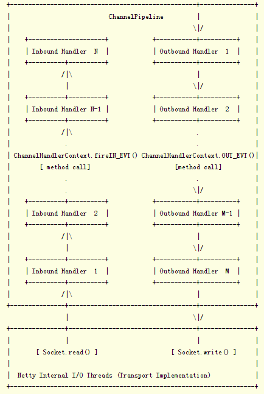
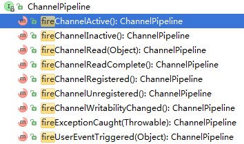

# ChannelHandler

## ChannelHandler

在nio编程中，我们经常需要对channel的输入和输出事件(统称为IO事件)进行处理，Netty抽象出一个`ChannelHandler`概念，专门用于处理此类事件。

因为IO事件分为输入和输出，因此ChannelHandler又具体的分为`ChannelInboundHandler和ChannelOutboundHandler`，分别用于某个阶段输入输出事件的处理。[注意: bound: 界, Inbound: 入站，入界, Outbound: 出站，出界]


## ChannelHandlerAdapter

---
    对于ChannelHandlerAdapter、ChannelInboundHandlerAdapter 、ChannelOutboundHandlerAdapter，
    从名字就可以看出来其作用是适配器，适配器是一种设计模式。
    
    设想一个，一个接口可能定义很多抽象方法，如果子类直接实现，必定要全部实现这些方法，使得代码很臃肿,
    因为我这个子类只需要使用一部分方法，另一部分方法对我来说没用.我不关心.
    
    由于接口中定义的有些方法是公共的，还有一些方法可能是子类并不关心的，
    因此通过适配器类，提供这些方法的默认实现。这样的话，在编程的时候，子类只需要覆写自己感兴趣的方法即可。
    
    这提示我们，在使用netty进行编程的时候，对于输入事件的处理，我们应该继承ChannelInboundHandlerAdapter类，
    而不是直接实现ChannelInboundHandler接口；反之对于输出事件，我们应该继承ChannelOutboundHandlerAdapter类。
---

在处理channel的IO事件时，我们通常会分成几个阶段。以读取数据为例，通常我们的处理顺序是：

     处理半包或者粘包问题-->数据的解码(或者说是反序列化)-->数据的业务处理

可以看到不同的阶段要执行不同的功能，`因此通常我们会编写多个ChannelHandler，来实现不同的功能`。而且多个ChannelHandler之间的顺序不能颠倒，例如我们必须先处理粘包解包问题，之后才能进行数据的业务处理。

## ChannelPipeline

Netty中通过`ChannelPipeline`来保证`ChannelHandler`之间的处理顺序。每一个Channel对象创建的时候，都会自动创建一个关联的`ChannelPipeline`对象，我们可以通过`io.netty.channel.Channel`对象的`pipeline()`方法获取这个对象实例。

>ChannelPipeline 的具体的创建过程定义AbstractChannel类的构造方法中：

```java
package io.netty.channel;
public abstract class AbstractChannel extends DefaultAttributeMap implements Channel {
....
private final DefaultChannelPipeline pipeline;
....
// 因为ChannelPipleLine的创建是定义在AbstractChannel的构造方法中的，
// 而每个Channel只会被创建一次，只会调用一次构造方法，因此每个Channel实例唯一对应一个ChannelPipleLine 实例。
protected AbstractChannel(Channel parent) {
    this.parent = parent;
    id = newId();
    unsafe = newUnsafe();
    // 我们可以看到ChannelPipleLine的具体创建过程实际上是通过return new DefaultChannelPipeline(this);实现的。
    pipeline = newChannelPipeline();//创建默认的pipeline
}

....
protected DefaultChannelPipeline newChannelPipeline() {
    // // DefaultChannelPipeline是ChannelPipeline的默认实现类。
    return new DefaultChannelPipeline(this);
}
....

@Override
    public ChannelPipeline pipeline() {//实现Chnannel定义的pipeline方法，返回pipeline实例
        return pipeline;
    }
}
```

回顾典型的服务端代码的编写：

```java
serverBootstrap.group(bossGroup, workerGroup)
               .channel(NioServerSocketChannel.class)
               .childHandler(new ChannelInitializer<SocketChannel>() {
                   // 在接受到一个SocketChannel的时候，通过initChannel方法来进行初始化，即将我们自定义的ChildChannelHandler1和ChildChannelHandler2添加到SocketChannel关联的ChannelPipeline中。
                       @Override
                       public void initChannel(SocketChannel ch) throws Exception {
                              ch.pipeline().addLast(new ChildChannelHandler1());
                              ch.pipeline().addLast(new ChildChannelHandler2());
                             }
                           })
                .bind(port);
```

>ChannelPipeline 除了负责配置handler的顺序，还负责在收到读/写事件之后按照顺序调用这些handler。以下左图显示读操作的调用过程，右边的显示了写事件调用过程。



## 输入事件和输出事件处理器以及调用顺序

举例来说，假设我们按照如下方式创建了一个ChannelPipeline对象。

```java
// 我们这里假设:
// InboundHandlerA、InboundHandlerB实现了ChannelInboundHandler接口
// OutboundHandlerA、OutboundHandlerB实现了ChannelOutboundHandler接口
// InboundOutboundHandlerX同时实现了ChannelInboundHandler和ChannelOutboundHandler接口
// 前面的1、2、3、4、5并不是handler的编号，而是handler的名字，ChannelPipeline允许在添加handler的时候为其指定一个名字。
ChannelPipeline p = ...;
   p.addLast("1", new InboundHandlerA());
   p.addLast("2", new InboundHandlerB());
   p.addLast("3", new OutboundHandlerA());
   p.addLast("4", new OutboundHandlerB());
   p.addLast("5", new InboundOutboundHandlerX());
```

>可以看到我们在一个ChannelPipeline钟同时定义了输出和输出事件的处理器。需要注意的是，
 
- 当一个输入事件来的时候，输出事件处理器是不会发生作用的；反之亦然
- 当一个输入事件来了之后，事件处理器的调用顺序为1,2,5
- 当一个输出事件来了之后，事件处理器的处理顺序为5,4,3。(注意输出事件的处理器发挥作用的顺序与定义的顺序是相反的)

---
>ChannelPipeline添加ChannelHandler需要注意的是：

1. 默认情况下，一个ChannelPipeline实例中，同一个类型ChannelHandler只能被添加一次，如果添加多次，则会抛出异常，具体参见io.netty.channel.DefaultChannelPipeline#checkMultiplicity。如果需要多次添加同一个类型的ChannelHandler的话，则需要在该ChannelHandler实现类上添加@Sharable注解。
2. 在ChannelPipeline中，每一个ChannelHandler都是有一个名字的，而且名字必须的是唯一的，如果名字重复了，则会抛出异常，参见io.netty.channel.DefaultChannelPipeline#checkDuplicateName。
3. 如果添加ChannelHandler的时候没有显示的指定名字，则会按照规则其起一个默认的名字。具体规则如下，如果ChannelPipeline中只有某种类型的handler实例只有一个,如XXXHandler,YYYHandler，则其名字分别为XXXHandler#0，YYYHandler#0，如果同一类型的Handler有多个实例，则每次之后的编号加1。具体可参见io.netty.channel.DefaultChannelPipeline#generateName方法。
---

## ChannelHandlerContext

>前面提到可以通过ChannelPipeline的添加方法，按照顺序添加ChannelHandler，并在之后按照顺序进行调用。事实上，每个ChannelHandler会被先封装成ChannelHandlerContext。之后再封装进ChannelPipeline中。

以DefaultChannelPipeline的addLast方法为例，如果查看源码，最终会定位到以下方法：`DefaultChannelPipeline#addLast(EventExecutorGroup, String,ChannelHandler)`

```java
@Override
public ChannelPipeline addLast(EventExecutorGroup group, final String name, ChannelHandler handler) {
    synchronized (this) {
        checkDuplicateName(name);//check这种类型的handler实例是否允许被添加多次
       //将handler包装成一个DefaultChannelHandlerContext类
        AbstractChannelHandlerContext newCtx = new DefaultChannelHandlerContext(this, group, name, handler);
        addLast0(name, newCtx);//维护AbstractChannelHandlerContext的先后关系
    }
 
    return this;
}
```

可以看到的确是先将ChannelHandler当做参数构建成一个DefaultChannelHandlerContext实例之后，再调用addLast0方法维护ChannelHandlerContext的先后关系，从而确定了ChannelHandler的先后关系。

**ChannelHandlerContext的类图继承关系如下：**


ChannelPipeline的默认实现类是DefaultChannelPipeline，ChannelHandlerContext的默认实现类是DefaultChannelHandlerContext。

DefaultChannelPipeline内部是通过一个双向链表记录ChannelHandler的先后关系，而双向链表的节点是AbstractChannelHandlerContext类。

以下是AbstractChannelHandlerContext类的部分源码(双向链表节点)：

```java
abstract class AbstractChannelHandlerContext extends DefaultAttributeMap
        implements ChannelHandlerContext, ResourceLeakHint {
...
volatile AbstractChannelHandlerContext next;//当前节点的上一个节点
volatile AbstractChannelHandlerContext prev;//当前节点的下一个节点
...
}
```

DefaultChannelPipeline内部通过两个哨兵节点HeadContext和TailContext作为链表的开始和结束，熟悉双向链表数据结构的同学，肯定知道，设置哨兵可以在移除节点的时候，不需要判断是否是最后一个节点。相关源码如下：

```java
public class DefaultChannelPipeline implements ChannelPipeline {
...
private static final String HEAD_NAME = generateName0(HeadContext.class);
private static final String TAIL_NAME = generateName0(TailContext.class);
...
final AbstractChannelHandlerContext head;//双向链表的头元素
final AbstractChannelHandlerContext tail;//双向列表的尾部元素
 
private final Channel channel;
....
protected DefaultChannelPipeline(Channel channel) {
    this.channel = ObjectUtil.checkNotNull(channel, "channel");
     ....
    tail = new TailContext(this);//创建双向链表头部元素实例
    head = new HeadContext(this);//创建双向链表的尾部元素实例
    //设置链表关系
    head.next = tail;
    tail.prev = head;
}
....
....
private void addLast0(AbstractChannelHandlerContext newCtx) {
   //设置ChannelHandler的先后顺序关系
    AbstractChannelHandlerContext prev = tail.prev;
    newCtx.prev = prev;
    newCtx.next = tail;
    prev.next = newCtx;
    tail.prev = newCtx;
   }
 }
```

很明显HeadContext和TailContext除了作为哨兵，还有其他的作用，这个我们稍后介绍。

---
    思考为什么DefaultChannelPipeline不是直接添加ChannelHander到其中，而是通过将其包装成AbstractChannelHandlerContext类后再添加？
    
     答案很简单，ChannelHandler本身不知道下一个ChannelHandler 是谁，或者有没有下一个ChannelHandler，
     这些信息需要ChannelPipeline类来维护。只不过DefaultChannelPipeline选择通过链表的方式来记录来实现这个关系。
     你完全也可以自定义了一个ChannelPipeline的实现，通过其他任何方式来维护,例如通过一个数组。
    
      另外一个原因是，因为ChannelHander通常是由开发者自己实现的，在回调其方法时，
      我们可以AbstractChannelHandlerContext给其封装更多的有用的信息。
---

## ChannelHandler、ChannelPipeline、ChannelHandlerContext的联合工作过程

前面提到DefaultChannelPipeline是将ChannelHandler包装成AbstractChannelHandlerContext类之后，再添加到链表结构中的，从而实现handler的级联调用。

ChannelInboundHandler 接口定义的9个方法：

```java
public interface ChannelInboundHandler extends ChannelHandler {
    void channelRegistered(ChannelHandlerContext ctx) throws Exception;
    void channelUnregistered(ChannelHandlerContext ctx) throws Exception;
    void channelActive(ChannelHandlerContext ctx) throws Exception;
    void channelInactive(ChannelHandlerContext ctx) throws Exception;
    void channelRead(ChannelHandlerContext ctx, Object msg) throws Exception;
    void channelReadComplete(ChannelHandlerContext ctx) throws Exception;
    void userEventTriggered(ChannelHandlerContext ctx, Object evt) throws Exception;
    void channelWritabilityChanged(ChannelHandlerContext ctx) throws Exception;
    void exceptionCaught(ChannelHandlerContext ctx, Throwable cause) throws Exception;
}
```

而在ChannelPipeline和ChannelHandlerContext中，都定义了相同的9个以fire开头的方法，如下所示



可以发现这两个接口定义的9个方法与ChannelInboundHandler定义的9个方法是一一对应的，只是在定义每个方法的时候，在前面加了1个fire。

---
    从总体上来说，在调用的时候，是按照如下顺序进行的：

1. 先是ChannelPipeline中的fireXXX方法被调用
2. ChannelPipeline中的fireXXX方法接着调用ChannelPipeline维护的ChannelHandlerContext链表中的第一个节点即HeadContext 的fireXXX方法
3. ChannelHandlerContext 中的fireXXX方法调用ChannelHandler中对应的XXX方法。由于可能存在多个ChannelHandler，因此每个ChannelHandler的xxx方法又要负责调用下一个ChannelHandlerContext的fireXXX方法，直到整个调用链完成
---

### 下面详细介绍每个fire方法被调用的时机

fireChannelRegistered() 和fireChannelActive()是在Channel注册到EventLoop中时调用的，只会被调用一次

相关源码位于：`io.netty.channel.AbstractChannel.AbstractUnsafe#register0`

```java
private void register0(ChannelPromise promise) {
    try {
        ...
        doRegister();//注册通道到EventLoop中
        registered = true;
        safeSetSuccess(promise);
        pipeline.fireChannelRegistered();//注册成功，调用fireChannelRegistered()
        if (isActive()) {
            pipeline.fireChannelActive();//如果激活，调用fireChannelActive()
        }
    } catch (Throwable t) {
        ....
    }
}
```

注意isActive方法是抽象方法，由子类覆盖，可以查看NioServerSocketChannel和NioSocketChannel的isActive方法，查看这两个通道在什么情况下属于激活状态。

类似的，当取消注册时候fireChannelInactive()、fireChannelUnregistered()会被调用

fireChannelRead(Object msg) 和fireChannelReadComplete()在有数据需要读取的情况下会被触发，可能会被触发多次

相关源码位于io.netty.channel.nio.AbstractNioByteChannel.NioByteUnsafe#read

```java
@Override
public void read() {
    ....
    try {
        int totalReadAmount = 0;
        boolean readPendingReset = false;
        do {
            ....
            pipeline.fireChannelRead(byteBuf);//有数据要读取，调用fireChannelRead
            ....
        } while (++ messages < maxMessagesPerRead);
 
        pipeline.fireChannelReadComplete();//数据读取完成，调用fireChannelReadComplete()
        ....
    } catch (Throwable t) {
        handleReadException(pipeline, byteBuf, t, close);
    } finally {
        ....
    }
}
```

fireExceptionCaught()方法，在读取数据出错的情况下，会被调用

在上述代码片段中，有一个handleReadException方法，表示如果读取数据出错的处理逻辑，其内部会调用fireExceptionCaught()

io.netty.channel.nio.AbstractNioByteChannel.NioByteUnsafe#handleReadException

```java
private void handleReadException(ChannelPipeline pipeline,
                        ByteBuf byteBuf, Throwable cause, boolean close) {
    ....
    pipeline.fireExceptionCaught(cause);//出现异常时，调用fireExceptionCaught
    if (close || cause instanceof IOException) {
        closeOnRead(pipeline);
    }
}
```

fireUserEventTriggered(Object event) 当正在读取数据的时候，如果连接关闭，调用此方法

上述代码片段在处理异常的时候，会判断异常类型是否是IOException或者连接是否关闭，如果是，则调用closeOnRead方法，这个方法内部会调用 fireUserEventTriggered(Object event)

io.netty.channel.nio.AbstractNioByteChannel.NioByteUnsafe#closeOnRead

```java
private void closeOnRead(ChannelPipeline pipeline) {
    SelectionKey key = selectionKey();
    setInputShutdown();
    if (isOpen()) {
        if (Boolean.TRUE.equals(config().getOption(ChannelOption.ALLOW_HALF_CLOSURE))) {
            key.interestOps(key.interestOps() & ~readInterestOp);
            pipeline.fireUserEventTriggered(ChannelInputShutdownEvent.INSTANCE);//调用fireUserEventTriggered方法
        } else {
            close(voidPromise());
        }
    }
}
```

fireChannelWritabilityChanged()方法，当有数据需要输出的时候被调用

相关源码位于：

io.netty.channel.ChannelOutboundBuffer#incrementPendingOutboundBytes

```java
void incrementPendingOutboundBytes(int size) {
    ...
    long newWriteBufferSize = TOTAL_PENDING_SIZE_UPDATER.addAndGet(this, size);
    if (newWriteBufferSize > channel.config().getWriteBufferHighWaterMark()) {
        if (WRITABLE_UPDATER.compareAndSet(this, 1, 0)) {
            channel.pipeline().fireChannelWritabilityChanged();//需要输出数据，调用fireChannelWritabilityChanged()
        }
    }
}
```
