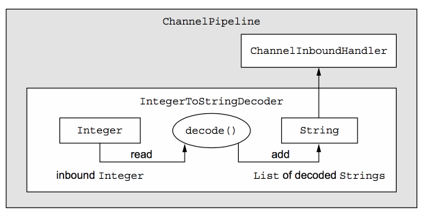
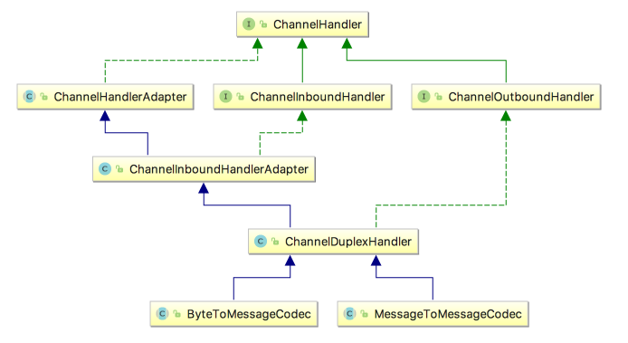

# Netty编解码框架

## 1 Netty编解码框架

在上一节中，我们提到TCP的粘包、拆包问题，可以通过自定义通信协议的方式来解决。通信协议就是通信双方约定好的数据格式，发送方按照这个数据格式来发送，接受方按照这个格式来解析。

>典型的协议包括：定长协议、特殊字符分隔符协议、报文头指定Length等。在确定了使用什么通信协议的情况下，发送方和接收方要完成的工作不同：

---
    编码：发送方要将发送的二进制数据转换成协议规定的格式的二进制数据流，称之为编码(encode)，编码功能由编码器(encoder)完成。

    解码：接收方需要根据协议的格式，对二进制数据进行解析，称之为解码(decode)，解码功能由解码器(decoder)完成。

    编解码：如果有一种组件，既能编码，又能解码，则称之为编码解码器(codec)。这种组件在发送方和接收方都可以使用。
---

因此对于开发人员而言，我们要做的工作主要就是2点：`确定协议、编写协议对应的编码器/解码器。`

### 公有协议和私有协议

协议分为公有协议和私有协议。所谓公有协议，指的是业界普遍遵循的通信协议，Netty提供了大量公有协议数据格式的编码解码器，从而简化开发者的使用。例如：

- 你想开发一个基于Netty的邮件服务器，你将会发现Netty针对POP3、IMAP、SMTP协议的数据格式都提供了相应的编码解码器。
- 如果你想自己开发一个web服务器，你会发现Netty提供好了HTTP协议、Websocket协议相应的编解码器。
- 甚至，对于一些业界流行的组件，如redis、memcached这两个缓存服务器，netty都提供了相应的解码器，因此如果你有意愿的话，可以自己编写访问redis、memcached服务器的client，甚至是开源出去给其他人使用。

>另外一方面，可能有的时候，我们希望定义一些私有协议，例如你们的公司需要编写一个RPC框架，这个框架仅限于公司内部使用。这个时候，因为协议本身还没有，对应的编解码器也没有，所以我们就要自己实现。

Netty提供了一套完善的编解码框架，不论是公有协议/私有协议，我们都可以在这个框架的基础上，非常容易的实现相应的编码/解码器。输入的数据是在ChannelInboundHandler中处理的，数据输出是在ChannelOutboundHandler中处理的。因此编码器/解码器实际上是这两个接口的特殊实现类，不过它们的作用仅仅是编码/解码。

## 2 解码器

对于解码器，Netty中主要提供了抽象基类ByteToMessageDecoder和MessageToMessageDecoder


### 2.1 抽象类ByteToMessageDecoder

用于将接收到的二进制数据(Byte)解码，得到完整的请求报文(Message)。

通常，ByteToMessageDecoder解码后内容会得到一个ByteBuf实例列表，每个ByteBuf实例都包含了一个完整的报文信息。你可以直接把这些ByteBuf实例直接交给之后的ChannelInboundHandler处理，或者将这些包含了完整报文信息的ByteBuf实例解析封装到不同的Java对象实例后，再交其处理。`不管哪一种情况，之后的ChannelInboundHandler在处理时不需要在考虑粘包、拆包问题。`

---
    ByteToMessageDecoder提供的一些常见的实现类：
    
    FixedLengthFrameDecoder：定长协议解码器，我们可以指定固定的字节数算一个完整的报文
    
    LineBasedFrameDecoder：行分隔符解码器，遇到\n或者\r\n，则认为是一个完整的报文
    
    DelimiterBasedFrameDecoder：分隔符解码器，与LineBasedFrameDecoder类似，只不过分隔符可以自己指定
    
    LengthFieldBasedFrameDecoder：长度编码解码器，将报文划分为报文头/报文体，根据报文头中的Length字段确定报文体的长度，因此报文提的长度是可变的
    
    JsonObjectDecoder：json格式解码器，当检测到匹配数量的"{" 、”}”或”[””]”时，则认为是一个完整的json对象或者json数组。
---

### Netty为什么把接收到的二进制数据放到ByteBuf实例中，而不是直接封装成Java对象

>这些实现类，都只是将接收到的二进制数据，解码成包含完整报文信息的ByteBuf实例后，就直接交给了之后的ChannelInboundHandler处理。之所以不将ByteBuf中的信息封装到Java对象中，道理很简单，Netty根本不知道开发者想封装到什么对象中，甚至不知道报文中的具体内容是什么，因此不如直接把包含了完整报文信息的ByteBuf实例，交给开发人员来自己解析封装。

当然也有例外，例如Netty提供的XmlDecoder，直接将二进制数据流解析成Aalto XML parser类库中定义的xml对象。

我们也可以自定义ByteToMessageDecoder，此时需要覆盖ByteToMessageDecoder的decode方法：

    protected abstract void decode(ChannelHandlerContext ctx, ByteBuf in, List<Object> out) throws Exception;

    参数的作用如下：

    in：需要解码的二进制数据。

    List<Object> out：解码后的有效报文列表，我们需要将解码后的报文添加到这个List中。之所以使用一个List表示，是因为考虑到粘包问题，因此入参的in中可能包含多个有效报文。当然，也有可能发生了拆包，in中包含的数据还不足以构成一个有效报文，此时不往List中添加元素即可。

另外特别要注意的是，在解码时，不需要直接调用ByteBuf的readXXX方法来读取数据，而是应该首先要判断能否构成一个有效的报文。例如对于以下的案例，假设协议规定传输的数据都是int类型的整数：


上图中显式输入的ByteBuf中包含4个字节，每个字节的值分别为：1，2，3，4。我们自定义一个ToIntegerDecoder进行解码，尽管这里我看到了4个字节刚好可以构成一个int类型整数，但是在真正解码之前，我们并不知道ByteBuf包含的字节数能否构成一个或者多个完成的有效报文，因此需要首先判断ByteBuf中剩余可读的字节，是否大于等于4，如下：

```java
public class ToIntegerDecoder extends ByteToMessageDecoder {
    @Override
   public void decode(ChannelHandlerContext ctx, ByteBuf in, List<Object> out) throws Exception {
        // 只有在可读字节数>=4的情况下，我们才进行解码，即读取一个int，并添加到List中。
    if (in.readableBytes() >= 4) {
        out.add(in.readInt());
    } }
}
```

在可读字节数小于4的情况下，我们并没有做任何处理，假设剩余可读字节数为3，不足以构成1个int。那么父类ByteToMessageDecoder发现这次解码List中的元素没有变化，则会对in中的剩余3个字节进行缓存，等待下1个字节的到来，之后再回到调用ToIntegerDecoder的decode方法。

另外，细心的读者可能注意到了，在ToIntegerDecoder的decode方法中，每次最多只读取一个1个int。如果ByteBuf中的字节数很多，例如为16，那么可以构成4个int，而这里只读取了1个int，那么剩余12字节怎么办？这个其实不用担心，ByteToMessageDecoder再每次回调子类的decode方法之后，都会判断输入的ByteBuf中是否还有剩余字节可读，如果还有，会再次回调子类的decode方法，直到某个回调decode方法List中的元素个数没有变化时才停止，元素个数没有变化，实际上意味着子类已经没有办法从剩余的字节中读取一个有效报文。

由于存在剩余可读字节时，ByteToMessageDecoder会自动再次回调子类decode方法，因此笔者建议在实现ByteToMessageDecoder时，decode方法每次只解析一个有效报文即可，没有必要一次全部解析出来。

### 2.2 抽象类MessageToMessageDecoder

`ByteToMessageDecoder是将二进制流进行解码后，得到有效报`文。而`MessageToMessageDecoder则是将一个本身就包含完整报文信息的对象转换成另一个Java对象。`

>举例来说，前面介绍了ByteToMessageDecoder的部分子类解码后，会直接将包含了报文完整信息的ByteBuf实例交由之后的ChannelInboundHandler处理，此时，你可以在ChannelPipeline中，再添加一个MessageToMessageDecoder，将ByteBuf中的信息解析后封装到Java对象中，简化之后的ChannelInboundHandler的操作。

另外，一些场景下，有可能你的报文信息已经封装到了Java对象中，但是还要继续转成另外的Java对象，因此一个MessageToMessageDecoder后面可能还跟着另一个MessageToMessageDecoder。一个比较容易的理解的类比案例是Java Web编程，通常客户端浏览器发送过来的二进制数据，已经被web容器(如tomcat)解析成了一个HttpServletRequest对象，但是我们还是需要将HttpServletRequest中的数据提取出来，封装成我们自己的POJO类，也就是从一个Java对象(HttpServletRequest)转换成另一个Java对象(我们的POJO类)。

---
    除了一些公有协议的解码器外，Netty提供的MessageToMessageDecoder实现类较少，主要是：
    
    StringDecoder：用于将包含完整的报文信息的ByteBuf转换成字符串。我们可以将其与ByteToMessageDecoder的一些实现类联合使用，以LineBasedFrameDecoder为例，其将二进制数据流按行分割后封装到ByteBuf中。我们可以在其之后再添加一个StringDecoder，将ByteBuf中的数据转换成字符串。
    
    Base64Decoder：用于Base64编码。例如，前面我们提到LineBasedFrameDecoder、DelimiterBasedFrameDecoder等ByteToMessageDecoder实现类，是使用特殊字符作为分隔符作为解码的条件。但是如果报文内容中如果本身就包含了分隔符，那么解码就会出错。此时，对于发送方，可以先使用Base64Encoder对报文内容进行Base64编码，然后我们选择Base64编码包含的64种字符之外的其他特殊字符作为分隔符。在解码时，首先特殊字符进行分割，然后通过Base64Decoder解码得到原始的二进制字节流。
---

MessageToMessageDecoder的类声明如下：

    public abstract class MessageToMessageDecoder<I> extends ChannelInboundHandlerAdapter

其中泛型参数I表示我们要解码的消息类型。例前面，我们在ToIntegerDecoder中，把二进制字节流转换成了一个int类型的整数。

类似的，MessageToMessageDecoder也有一个decode方法需要覆盖 ，如下：

```java
/**
* 参数msg，需要进行解码的参数。例如ByteToMessageDecoder解码后的得到的包含完整报文信息ByteBuf
* List<Object> out参数：将msg经过解析后得到的java对象，添加到放到List<Object> out中
*/
protected abstract void decode(ChannelHandlerContext ctx, I msg, List<Object> out) throws Exception;
```

例如，现在我们想编写一个IntegerToStringDecoder，把前面编写的ToIntegerDecoder输出的int参数转换成字符串，此时泛型I就应该是Integer类型。



IntegerToStringDecoder源码如下所示：

```java
public class IntegerToStringDecoder extends MessageToMessageDecoder<Integer> {
    @Override
    public void decode(ChannelHandlerContext ctx, Integer msg List<Object> out) throws Exception {
        out.add(String.valueOf(msg));
    }
}
```

>此时我们应该按照如下顺序组织ChannelPipieline中ToIntegerDecoder和IntegerToStringDecoder 的关系：

```java
ChannelPipieline ch=....
ch.addLast(new ToIntegerDecoder());
ch.addLast(new IntegerToStringDecoder());
```

也就是说，前一个ChannelInboudHandler输出的参数类型，就是后一个ChannelInboudHandler的输入类型。

特别需要注意的一点是，如果我们指定MessageToMessageDecoder的泛型参数为ByteBuf，表示其可以直接针对ByteBuf进行解码，那么其是否能替代ByteToMessageDecoder呢？

答案是不可以的。因为ByteToMessageDecoder除了进行解码，还要会对不足以构成一个完整数据的报文拆包数据(拆包)进行缓存。而MessageToMessageDecoder则没有这样的逻辑。

>因此通常的使用建议是，使用一个ByteToMessageDecoder进行粘包、拆包处理，得到完整的有效报文的ByteBuf实例，然后交由之后的一个或者多个MessageToMessageDecoder对ByteBuf实例中的数据进行解析，转换成POJO类。

## 3 编码器

与ByteToMessageDecoder和MessageToMessageDecoder相对应，Netty提供了对应的编码器实现MessageToByteEncoder和MessageToMessageEncoder，二者都实现ChannelOutboundHandler接口。


>相对来说，编码器比解码器的实现要更加简单，原因在于解码器除了要按照协议解析数据，还要要处理粘包、拆包问题；而编码器只要将数据转换成协议规定的二进制格式发送即可。

## 3.1 抽象类MessageToByteEncoder
        
    MessageToByteEncoder也是一个泛型类，泛型参数I表示将需要编码的对象的类型，编码的结果是将信息转换成二进制流放入ByteBuf中。子类通过覆写其抽象方法encode，来实现编码，如下所示：

```java
public abstract class MessageToByteEncoder<I> extends ChannelOutboundHandlerAdapter {
....
// 可以看到，MessageToByteEncoder的输出对象out是一个ByteBuf实例，我们应该将泛型参数msg包含的信息写入到这个out对象中。
     protected abstract void encode(ChannelHandlerContext ctx, I msg, ByteBuf out) throws Exception;
}
```

MessageToByteEncoder使用案例：

```java
public class IntegerToByteEncoder extends MessageToByteEncoder<Integer> {
    @Override
    protected void encode(ChannelHandlerContext ctx, Integer msg, ByteBuf out) throws Exception {
        out.writeInt(msg);//将Integer转成二进制字节流写入ByteBuf中
    }
}
```

## 3.2 抽象类MessageToMessageEncoder

>MessageToMessageEncoder同样是一个泛型类，泛型参数I表示将需要编码的对象的类型，编码的结果是将信息放到一个List中。子类通过覆写其抽象方法encode，来实现编码，如下所示：

```java
public abstract class MessageToMessageEncoder<I> extends ChannelOutboundHandlerAdapter {
   ...
   // 与MessageToByteEncoder不同的，MessageToMessageEncoder编码后的结果放到的out参数类型是一个List中。
   // 例如，你一次发送2个报文，因此msg参数中实际上包含了2个报文，因此应该解码出两个报文对象放到List中。
   protected abstract void encode(ChannelHandlerContext ctx, I msg, List<Object> out) throws Exception;
   ...
}
```

---
    MessageToMessageEncoder提供的常见子类包括：
    
    LineEncoder：按行编码，给定一个CharSequence(如String)，在其之后添加换行符\n或者\r\n，并封装到ByteBuf进行输出，与LineBasedFrameDecoder相对应。
    
    Base64Encoder：给定一个ByteBuf，得到对其包含的二进制数据进行Base64编码后的新的ByteBuf进行输出，与Base64Decoder相对应。
    
    LengthFieldPrepender：给定一个ByteBuf，为其添加报文头Length字段，得到一个新的ByteBuf进行输出。Length字段表示报文长度，与LengthFieldBasedFrameDecoder相对应。
    
    StringEncoder：给定一个CharSequence(如：StringBuilder、StringBuffer、String等)，将其转换成ByteBuf进行输出，与StringDecoder对应。
---

>细心的读者注意到了，这些MessageToMessageEncoder实现类最终输出的都是ByteBuf，因为最终在网络上传输的都要是二进制数据。

## 4 编码解码器Codec

编码解码器同时具有编码与解码功能，特点同时实现了ChannelInboundHandler和ChannelOutboundHandler接口，因此在数据输入和输出时都能进行处理。Netty提供提供了一个ChannelDuplexHandler适配器类，编码解码器的抽象基类 `ByteToMessageCodec 、MessageToMessageCodec都继承与此类`，如下：



ByteToMessageCodec内部维护了一个ByteToMessageDecoder和一个MessageToByteEncoder实例，可以认为是二者的功集合，泛型参数I是接受的编码类型：

```java
public abstract class ByteToMessageCodec<I> extends ChannelDuplexHandler {
    private final TypeParameterMatcher outboundMsgMatcher;
    private final MessageToByteEncoder<I> encoder;
    private final ByteToMessageDecoder decoder = new ByteToMessageDecoder(){…}
  
    ...
    protected abstract void encode(ChannelHandlerContext ctx, I msg, ByteBuf out) throws Exception;
    protected abstract void decode(ChannelHandlerContext ctx, ByteBuf in, List<Object> out) throws Exception;
    ...
}
```

MessageToMessageCodec内部维护了一个MessageToMessageDecoder和一个MessageToMessageEncoder实例，可以认为是二者的功集合，泛型参数INBOUND_IN和OUTBOUND_IN分别表示需要解码和编码的数据类型。

```java
public abstract class MessageToMessageCodec<INBOUND_IN, OUTBOUND_IN> extends ChannelDuplexHandler {
   private final MessageToMessageEncoder<Object> encoder= ...
   private final MessageToMessageDecoder<Object> decoder =…
   ...
   protected abstract void encode(ChannelHandlerContext ctx, OUTBOUND_IN msg, List<Object> out) throws Exception;
   protected abstract void decode(ChannelHandlerContext ctx, INBOUND_IN msg, List<Object> out) throws Exception;
}
```

由于前面已经分析了编码器和解码器，这里对于编码解码器不再进行过多说明。在后面章节中，我们将详细介绍不同编码、解码器的详细使用方法。