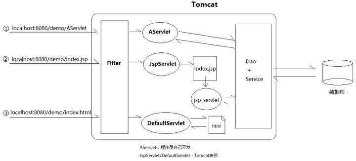
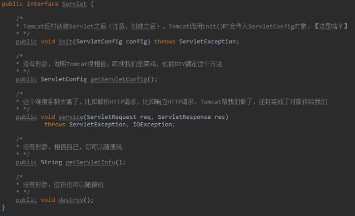
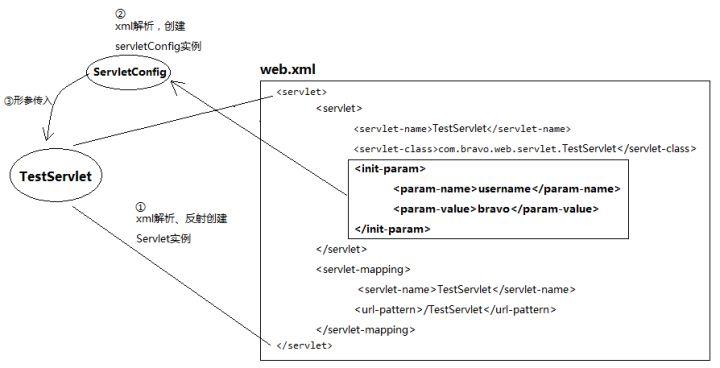
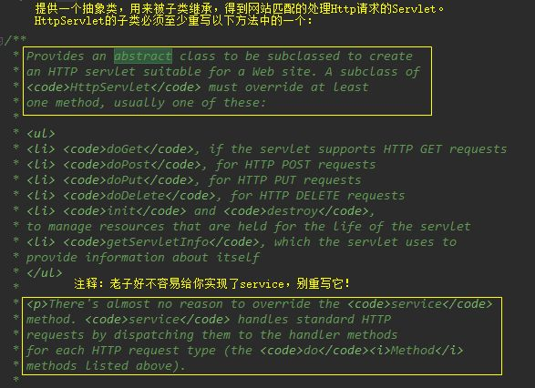
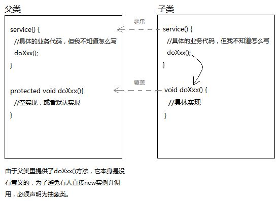

# Servlet(上)

Servlet是Server Applet（运行在服务端的小程序）,Tomcat其实是Web服务器和Servlet容器的结合体,

什么是Web服务器？Web服务器的作用说穿了就是：将某个主机上的资源映射为一个URL供外界访问。

Servlet容器，顾名思义里面存放着Servlet对象,我们为什么能通过Web服务器映射的URL访问资源？肯定需要写程序处理请求，主要3个过程：接收请求,处理请求,响应请求

其中接收请求和响应请求是共性功能，且没有差异性,访问淘宝和访问京东，都是接收http://www.xxx.com/brandNo=1的请求，响应给浏览器的都是JSON数据。于是，大家就把接收和响应两个步骤抽取成Web服务器：

但处理请求的逻辑是不同的。没关系，抽取出来做成Servlet，交给程序员自己编写。但是Servlet并不擅长往浏览器输出HTML页面，所以出现了JSP.

等Spring家族出现后，Servlet开始退居幕后，取而代之的是方便的SpringMVC。SpringMVC的核心组件DispatcherServlet其实本质就是一个Servlet。但它已经自立门户，在间接继承HttpServlet的基础上，又做了封装.

---



编程学习越往后越是如此，我们能做的其实很有限。大部分工作，框架都已经帮我们做了。只要我们实现xxx接口，它会帮我们创建实例，然后搬运到它合适的位置，然后一套既定的流程下来，肯定会执行到。

进入Tomcat阶段后，我们开始全面面向接口编程。但是“面向接口编程”这个概念，最早其实出现在JDBC阶段。我就问你，JDBC接口是你自己实现的吗？别闹了，你导入MySQL的驱动包，它给你搞定了一切。

# 如何编写一个Servlet



最难的地方在于形参，然而Tomcat会事先把形参对象封装好传给我(ServletConfig等)...除此以外，既不需要我写TCP连接数据库，也不需要我解析HTTP请求，更不需要我把结果转成HTTP响应，request对象和response对象帮我搞定了。

Servlet里主要写的代码都是业务逻辑代码。和原始的、底层的解析、连接等没有丝毫关系。最难的几个操作，人家已经给你封装成形参传进来了。

总的来说，Tomcat已经替我们完成了底层封装，并且传入三个对象：ServletConfig、ServletRequest、ServletResponse。

# ServletConfig



# Request/Response
  
HTTP请求到了Tomcat后，Tomcat通过字符串解析，把各个请求头（Header），请求地址（URL），请求参数（QueryString）都封装进了Request对象中。通过调用等等方法，都可以得到浏览器当初发送的请求信息。

```java
request.getHeader();
request.getUrl()；
request.getQueryString();
...
```

至于Response，Tomcat传给Servlet时，它还是空的对象。Servlet逻辑处理后得到结果，最终通过response.write()方法，将结果写入response内部的缓冲区。Tomcat会在servlet处理结束后，拿到response，遍历里面的信息，组装成HTTP响应发给客户端。

Servlet的init、service、destroy是生命周期方法。init和destroy各自只执行一次，即servlet创建和销毁时。而service会在每次有新请求到来时被调用。也就是说，我们主要的业务代码需要写在service中。

但是，浏览器发送请求最基本的有两种：Get/Post，于是我们必须这样写：


我不想直接实现javax.servlet接口,于是，发现了GenericServlet，是个抽象类。

# GenericServlet


我们发现GenericServlet做了以下改良：

- 提升了init方法中原本是形参的servletConfig对象的作用域（成员变量），方便其他方法使用
init方法中还调用了一个init空参方法，如果我们希望在servlet创建时做一些什么初始化操作，可以继承GenericServlet后，覆盖init空参方法
- 由于其他方法内也可以使用servletConfig，于是写了一个getServletContext方法
- service竟然没实现

放弃GenericServlet。于是我们继续寻找，又发现了HttpServlet：

# HttpServlet


它继承了GenericServlet,HttpServlet已经实现了service方法：


HttpServlet的service方法已经替我们完成了复杂的请求方法判断。但是，我翻遍整个HttpServlet源码，都没有找出一个抽象方法。所以为什么HttpServlet还要声明成抽象类呢？

一个类声明成抽象方法，一般有两个原因：

1. 有抽象方法
2. 没有抽象方法，但是不希望被实例化



>HttpServlet做成抽象类，仅仅是为了不让new。


它为什么不希望被实例化，且要求子类重写doGet、doPost等方法呢？


protected修饰，希望子类重写,如果我们没重写会怎样？
                   


浏览器页面会显示：405（http.method_get_not_supported）

也就是说，HttpServlet虽然在service中帮我们写了请求方式的判断。但是针对每一种请求，业务逻辑代码是不同的，HttpServlet无法知晓子类想干嘛，所以就抽出七个方法，并且提供了默认实现：报405、400错误，提示请求不支持。

但这种实现本身非常鸡肋，简单来说就是等于没有。所以，不能让它被实例化，不然调用doXxx方法是无用功。

Filter用到了责任链模式，Listener用到了观察者模式，Servlet也不会放过使用设计模式的机会：模板方法模式。上面的就是。


# 小结：如何写一个Servet？

不用实现javax.servlet接口,不用继承GenericServlet抽象类,只需继承HttpServlet并重写doGet()/doPost(),父类把能写的逻辑都写完，把不确定的业务代码抽成一个方法，调用它。当子类重写该方法，整个业务代码就活了。这就是模板方法模式


