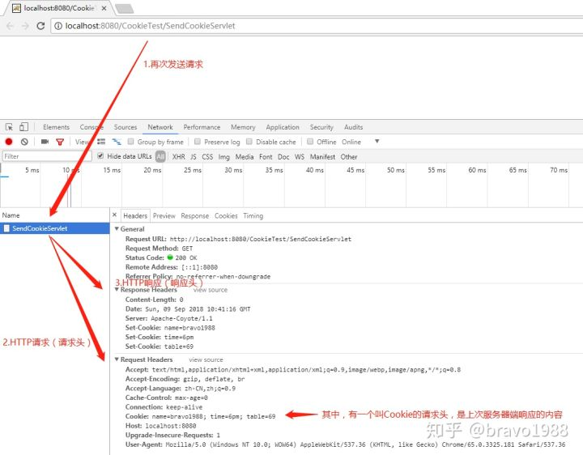
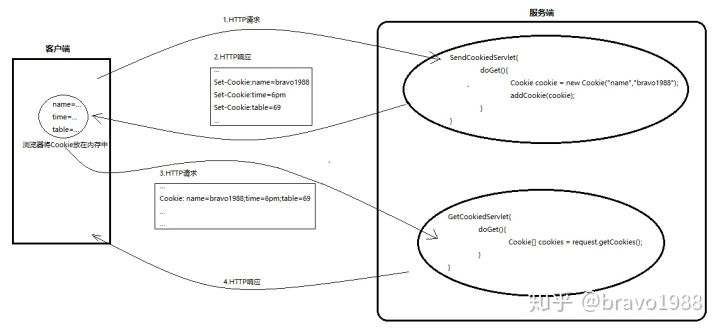

# Cookie

## 场景

1. 登录京东，选了iphone x放入购物车后关闭浏览器。再次打开时，发现又要重新登录。
2. 登录淘宝，在一个页面逗留了很久，终于决定要买了，却提示你重新登录。

会话跟踪能够解释上面2种现象.

## 首先，为什么需要会话机制？
   
会话机制最主要的目的是帮服务器记住客户端状态（标识用户，跟踪状态）。因为http协议无法记录用户的状态.

目前，客户端与服务器的通讯都是通过HTTP协议。而HTTP是一种无状态协议。什么叫无状态？就是客户端第二次来访时，服务器根本不知道这个客户端以前是否来访过，Web服务器本身不能通过http协议识别出哪些请求是同一个浏览器发出的。即：浏览器的每一次请求都是完全孤立的。

---
    假设我们注册了一个论坛，因为HTTP是无状态的，服务器无法辨认访问者，那么即使是同一个网站的不同页面，
    服务器都必须强制访问者重新登录一次，以确定你是合法用户...

    所以，会话机制显得很有必要。由于某些原因，HTTP必须保持无状态，所以会话跟踪技术就成了对HTTP无状态协议的一种扩展。

    再比如为了更好的用户体验（比如实现购物车），就有了会话机制。有了会话机制，
    服务器可以区分不同客户端发来的请求，把同一个客户端的操作归类在一起。


---

## 其次，如何定义一个会话？

基于上面的分析,会话是为了唯一标识一个用户并记录其状态.

>服务器什么情况下无法断定一个客户端？无非两种情况：

- 服务器不行了（session失效）
- 客户端不行了（cookie失效）

又基于上面分析，可以总结出会话的基本原则: `双方共存（cookie与session同在）`

# 会话跟踪常用的技术

会话跟踪常用的有两种技术：Cookie和Session，并且Session底层依赖于Cookie。

# 认识Cookie

当然啦，如果Cookie被禁用，也可以通过URL重写等手段实现，但这里不涉及。因为只要你真的明白这篇文章所讲的全部内容，URL重写理解起来很简单。

>我希望大家在看接下来的文字时，要始终提醒自己会话机制的目的是什么：`标识用户，跟踪状态。`

Cookie其实是一份小数据，是服务器响应给客户端，并且存储在客户端的一份小数据。下次客户端访问服务器时，会自动带上这个Cookie。服务器通过Cookie就可以区分客户端。

Tomcat在真正给浏览器发送HTTP响应前，会从Response对象中取出HTTP相关的信息（比如响应体中HTML，响应头等），其中就包括cookie。HTTP响应头都是以键值对的形式展现，一般来说都是一键一值，比如：

```
Content-Length: 0
Date: Sun, 09 Sep 2018 10:29:27 GMT
Server: Apache-Coyote/1.1
```

也有一键多值的，比如Set-Cookie这个响应头：

```
Set-Cookie: name=xxx
Set-Cookie: time=9am
Set-Cookie: table=10
```

当我们第二次请求同一个服务器，浏览器在发送HTTP请求时，会带上这些Cookie。





Cookie的两种类型

- 会话Cookie (Session Cookie)
- 持久性Cookie (Persistent Cookie)

上面代码中，服务器向浏览器响应的Cookie就是会话Cookie。会话Cookie被保存在浏览器的内存中，当浏览器关闭时，内存被释放，内存中的Cookie自然也就烟消云散。关闭浏览器引发Cookie消失，下次还要重新登录。能不能向客户端响应持久性Cookie呢？只要设置Cookie的持久化时间即可！


Set-Cookie的内容中，多了一个Expires，它代表过期时间，比如现在时间是12:00，你设置MaxAge=10*60，则过期时间就是12:10（注意，时间依据的是我们在东八区的时间）

- 不设置MaxAge，默认响应会话Cookie，存在浏览器内存。Cookie随浏览器关闭而消失
- 设置MaxAge>0，响应持久性Cookie，会存在电脑硬盘的特定文件夹下（浏览器自定义的）
- 设置特定Cookie的MaxAge<=0，则会删除已经存在客户端的此Cookie

一般，响应给客户端的Cookie都是会话Cookie（不设置MaxAge），是存在浏览器内存中的。所以关闭浏览器后，内存中Cookie就消失了。Cookie消失，则下次请求服务器时，请求头中不存在代表用户信息的Cookie（唯一标识用户，表示其状态），那么浏览器就无法识别请求的用户。

### Java Servlet中的Cookies

客户端可以向服务器发送多个cookie，除了键值对之外，服务器还在响应头中向客户端发送一些其他数据,例如 comment, domain, maximum time before cookie expires,以及Path where browser should send the cookie back in request.`但是当client向浏览器发送cookie时，它只会发送cookie的name和value。`:

```
Set-Cookie	Counter=7;
Version=1;
Comment="SetCookie Counter";
Domain="localhost";
Max-Age=86400;
Expires=Thu, 15-Aug-2013 20:19:19 GMT;
Path=/cookie/SetCookie

Set-Cookie	Test="Test Cookie7";
Version=1;
Comment="Test Cookie"
```

# Some important methods of Cookie class are:

1. getComment(） - 返回描述此cookie用途的注释，在客户端使用。请注意，当客户端在请求标头中发送cookie时，服务器不会收到此信息。我们可以使用setComment(）方法在服务器端设置cookie描述。
2. getDomain(） - 返回cookie的域名。我们可以使用setDomain(）方法设置cookie的域名，
如果设置了域名，则cookie将仅发送给该特定域请求。
3. getMaxAge(） - 以秒为单位返回最大年龄。我们可以使用setMaxAge(）来设置cookie的到期时间。
4. getName(） - 返回cookie的名称，可以在浏览器和服务器端使用。名称没有setter，我们只能通过构造函数设置一次名称。
5. getPath(） - 返回浏览器返回此cookie的服务器上的路径。我们将看到它的示例，其中cookie将仅发送到特定资源。
我们可以使用setPath(）来指示浏览器仅将cookie发送到特定资源。
6. getSecure(） - 如果浏览器仅通过安全协议发送cookie，则返回true;如果浏览器可以使用任何协议发送cookie，
则返回false。我们可以使用setSecure(）方法指示浏览器仅通过安全协议发送cookie。
7. getValue(） - 以String的形式返回cookie的值。还有setValue(）方法来更改cookie的值。
8. getVersion(） - 返回此cookie符合的协议版本。还有一个版本的setter方法。
9. isHttpOnly(） - 检查此Cookie是否已标记为HttpOnly。还有一个setter方法，我们可以使用它来指示客户端仅将其用于HTTP。

> Note: Throws:IllegalArgumentException - if the cookie name is null or 
empty or contains any illegal characters (for example, a comma, space, 
or semicolon) or matches a token reserved for use by the cookie protocol
,Cookie的value不能包含空格.