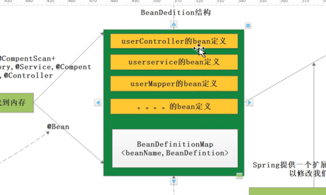
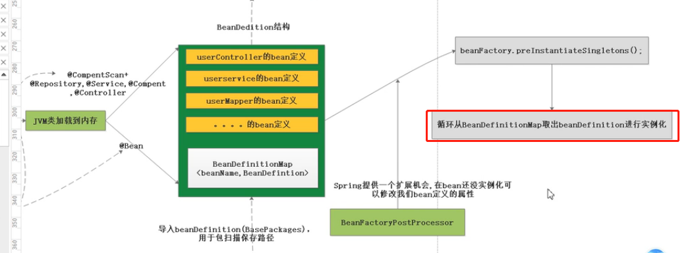
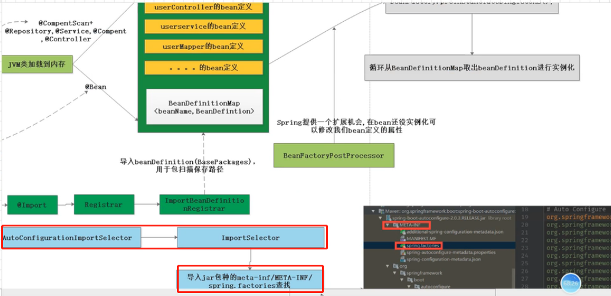
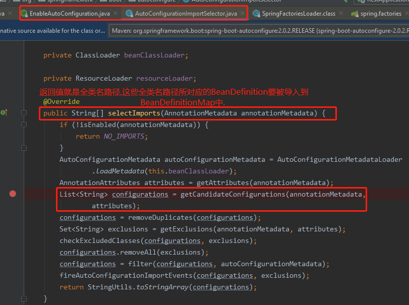
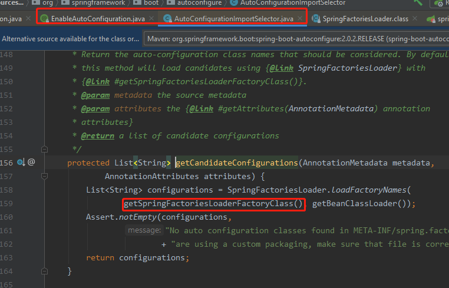
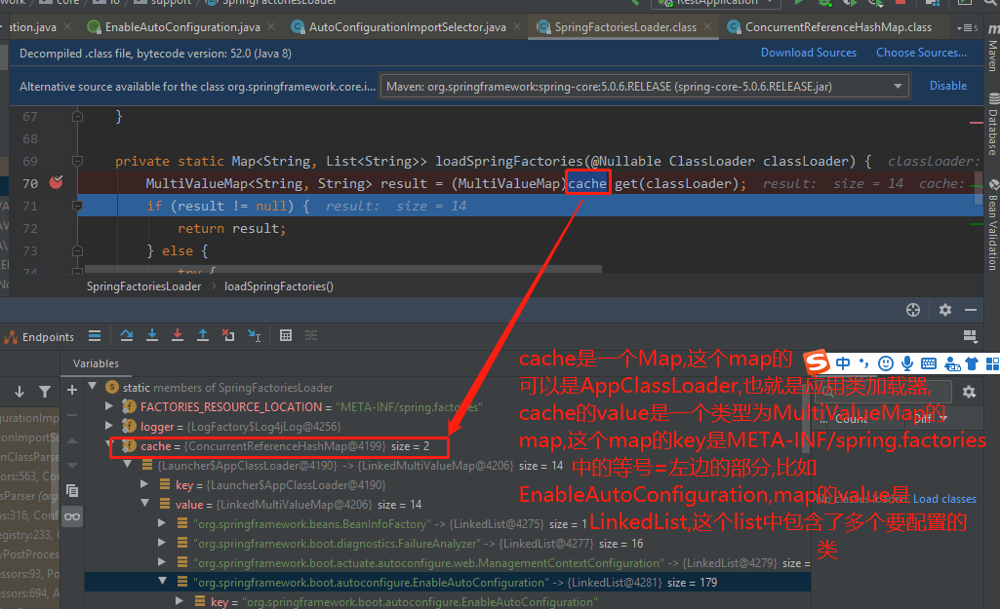
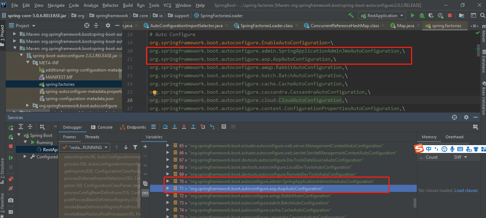

# SpringBoot自动装配了什么东西?怎么个自动装配的?(核心)

比如我们定义了一个类,叫Player,如下:

```java
@Lazy
@Scope
public class Player{
    Integer age;
    String lastName;
    Float height;
}
```

    那么Spring是怎么去描述这个Player呢?

    Spring它也有一个对象用来描述Player这个Bean,这个对象就是BeanDefinition.

    比如,上面的Player,是否是懒加载的(@Lazy),这个Player的class属性是什么(类对象是什么),
    是不是抽象的,是不是primary的(当发生自动装配的时候,假如某个bean会发现多个,那么标注primary为true的BeanDefinition首先被注入),
    构造方法有哪些,@Scope是单例的还是原型的,等等一系列的关于这个bean的属性,都是由BeanDefinition来描述的.





上图中的UserController.class这些类加载到内存后,通过@Controller注解,可以被Spring识别出来,然后就形成一个个的BeanDefinition.

每个被Spring识别出来的Bean都会构成一个BeanDefinition.这些BeanDefinition的存储结构叫BeanDefinitionMap<beanName, BeanDefinition>

BeanDefinition包含的属性字段如上图.比如说要描述当前这个bean属于哪个class,这个bean的scope属性,autowireMode你的注入模型是什么,等



    BeanDefinition相当于是Bean的图纸,IoC会拿着这些图纸去依葫芦画瓢把对象给new出来

    演示项目: spring-source-learn-code中的com.beans.BeanDefinition.setInject.MainClass
    以及com.autoconfiguration.TestBaseJavaConfig.

# 接下来看一下SpringBoot自动装配的过程

    @SpringBootApplication = @SpringBootConfiguration + @EnableAutoConfiguration + @ComponentScan


    @SpringBootConfiguration: 意味着可以在主启动类中使用@Bean配置bean,一般不这么配置,不美观.


    @ComponentScan: 执行组件扫描(@Component，@Service，@Repository，@Controller等Bean)
    扫描主启动类所在包以及子包中符合条件的bean.
    
    这也是SpringApplication.run方法第一个参数是主启动类的原因.因为要根据这个主启动类所在的包来扫描.

---

    @EnableAutoConfiguration
    

    
    看源码的方法: 
    1. 一行行的看就完蛋了,你会崩溃的,一行代码的调用栈非常深,你看一行要看好几天.
    2. 看源码一定要debug


    










    @EnableAutoConfiguration注解的作用: 把AutoConfigurationImportSelector类加载器所对应的类路径
    下的META-INF/spring.factories中的配置类加载到SpringIoc容器中

    removeDuplicates: 防止你自己写的配置类跟自动装配的名称相冲突,也就是去重.
    
    getExclusions: 因为@SpringBootApplication(exclude = {})可以排除加载配置类,所以getExclusions就是
    排除@SpringBootApplication中要排除的类
    
    filter(configurations, autoConfigurationMetadata): 作用是: 
    比如org.springframework.boot.autoconfigure.data.redis.RedisAutoConfiguration,这个类上面有条件注解
    @ConditionalOnClass(RedisOperations.class),filter意思就是根据条件注解来进行过滤,把不满足条件的配置类过滤掉.
    


---    
    SpringBoot自动装配了什么东西?
    
    通过@Import注解,读取spring.factories这个配置文件,把里面的配置类解析成一个一个的BeanDefinition
    ,然后把BeanDefinition导入到BeanDefinitionMap中,然后SpringIoC就可以使用BeanDefinitionMap来创建bean实例了.
    
    所以SpringBoot装配的是BeanDefinition,自动就是通过@Import注解,读取spring.factories.
---
