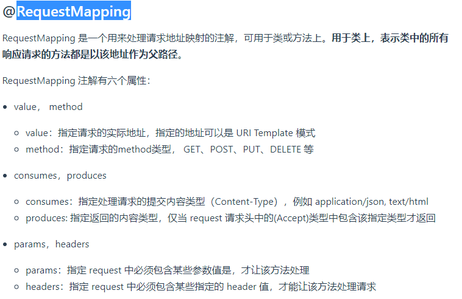
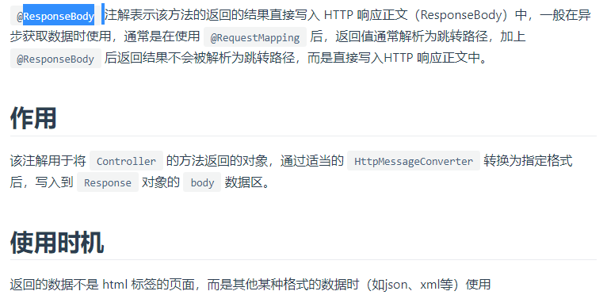
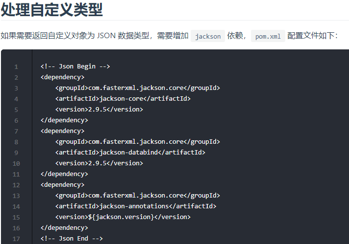
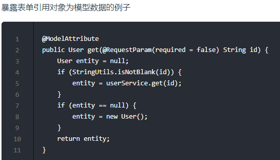
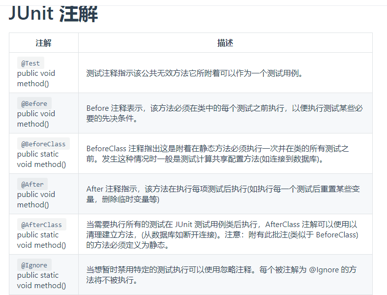
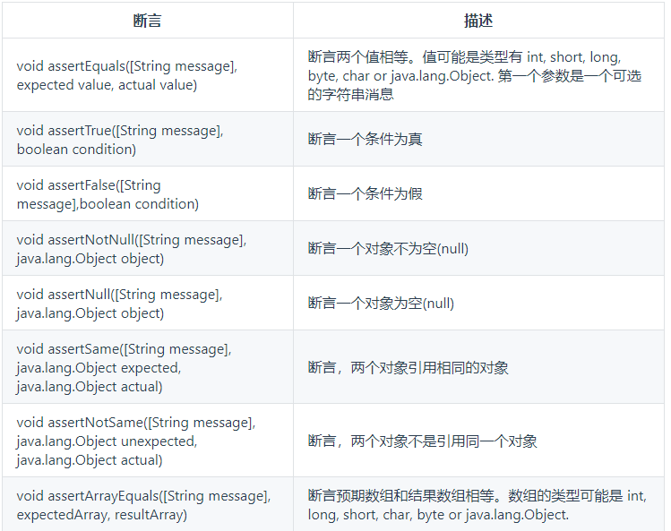

# Component

@Component(value = "aa"): aa就是当前bean的name,或者说id

# RequestMapping注解

>@RestController和@RequestMapping ("/" )，不是SpringBoot 中的内容，是SpringMVC中的内容



- ContentType: 用来告诉服务器当前发送的数据是什么格式 
- Accept: 用来告诉服务器，客户端能认识哪些格式,最好返回这些格式中的其中一种 

---
    有个用户发了一个请求, 请求头中:
    
    ContentType =application/json 
    Accept      =  */*  
    
    但是我的接口中定义了consumes={"application/xml"},我只接收application/xml 格式，也只返回xml格式.很明显，用户调不通这个接口.
---

# Resource注解


# ResponseBody




@ResponseBody注释: 一旦handler method返回响应对象，MappingJackson2HttpMessageConverter
就会启动(kicks in)并将其转换为JSON响应。

# @RequestBody

用于将"请求主体JSON数据(request body JSON data)"映射到Employee对象，这也是由MappingJackson2HttpMessageConverter映射完成的。

# ModelAttribute




# RestController

@RestController：Spring4之后加入的注解，原来在@Controller中返回json需要@ResponseBody来配合，如果直接用@RestController替代@Controller就不需要再配置@ResponseBody，默认返回json格式。

# @PathVariable

从URI中提取数据并将其映射到函数的参数中

# @RequestParam:

获取请求参数的值,public String hello(@RequestParam(value = "id",required = false,defaultValue = "0") Integer id){}

# @Value

@Value("${age}")获取配置文件中的属性值

# @SpringBootApplication

@SpringBootApplication = @Configuration + @EnableAutoConfiguration + @ComponentScan

- @ComponentScan: 执行组件扫描(使用@Component，@Service，@Repository，@Controller等注释的Bean)-扫描与Application类相同的包或子包中的其他配置和bean
- @EnableAutoConfiguration  - 告诉SpringBoot自动依据类路径的设置添加bean.

@EnableAutoConfiguration 注解的作用是让 SpringBoot来“猜测” 如何配置 Spring。猜测的依据很简单，就是根据依赖的jar包。因为在我们的依赖中，包含了 Tomcat和SpringMvc ，因此SpringBoot的自动配置机制就会认为这是一个web应用。
因此在main方法run后，就启动 tomcat，让用户通过url来访问

# @JsonView的应用场景

1. 在实际开发中，有些数据实体类包容相当多的属性，但在特定的场景中，往往并不需要那么多的属性，只要几个就好了。
2. 通过在数据实体类和控制器中使用@JsonView注解，能够让我们针对特定的场景从数据实体类的属性集合中仅返回那些对于客户端应用来说“有用的”属性数据。
3. Spring将数据转换的结果统称为“View”，生成的Json数据也是“View”。

# @ImportResource

如果您已经有XML文件，您不希望转换为Java配置，您仍然可以使用@ImportResource导入它们,这样可以兼容xml和新的注解.

```java
@SpringBootApplication
@ImportResource("applicationContext.xml")
public class Application {
    //...
}    
```

# 条件注解-ConditionalOn

```java
//判断当前项目中有没有CharacterEncodingFilter这个类
@ConditionalOnClass({CharacterEncodingFilter.class})

//Spring底层有@conditiona注解，根据不同的条件，如果满足指定的条件才会让配置类中的配置就会生效，判断当前应用是否为web应用。
@ConditionalOnWebApplication(
    type = Type.SERVLET
)

//判断配置文件中是否存在某个配置spring.http.encoding
@ConditionalOnProperty(
    prefix = "spring.http.encoding",
    value = {"enabled"},
    matchIfMissing = true
)

@Bean
@ConditionalOnMissingBean(RequestContextListener.class)
public RequestContextListener requestContextListener() {
    return new RequestContextListener();
}

@ConditionalOnProperty(
    value = {"spring.mvc.favicon.enabled"},
    matchIfMissing = true // 如果缺失了,就是true
)
```

# Junit注解




# 其他

- @PostConstruct: Spring bean对象构造完后调用.
- @PreDestroy: Spring bean对象销毁前调用
- @Transactional标注在某个方法上表示这个方法是要进行事务管理,事务就是多条操作同时成功或者失败.
- 启动指定类的ConfigurationProperties功能:@EnableConfigurationProperties({HttpEncodingProperties.class})
- @Primary:声明默认的，首要的bean(在没有具体指明名字的时候使用).
- Springboot中显示的导入配置类的方法; @Import(value = { LoginSecurityConfig.class })
- @ComponentScan(basePackages="pkg")-这个是为了导入和MainApplication不是同一个包,也不是其子包的package中的配置.
