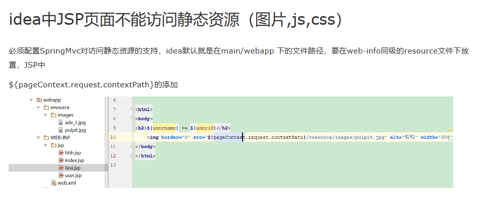
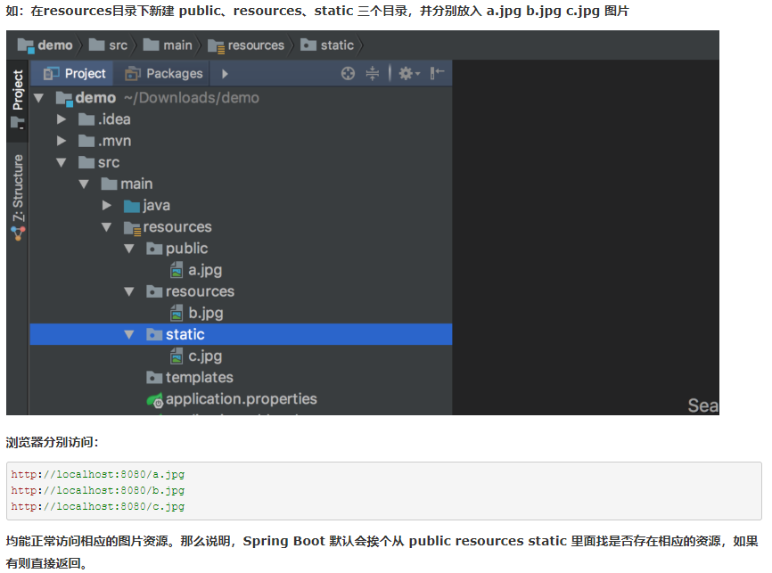

# 传统的基于web.xml静态资源




# Spring Boot Web项目中的静态资源

在我们开发Web应用的时候，需要引用大量的js、css、图片等静态资源。Spring Boot默认情况下,将放置在classpath下的以下文件夹中的文件视为静态资源文件，并将其映射为一个唯一的URL：

- classpath:/static
- classpath:/public
- classpath:/resources
- classpath:/META-INF/resources




我们可以在src/main/resources/目录下创建static，在该位置放置一个图片文件。启动程序后，尝试访问http://localhost:808/D.jpg。如能显示图片，配置成功。


# 新增静态资源路径


# 自定义静态资源映射


# 设置静态默认欢迎页面


# Favicon设置


### WebJars基础

现代网页设计，离不开各种各样的Web前端UI库。各种UI库通常都会包容多个文件(比如.css， .js，字体，图标等）。

Spring Boot支持一种被称为webjar的技术，将一些前端框架(比如Bootstrap）打包为单个文件， 从而在Thymeleaf模板中可以作为一个整体进行引用。

使用WebJars打包的资源，其URL以“/webjars/”打头，也就是说，所有指向/webjars/的HTTP请求，都会被导向这个包中所包容的静态资源文件。

#### 获取webjar的maven依赖(以Bootstrap为例）

要想在Spring Boot Web项目中使用诸如Bootstrap等前端框架，需要访问webjars或
MavenRepository网站去搜索其Maven依赖声明。

添加完依赖之后，可以看到相关的js文件、 css样式表和字体等静态
资源，都被放到了jar包中，并且准备好了在视图模板文件中访问。

>http://www.webjars.org/, https://mvnrepository.com

#### 如何引用WebJars包？

特别注意其包名：`resources.webjars.jquery.1.11.1，`这实际上就是文件夹名，你可以这样看：所有jquery文件位于resources文件夹下的
/webjars/jquery/1.11.1下。

现在，就可以在网页中使用以下URL引用到它们：
```html
<script src="/webjars/jquery/1.11.1/jquery.min.js">
</script>
```

## SpringBoot静态资源映射规则

>在默认的情况下，SpringBoot会加载classpath下的/static、/public、/resources 、 /META-INF/resources目录下的静态资源供用户进行访问，个人感觉 static可能更具有说明力。我们可以在项目的src/main/resources目录下建立static文件夹.注意在我们访问的URL中并不会包含"static"这个单词， static是所有静态资源的根目录，就相当于常规J2EE开发下的 webapp目录一样，因此 url是不需要包含的。

~~~java
public void addResourceHandlers(ResourceHandlerRegistry registry) {
            if (!this.resourceProperties.isAddMappings()) {
                logger.debug("Default resource handling disabled");
            } else {
                Duration cachePeriod = this.resourceProperties.getCache().getPeriod();
                CacheControl cacheControl = this.resourceProperties.getCache().getCachecontrol().toHttpCacheControl();
                if (!registry.hasMappingForPattern("/webjars/**")) {
                    this.customizeResourceHandlerRegistration(registry.addResourceHandler(new String[]{"/webjars/**"}).addResourceLocations(new String[]{"classpath:/META-INF/resources/webjars/"}).setCachePeriod(this.getSeconds(cachePeriod)).setCacheControl(cacheControl));
                }

                String staticPathPattern = this.mvcProperties.getStaticPathPattern();
                if (!registry.hasMappingForPattern(staticPathPattern)) {
                    this.customizeResourceHandlerRegistration(registry.addResourceHandler(new String[]{staticPathPattern}).addResourceLocations(getResourceLocations(this.resourceProperties.getStaticLocations())).setCachePeriod(this.getSeconds(cachePeriod)).setCacheControl(cacheControl));
                }

            }
        }

~~~

1、所有的/webjars/**,都去classpath:/META-INF/resources/webjars/找资源

webjars:以jar包的方式引入资源，网页搜索webjars,选择maven的方式引入，例如引入jquery

~~~xml
<dependency>
  <groupId>org.webjars</groupId>
  <artifactId>jquery</artifactId>
  <version>3.3.1</version>
</dependency>
~~~

访问jQuery.js的路径为：localhost:8080/webjars/jquery/3.3.1/jquery.js

2.“/**”访问当前项目的任何资源，（静态资源的文件夹）

~~~java
"classpath:/META-INF/resources/",
"classpath:/resources/",
"classpath:/static/",
"classpath:/public/"
"/":当前项目的根路径
~~~

## Spring boot配置Servelt、Filter、Listener

>实例:spring_boot_web

在SpringBoot中，不光将Spring的配置文件省略了，连web容器的web.xml文件都省略了，而之前，我们通常都是将Servelt、Filter、Listener等配置在web.xml中配置的，而SpringBoot提供了更加简化的配置.

Spring Boot集成了servlet容器，当我们在pom文件中增加spring- boot-starter-web的maven依赖时，不做任何web相关的配置便能提供web服务，这还得归功于spring boot自动配置的功能（因为加了EnableAutoConfiguration的注解），帮我们创建了一堆默认的配置，以前在web.xml中配置，现在都可以通过spring bean的方式进行配置，由spring来进行生命周期的管理.

>SpringBoot提供了2种方式配置Servlet、Listener、Filter。一种是基于RegistrationBean，另一种是基于注解。

### 基于RegistrationBean的配置

>spring boot提供了ServletRegistrationBean，FilterRegistrationBean，ServletListenerRegistrationBean这3个东西来进行配置Servlet、Filter、Listener,见:配置类WebConfig.java

### 基于注解的配置

>在对应的Servlet，Filter，Listener打上对应的注解@WebServlet，@WebFilter，@WebListener,在启动类加上注解@ServletComponentScan即可

## SpringBoot热加载

spring-boot-devtools是一个自动应用代码更改到最新的App上面去，使应用可以自动重启的模块
.原理是在发现代码有更改之后，重新启动应用，但是比速度比手动停止后再启动还要更快，更快的深层原理是使用了两个ClassLoader，一个Classloader加载那些不会改变的类（第三方Jar包），另一个ClassLoader加载会更改的类，称为restart ClassLoader,这样在有代码更改的时候，原来的restart ClassLoader 被丢弃，重新创建一个restart ClassLoader，由于需要加载的类相比较少，所以实现了较快的重启时间（5秒以内）。

默认情况下，修改了/META-INF/maven, /META-INF/resources ,/resources ,/static ,/public或者/templates目录下的内容不会引起应用的重新启动。意思是，java代码，pom文件，application.properties(yml)文件的修改都会引起重新启动。

通过以下方式，我们可以指定只有哪些目录下的内容修改不会引起重启：

`spring.devtools.restart.exclude=static/**,public/**`

以上配置说明只有static目录和public目录下的内容修改后不会引起重启。

>由于默认的配置已经比较合理，所以有一种可能的情况是，我们希望在默认的配置下，添加其他我们想要的目录，在这个目录下修改内容时也不重新启动，此时可以将spring.devtools.restart.exclude改为spring.devtools.restart.additional-exclude即可。

# Spring Boot的嵌入式容器

内嵌web容器的两个默认配置项：默认的监听端口:8080,应用的contextPath为"/"。如我们想要覆盖默认的配置，可以按照如下方式进行：

```yaml
#Tomcat configuration
server.port=80
server.contextPath=/springboot
```


# 如何部署Spring Boot Web项目

Spring Boot项目主要有两种部署方式：

1. 打包为war，然后部署到Tomcat这种外部的Servlet容器中。
2. SpringBoot通过`spring-boot-maven-plugin`构建了一个“自包容”的jar包(称为Fat JAR），然后使用java -jar命令直接运行。通常我们将一个可以运行的 jar包称之为fat jar 。因为这样的 jar包内部通常包含了自己运行时的所有依赖，体积比较大

springbootstudy-0.0.1-SNAPSHOT.jar是我们打包好的，内部包含了其他依赖的，可以直接运行的jar，而springbootstudy-0.0.1-SNAPSHOT.jar.original 则是原始的打包后的jar。进入target生成文件夹所在目录，我们可以看看这两个文件的区别：第一个可以直接运行的springbootstudy-0.0.1-SNAPSHOT.jar的大小为13M 左右，而第二个只有 6KB。可以直接解压这个 jar文件，就会发现这个jar的 lib目录下，实际上存放了所有依赖的 jar。而 springbootstudy-0.0.1-SNAPSHOT.jar.original 则是没有包含这些依赖的 jar的原始包

我们可以通过命令`java -jar springbootstudy-0.0.1-SNAPSHOT.jar`来直接运行这个jar.

# 将项目打包为war，然后部署到外部Tomcat容器

1. 步骤一、修改打包方式打开pom.xml，将打包方式由jar改为war
2. 步骤二、调整嵌入式Tomcat插件的编译方式,默认情况下， spring-boot-starter-web会启动一个嵌入式的tomcat，因为现在我们是要生成一个war包，跑在外部的tomcat上，所以，给项目添加一个tomcat依赖(spring-boot-starter-tomcat)，并将其scope设置为“provided(表明这些组件由外部容器提供）”从而覆盖掉默认设置。
