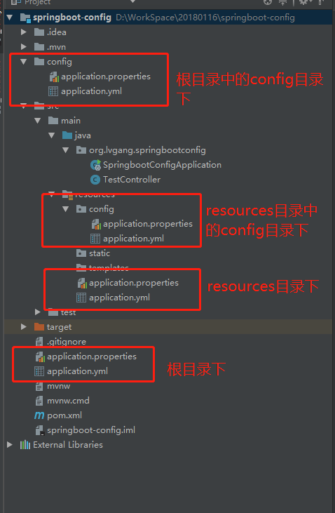

# SpringBoot 配置文件存放位置及读取顺序(会注入Environment对象中.)

SpringBoot配置文件可以使用yml格式和properties格式,默认可以放到以下目录中：
                                     
1. 项目根目录的/config目录
2. 项目根目录下
3. classpath根路径下的/config目录(项目的resources目录下)
4. classpath根路径(项目的resources目录下)



某一个目录下,同时存在yml和properties文件,SpringBoot会先加载yml,然后加载properties,properties中的属性会覆盖yml中的.

## yml和properties一共4种

- Bootstrap.yml
- bootstrap.properties
- application.yml
- application.properties

bootstrap.yml（bootstrap.properties）在application.yml（application.properties）之前加载

## bootstrap典型场景

使用 Spring Cloud Config Server的时候，可以在 bootstrap.yml里面指定spring.application.name和 spring.cloud.config.server.git.uri, 以及一些加密/解密的信息

# 属性的引用

我们直接在application.properties中定义一些自己使用的属性，然后通过@Value("${属性名}")注解来加载对应的配置属性:

```yml
# 各个参数之间也可以直接引
com.blog.name=name
com.blog.title=title
com.blog.desc=${com.blog.name} - 《${com.blog.title}》
```

```java
//要注意的是，@Value注解是在Bean实例化之后再进行注入的，也就是说,当我们在构造方法中使用这个属性的值时，起还是为null。等到实例化之后，这个属性就会被设置
public class Application {
    @Value("${name}")
    private String name;
}
```

## 使用随机数:

在一些情况下，有些参数我们需要希望它不是一个固定的值，比如密钥、服务端口等。Spring Boot的属性配置文件中可以通过${random}来产生int值、long值或者string字符串，来支持属性的随机值.

## 通过命令行设置属性值

java -jar xxx.jar --server.port=8888，通过使用–-server.port属性来设置xxx.jar应用的端口为8888

通过命令行来修改属性值固然提供了不错的便利性，但是通过命令行就能更改应用运行的参数，那岂不是很不安全？是的，所以Spring Boot也贴心的提供了屏蔽命令行访问属性的设置，只需要这句设置就能屏蔽：SpringApplication.setAddCommandLineProperties(false)。

指定SpringBoot加载属性文件的位置:`java -jar -Dspring.config.location=C:\application.properties demo.jar`

Spring boot会默认从从类路径下加载application.properties或者application.yml

## yaml语法

基本语法：k:(空格)v ：表示一对键值对，注意的是空格不能省略，以缩进(空格)来控制层级关系，左对齐的一列数据就是同一个层级的。注意的是属性和值也是大小写敏感的

### 值的写法

1. 值为普通的值（数字，字符串，布尔）：k: v ：就直接写值，注意，字符串默认不用添加单引号和双引号。
2. "":双引号：会转义字符串里面的特殊字符；特殊字符会作为本身想表达的意思
3. '':单引号：不会转义字符串里面的特殊字符，特殊字符最终就是一个普通的字符
4. 值为对象，Map使用k: 下一行写对象的属性和值
5. 值为集合，使用k: 下一行使用-(空格)值来书写

~~~yaml
person:
  name: "张三\n李四"
  age: 14
  map: {k1: V1,k2: V2}
  list:
    - cat
    - dog
    - pig
  cat:
    name: '小猫\n小狗'
    age: 4
~~~

上述yaml文件锁对应的Javabean如下所示：

~~~ java
@Component
@ConfigurationProperties(prefix = "person")
public class Person {
    
    private String name;

    private int age;

    private Map<String,Object> map = new HashMap<>();

    private List<String> list = new ArrayList<>();

    private Cat cat;
~~~

说明：

1. @ConfigurationProperties(prefix = "person")注解是获取yaml文件中的配置
2. 其中prefix = "person"表示获取yaml中前缀为person的值
3. 要使用ConfigurationProperties注解，最好在pom.xml文件中做如下配置

~~~ xml
<dependency>
  <groupId>org.springframework.boot</groupId>
  <artifactId>spring-boot-configuration-processor</artifactId>
  <optional>true</optional>
</dependency>
~~~

### 配置文件注入

将配置文件中属性和值注入到bean实体类中，我们可以使@ConfigurationProperties注解，除此之外，我们还可以使用@Value注解，使用方法如下：

~~~ java
@Component
public class Person {
    @Value("${person.name}")
    private String name;
    @Value("#{11*2}")
    private int age;

    private Map<String,Object> map = new HashMap<>();

    private List<String> list = new ArrayList<>();

    private Cat cat;
~~~

注意的是：@Value注解只能用于基本类型的值注入，与@ConfigurationProperties注解的区别如下：

|            | @ConfigurationProperties | @Value |
| ---------- | ------------------------ | ------ |
| 功能         | 批量注入配置文件中的属性             | 单个指定   |
| 松散绑定       | 支持                       | 不支持    |
| SpEL       | 不支持                      | 支持     |
| JSR303数据校验 | 支持                       | 不支持    |
| 复杂类型封装     | 支持                       | 不支持    |

使用JSR303进行字段校验的同时，在bean类上使用@Validated注解。

### 外部配置文件

使用@PropertySource(value ={"classpath: person.properties"})加载指定的配置文件

其中person.properties书写如下：

~~~properties
person.last-name=\u674E\u56DB
person.age=12
person.birth=2017/12/15
person.boss=false
person.maps.k1=v1
person.maps.k2=14
person.lists=a,b,c
person.dog.name=dog
person.dog.age=15
~~~

使用@ImportResource(locations = {"classpath: beans.xml"})注解加载Spring配置文件。如下

~~~xml
<?xml version="1.0" encoding="UTF-8"?>
<beans xmlns="http://www.springframework.org/schema/beans"
       xmlns:xsi="http://www.w3.org/2001/XMLSchema-instance"
       xsi:schemaLocation="http://www.springframework.org/schema/beans http://www.springframework.org/schema/beans/spring-beans.xsd">

    <bean id="helloService" class="com.springboot.service.HelloService"></bean>
</beans>
~~~

>但是，在SpringBoot中不推荐再继续使用xml配置文件来启动项目，推进使用全注解的方式来给容器添加组件，使用@bean注解和@Configuration注解，如下：

说明：

1. @Configuration注解指明当前类是一个配置类，就是用来代替之前的Spring.xml配置文件
2. 在Spring.xml文件中，使用<bean></bean>标签来添加组件，在配置类中使用@bean注解
3. @bean注解标记在方法中就是将方法的返回值添加到容器中，容器中这个组件的默认id就是方法名

### 配置文件中的占位符

配置文件中可以使用随机数：${random.value/int/long}等。

也可以在配置文件中引用前面已经配置了的属性：${app.name:默认值}

~~~yaml
person:
  name: "张三\n李四${random.int}"
  age: 14
  map: {k1: V1,k2: V2}
  list:
    - cat
    - dog
    - pig
  cat:
    name: '${person.name}小猫\n小狗'
    age: 4
~~~

#### 6.Profile多环境支持

1. 使用多Profile文件的方法，在编写配置文件名时带上不同环境的标识，文件名application-{profile}.yml
2. 使用yaml多文档块的方式
3. 激活指定的profile

第一种方法就是在建立不同的配置文件application.yml、application-dev.yml、application-pro.yml。程序默认使用application.yml，在application.yml中使用spring.profiles.active=dev来激活指定的配置文件。

第二种配置方法如下

~~~yaml
server:
  port: 8080
Spring:
  profiles:
    active: dev
---
server:
  port: 8081
spring:
  profiles: dev
---
server:
  port: 8084
spring:
  profiles: pro
~~~

激活指定环境也可以在项目打成jar包的时候使用命令的形式java -jar jar名 --spring.profiles.active=dev

### 配置文件加载位置

SpringBoot启动的时候会扫描以下位置的application.yml文件作为SpringBoot的默认配置文件

1. file:./config/ 项目根目录下的config文件
2. file:./ 项目根目录下
3. classpath:/config/ 项目src/main/resources/config目录下
4. classpath:/ 项目src/main/resources/目录下

以上是按照优先级从高到底的顺序，所有位置的文件都会被加载，高优先级配置会覆盖低优先级配置的内容。

可以通过spring.config.location来改变默认配置，使用方法就是在项目打包后使用的命令的形式将外在配置文件和项目的配置文件形成互补，

java -jar jar名 --spring.config.location=D:/application.yml

### 自动配置原理

application.yml文件中到底都能配置什么?

1. SpringBoot启动的时候加载主配置类，在主配置类中使用了@SpringBootApplication注解，点进去发现会开启@EnableAutoConfiguration注解自动配置。
2. @EnableAutoConfiguration的作用：利用@Import({AutoConfigurationImportSelector.class})给容器中导入一些组件，点进去找到selectImports方法中List<String> configurations = this.getCandidateConfigurations(annotationMetadata, attributes);
3. SpringFactoriesLoader.loaFactoryNames()扫描所有jar包类路径下WETN_INF/Spring.factories,把扫描到的这些文件的内容包装成一个properties对象，从properties中获取EnableAutoConfiguration.class类（类名）对应的值，然后将他们添加到容器中

**总结将类路径下WETA-INF/Spring.factories里面配置的所有EnableAutoConfiguration的值加入到容器中**

以HttpEncodingAutoConfiguration为例解释自动配置原理

~~~java
@Configuration //表示这是一个配置类
@EnableConfigurationProperties({HttpEncodingProperties.class})
//启动指定类的ConfigurationProperties功能
@ConditionalOnWebApplication(//Spring底层有@conditiona注解，根据不同的条件，如果满足指定的条件才会让配置类中的配置就会生效，判断当前应用是否为web应用。
    type = Type.SERVLET
)
@ConditionalOnClass({CharacterEncodingFilter.class})
//判断当前项目中有没有CharacterEncodingFilter这个类
@ConditionalOnProperty(//判断配置文件中是否存在某个配置spring.http.encoding
    prefix = "spring.http.encoding",
    value = {"enabled"},
    matchIfMissing = true
)
~~~

根据当前不同的条件判断，决定这个配置类是否生效。

所有可以在配置文件中能配置的属性都是在xxxProperties类中封装着，配置文件能配置什么就可以参照某个功能对应的这个属性类

~~~java
@ConfigurationProperties(
    prefix = "spring.http.encoding"
)//从配置文件中获取指定的值和bean的属性进行绑定，也就是说在yaml文件中可以配置spring.http.encoding
public class HttpEncodingProperties {
~~~

### SpringBoot自动配置的精髓

SpringBoot在启动的时候就会加载大量的自动配置类

我们看我们需要的功能有没有在SpringBoot默认写好的自动配置文件类中，如果自动配置文件类中有我们需要的组件，就不在需要我们配置。

1、快捷键Alt+Shift+N打开自动搜索，输入*AutoConfiguration，选择自己需要的配置文件类

2、在配置文件类中选择注解xxxProperties.class

3、在ConfigurationProperties注解后面就是可以配置的属性名，字段名就是属性值

自动配置文件类只有满足条件才能生效，如何知道那些自动配置类生效，使用方法如下：

~~~yaml
debug: true
~~~

在yaml文件中配置应用以debug模式来启动，在控制台就会打印那些自动配置类已经生效了。其中Negative matches就是没有生效的配置类。Positive matches就是生效的自动配置。

```properties
jpa:
  hibernate:
    ddl-auto: create  
    # create表示每次都会自动删除原先存在的表，就是说如果表中存在数据，运
    # 行程序数据就不存在了。也可以是 update：会创建表，如果表中有数据，不会删除表
    # ，其中表名就是实体类的名字，表字段就是实体类的对应字段.
  show-sql: true
```

springboot项目中yaml中可以定义多个profile，也可以指定激活的profile：

```yml
spring:
  profiles.active: dev

---
spring:
  profiles: dev
myconfig:
  config1: dev-enviroment

---
spring:
  profiles: test
myconfig:
  config1: test-enviroment

---
spring:
  profiles: prod
myconfig:
  config1: prod-envioment
```


也可以在运行的执行指定profile：

`java -Dspring.profiles.active="prod" -jar yourjar.jar`

还可以使用Profile注解，MyConfig只会在prod这个profile下才会生效，其他profile不会生效

```java
@Profile("prod")
@Component
public class MyConfig {
    ....
}
```