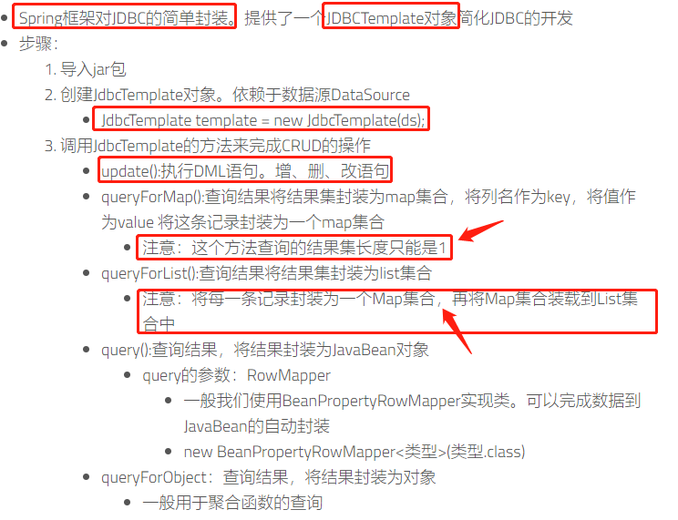
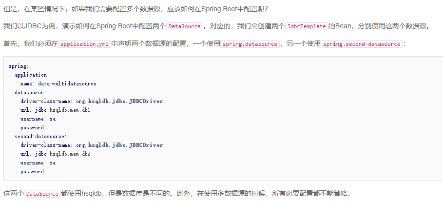

# Spring JDBC

    对于比较简单的项目，使用JDBC去访问数据库是可行的，但对于真实的项目，现在很少直接使用它了，所以，对这块内容，了解即可。



- JDBC产生了大量的冗余代码，例如打开/关闭一个数据库连接，处理sql异常等
- Spring提供了一个JdbcTemplate对JDBC进行了封装,配合Spring Boot的自动配置功能，能比较好地消除了直接使用原生JDBC所带来的冗余代码
- 在Spring JdbcTemplate中，只需要配置到数据库的连接,然后写SQL查询语句即可，我们的其余工作由Spring执行。
- JdbcTemplate类执行SQL查询，遍历ResultSet
- JdbcTemplate类的实例是线程安全的。这意味着通过配置JdbcTemplate类的单个实例，我们可以将它用于几个DAO对象。
- 使用JdbcTemplate来避免资源泄漏等常见错误并删除JDBC样板代码.

```xml
<project>
    <dependency>
        <groupId>org.springframework.boot</groupId>
        <artifactId>spring-boot-starter-jdbc</artifactId>
    </dependency>
    <dependency>
        <groupId>mysql</groupId>
        <artifactId>mysql-connector-java</artifactId>
        <scope>runtime</scope>
    </dependency>
</project>
```

## SpringBoot配置多个DataSource





