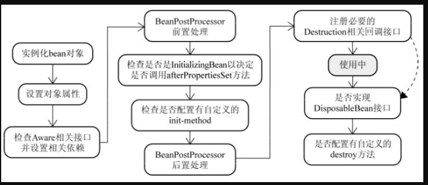

# Aware的作用

    Aware接口可以用于在初始化bean时获得 Spring 容器中的一些对象，比如 Spring 上下文等,这些Aware接口会被Spring回调
 
    Aware子接口均继承于org.springframework.beans.factory.Aware标记接口.

- **ApplicationContextAware**: 获得ApplicationContext对象,可以用来获取所有Bean definition的名字。
- **BeanFactoryAware**:获得BeanFactory对象，可以用来检测Bean的作用域。
- **BeanNameAware**:获得Bean的名字
- **ResourceLoaderAware**:获得ResourceLoader对象，可以获得classpath中某个文件。
- **ServletContextAware**:在一个MVC应用中可以获取ServletContext对象，可以读取context中的参数。
- **ServletConfigAware**： 在一个MVC应用中可以获取ServletConfig对象，可以读取config中的参数。

# Spring Bean生命周期

    Spring只帮我们管理单例模式 Bean 的完整生命周期
    
    对于 prototype 的 bean ，Spring 在创建好交给使用者之后, 就不会再管理后续的生命周期

---

1. 实例化
2. 填充属性
3. setBeanName方法(接口BeanNameAware)
4. setBeanFactory方法(接口BeanFactoryAware)
5. setApplicationContext方法(接口ApplicationContextAware(需要容器实现ApplicationContext接口才会被调用))
6. postProcessBeforeInitialization方法(BeanPostProcessor的预初始化方法(注意，它是针对全部bean生效))
8. 调用接口InitializingBean的afterPropertiesSet方法
7. 调用定制的初始化方法(也就是@PostConstruct标注方法)
9. postProcessAfterInitialization方法(BeanPostProcessor的后初始化方法(注意，它是针对全部bean生效))
10. Bean准备就绪
12. 调用接口DisposableBean的destroy方法 (容器关闭之后才会调用)
11. 调用定制的销毁方法(@PostDestroy标注方法)

# Bean的前置后置处理方式汇总

    方式1: 使用@PostConstruct和@PreDestroy注解, 注意:为了注解可以生效，需要在配置文件中定义
    org.springframework.context.annotation.CommonAnnotationBeanPostProcessor这个bean
    或者添加context:annotation-config.

    方式2: 通过实现InitializingBean的afterPropertiesSet()和实现DisposableBean接口的destroy(),
    这种方法比较简单，但是不建议使用。因为这样会将Bean的实现和Spring框架耦合在一起.
    
    方式3: 在bean的xml配置文件中指定init-method和destroy-method方法,
    这种方式比较推荐，因为不会和spring的框架耦合.
