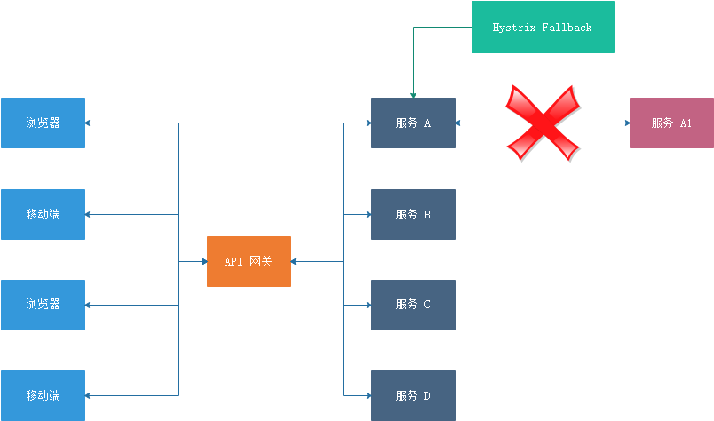

# 使用熔断器(Hystrix断路器)防止服务雪崩

## 概述

在微服务架构中，根据业务来拆分成一个个的服务，服务与服务之间可以通过 RPC 相互调用，在 Spring Cloud 中可以用 RestTemplate + Ribbon 和 Feign 来调用。为了保证其高可用，单个服务通常会集群部署。由于网络原因或者自身的原因，服务并不能保证 100% 可用，如果单个服务出现问题，调用这个服务就会出现线程阻塞，此时若有大量的请求涌入，Servlet 容器的线程资源会被消耗完毕，导致服务瘫痪。服务与服务之间的依赖性，故障会传播，会对整个微服务系统造成灾难性的严重后果，这就是服务故障的 “雪崩” 效应。

为了解决这个问题，业界提出了熔断器模型。

Netflix 开源了 Hystrix 组件，实现了熔断器模式，Spring Cloud 对这一组件进行了整合。在微服务架构中，一个请求需要调用多个服务是非常常见的，如下图：

较底层的服务如果出现故障，会导致连锁故障。当对特定的服务的调用的不可用达到一个阀值（Hystrix 是 5 秒 20 次） 熔断器将会被打开。

熔断器打开后，为了避免连锁故障，通过 fallback 方法可以直接返回一个固定值。

许多的依赖不可避免的会调用失败，比如超时，异常等，Hystrix能够保证在一个依赖出问题的情况下， **不会导致整体服务的失败，避免级联故障，以提高分布式系统的弹性。

>断路器本身是一种开关装置，当某个服务单元发生故障之后，通过断路器的故障监控（类似熔断保险丝）， 向调用方法返回一个预期的，可处理的备选响应（FallBack），而不是长时间的等待或者抛出调用方法异常无法处理的异常，这样就保证服务调用方的线程不会被长时间，不必要的占用，从而避免了故障在分布式系统中的蔓延。

    一旦某个服务单元发生瘫痪或者网络延迟等原因，断路器模式监控到此异常，就会向调用方返回一个错误响应，
    而不是让调用方长时间在等待，这样就不会产生在一个线程中被长时间占用，提高了系统的响应速度。

## 服务熔断

熔断机制是应对雪崩效应的一种微服务链路保护机制，当链路的某一个微服务不可用或者响应时间太长，会进行服务的降级， **进而熔断该节点微服务的调用，快速返回“错误”的响应信息**，当检测到该节点微服务调用响应正常后恢复调用链路，在SpringCloud框架中熔断机制使用Hystrix实现，Hystrix会监控微服务调用情况，当失败达到一定阈值。就会启动熔断机制，熔断机制的注解是 **@HystrixCommand**

## 服务监控Hystrix Dashboard

Hystrix还提供了准实时的调用监控仪表盘(Hystrix Dashboard)，Hystrix Dashboard会持续的记录所有通过Hystrix发起的请求的执行信息，并以统计报表的图形的形式展示给用户，包括每秒执行多少次请求多少成功多少失败等，对监控内容转换为可视化界面。

# 附：Hystrix 说明

## 什么情况下会触发 fallback 方法

## fallback 方法在什么情况下会抛出异常

# Hystrix Dashboard 界面监控参数

>Hystrix 常用配置信息(修改application.properties)

# 超时时间（默认1000ms，单位：ms）

- hystrix.command.default.execution.isolation.thread.timeoutInMilliseconds：在调用方配置，被该调用方的所有方法的超时时间都是该值，优先级低于下边的指定配置
- hystrix.command.HystrixCommandKey.execution.isolation.thread.timeoutInMilliseconds：在调用方配置，被该调用方的指定方法（HystrixCommandKey 方法名）的超时时间是该值

# 线程池核心线程数

- hystrix.threadpool.default.coreSize：默认为 10

# Queue

- hystrix.threadpool.default.maxQueueSize：最大排队长度。默认 -1，使用 SynchronousQueue。其他值则使用 LinkedBlockingQueue。如果要从 -1 换成其他值则需重启，即该值不能动态调整，若要动态调整，需要使用到下边这个配置
- hystrix.threadpool.default.queueSizeRejectionThreshold：排队线程数量阈值，默认为 5，达到时拒绝，如果配置了该选项，队列的大小是该队列
- 注意： 如果 maxQueueSize=-1 的话，则该选项不起作用

# 断路器

- hystrix.command.default.circuitBreaker.requestVolumeThreshold：当在配置时间窗口内达到此数量的失败后，进行短路。默认 20 个（10s 内请求失败数量达到 20 个，断路器开）
- hystrix.command.default.circuitBreaker.sleepWindowInMilliseconds：短路多久以后开始尝试是否恢复，默认 5s
- hystrix.command.default.circuitBreaker.errorThresholdPercentage：出错百分比阈值，当达到此阈值后，开始短路。默认 50%

# fallback

- hystrix.command.default.fallback.isolation.semaphore.maxConcurrentRequests：调用线程允许请求 
- HystrixCommand.GetFallback() 的最大数量，默认 10。超出时将会有异常抛出，注意：该项配置对于 THREAD 隔离模式也起作用

# 属性配置参数

- 参数说明：https://github.com/Netflix/Hystrix/wiki/Configuration
- HystrixProperty 参考代码：http://www.programcreek.com/java-api-examples/index.php?source_dir=Hystrix-master/hystrix-contrib/hystrix-javanica/src/test/java/com/netflix/hystrix/contrib/javanica/test/common/configuration/command/BasicCommandPropertiesTest.java

