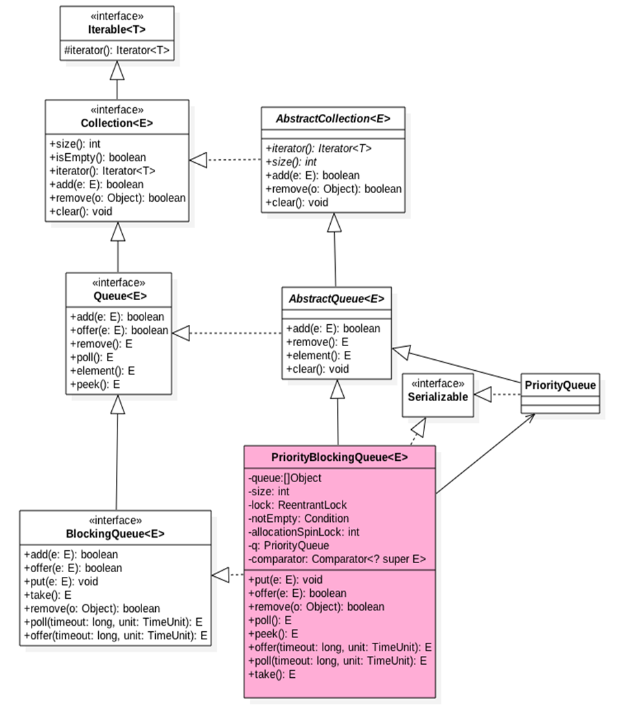

# Queue

## 重要的实现类

- PriorityQueue：基于堆结构实现，可以用它来实现优先级队列

还有其他的,如:

- ArrayBlockingQueue
- LinkedBlockingQueue
- PriorityBlockingQueue

>AbstractQueue提供了Queue接口的骨干实现，以减少实现Queue的工作量

## 分类

### 分类角度1-有界/无界

1. Bounded Queues 有界队列: 有界队列是有容量限制的队列，这意味着我们必须在创建队列时提供队列的最大大小。 
例如ArrayBlockingQueue的构造器，肯定是有容量capacity这个参数的.
2. Unbounded Queues 无界队列: 无界队列是不受容量限制的队列，这意味着创建队列的时候，不用提供队列的大小。 例如LinkedList，PriorityQueue.

- 所有的在java.util包中可用的Queue都是无界队列(Unbounded Queues)
- 在java.util.concurrent包中的所有可用Queue都是有界队列(Bounded Queues).

### 分类角度2-阻塞/非阻塞

1. 阻止队列(Blocking Queues): 实现BlockingQueue接口的所有队列都是BlockingQueues，其余是非阻塞队列
2. 非阻塞队列(Non-Blocking Queues)

>BlockingQueues阻塞直到它完成它的工作或超时，但Non-BlockingQueues不会阻塞，会直接返回结果.

### 特点

6. 最常用的Queue实现是LinkedList，ArrayBlockingQueue和PriorityQueue。
7. BlockingQueues不接受null元素。 如果我们执行任何与null相关的操作，它将抛出NullPointerException。
9. BlockingQueues是线程安全的。
10.  java.util.concurrent package中可用的Queues是Bounded Queues.
11. 所有Deques都不是线程安全的。
12. ConcurrentLinkedQueue is an unbounded thread-safe Queue based on linked nodes.
ConcurrentLinkedQueue是一个无界的线程安全的基于链接节点的Queue.
13. 除了Deques之外，所有队列都支持在队列尾部插入并在队列的头部删除。
14. Deques是队列，但它们支持两端的元素插入和移除。(Deques are queues but they support element insertion and removal at both ends.)

Deque:

	 (insert or remove)--rear-----------front--->(remove or insert)
