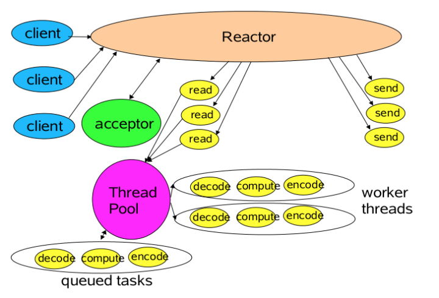

# Java I/O

## 分类

Java 的 I/O 可以分成:磁盘I/O和网络I/O(Socket)，当然也可以从另一个角度分类，分成字节操作(InputStream 和 OutputStream)和字符操作(Reader 和 Writer)。

不管是磁盘还是网络传输，最小的存储单元都是字节，而不是字符。但是在程序中操作的通常是字符形式的数据，因此需要提供对字符进行操作的方法。InputStreamReader 实现从字节流解码成字符流；OutputStreamWriter 实现字符流编码成为字节流。

## 装饰者模式

以 InputStream 为例，InputStream 是抽象类，FileInputStream 是 InputStream 的子类，属于具体实现类，提供了字节流的输入操作；BufferedInputStream 为 FileInputStream 提供缓存的功能。实例化一个具有缓存功能的字节流对象时，只需要在 FileInputStream 对象上再套一层 BufferedInputStream 对象即可。

```java
FileInputStream fileInputStream = new FileInputStream(filePath);
BufferedInputStream bufferedInputStream = new BufferedInputStream(fileInputStream);
```

## 传统BIO模型分析

>传统的服务器端同步阻塞I/O处理（也就是BIO，Blocking I/O）的经典编程模型：

```java
// 注意这里是伪代码
{
 ExecutorService executor = Excutors.newFixedThreadPollExecutor(100);//线程池

 ServerSocket serverSocket = new ServerSocket();
 serverSocket.bind(8088);
 while(!Thread.currentThread.isInturrupted()){//主线程死循环等待新连接到来
 Socket socket = serverSocket.accept();
 executor.submit(new ConnectIOnHandler(socket));//为新的连接创建新的线程
}

class ConnectIOnHandler extends Thread{
    private Socket socket;
    public ConnectIOnHandler(Socket socket){
       this.socket = socket;
    }
    public void run(){
      while(!Thread.currentThread.isInturrupted()&&!socket.isClosed()){死循环处理读写事件
          String someThing = socket.read()....//读取数据
          if(someThing!=null){
             ......//处理数据
             socket.write()....//写数据
          }

      }
    }
}
```

这是一个经典的`每连接每线程的模型`，之所以使用多线程，主要原因在于socket.accept()、socket.read()、socket.write()三个主要函数都是同步阻塞的，`当一个连接在处理I/O的时候，系统是阻塞的，如果是单线程的话必然就挂死在那里；但CPU是被释放出来的，开启多线程，就可以让CPU去处理更多的事情。`其实这也是所有使用多线程的本质：

1. 利用多核。
2. 当I/O阻塞系统，但CPU空闲的时候，可以利用多线程使用CPU资源。

现在的多线程一般都使用线程池，可以让线程的创建和回收成本相对较低。在活动连接数不是特别高（小于单机1000）的情况下，这种模型是比较不错的，可以让每一个连接专注于自己的I/O并且编程模型简单，也不用过多考虑系统的过载、限流等问题。线程池本身就是一个天然的漏斗，可以缓冲一些系统处理不了的连接或请求。

>不过，这个模型最本质的问题在于，严重依赖于线程。但线程是很"贵"的资源，主要表现在：

1. 线程的创建和销毁成本很高，在Linux这样的操作系统中，线程本质上就是一个进程。创建和销毁都是重量级的系统函数。
2. 线程本身占用较大内存，像Java的线程栈，一般至少分配512K～1M的空间，如果系统中的线程数过千(java后台游戏)，恐怕整个JVM的内存都会被吃掉一半。
3. 线程的切换成本是很高的。操作系统发生线程切换的时候，需要保留线程的上下文，然后执行系统调用。如果线程数过高，可能执行线程切换的时间甚至会大于线程执行的时间，这时候带来的表现往往是系统load偏高、CPU sy使用率特别高（超过20%以上)，导致系统几乎陷入不可用的状态。
4. 因为系统负载是用活动线程数或CPU核心数，一旦线程数量高但外部网络环境不是很稳定，就很容易造成大量请求的结果同时返回，激活大量阻塞线程从而使系统负载压力过大。
所以，当面对十万甚至百万级连接的时候，传统的BIO模型是无能为力的。随着移动端应用的兴起和各种网络游戏的盛行，`百万级长连接`日趋普遍，此时，必然需要一种更高效的I/O处理模型。

## 常见I/O模型对比

所有的系统I/O都分为两个阶段：`等待就绪和操作`。举例来说，`读函数，分为等待系统可读和真正的读；同理，写函数分为等待网卡可以写和真正的写。`

需要说明的是`等待就绪的阻塞是不使用CPU的，是在“空等”；而真正的读写操作的阻塞是使用CPU的，真正在"干活"，`而且这个过程非常快，属于memory copy，带宽通常在1GB/s级别以上，可以理解为基本不耗时。


    以socket.read()为例子：
    
    传统的BIO里面socket.read()，如果TCP RecvBuffer里没有数据，函数会一直阻塞，直到收到数据，返回读到的数据。
    
    对于NIO，如果TCP RecvBuffer有数据，就把数据从网卡读到内存，并且返回给用户；反之则直接返回0，永远不会阻塞。
    
    最新的AIO(Async I/O)里面会更进一步：不但等待就绪是非阻塞的，就连数据从网卡到内存的过程也是异步的。
    
    换句话说，BIO里用户最关心“我要读”，NIO里用户最关心"我可以读了"，在AIO模型里用户更需要关注的是“读完了”。
    
    NIO一个重要的特点是：socket主要的读、写、注册和接收函数，在等待就绪阶段都是非阻塞的，真正的I/O操作是同步阻塞的（消耗CPU但性能非常高）。

## 如何结合事件模型使用NIO同步非阻塞特性

回忆BIO模型，之所以需要多线程，是因为在进行I/O操作的时候,没有办法知道到底能不能写、能不能读，只能"傻等"，也没法在socket.read()和socket.write()函数中返回，这两个函数无法进行有效的中断(明明不能读，当前线程还必须要等)。所以除了多开线程另起炉灶，`没有好的办法利用CPU。`

`NIO的读写函数可以立刻返回，这就给了我们不开线程利用CPU的最好机会`：如果一个连接不能读写（socket.read()返回0或者socket.write()返回0），我们可以把这件事记下来，记录的方式通常是在Selector上注册标记位，然后切换到其它就绪的连接（channel）继续进行读写。(由单线程就可以搞定，不用开启多线程)

>下面具体看下如何利用事件模型单线程处理所有I/O请求：

NIO的主要事件有几个：读就绪、写就绪、有新连接到来。

>我们首先需要注册当这几个事件到来的时候所对应的事件处理器。`然后在合适的时机告诉事件选择器：我对这个事件感兴趣。`

- 对于写操作，就是写不出去的时候对写事件感兴趣；
- 对于读操作，就是完成连接和系统没有办法承载新读入的数据的时；
- 对于accept，一般是服务器刚启动的时候；
- 而对于connect，一般是connect失败需要重连或者直接异步调用connect的时候。

其次，用一个死循环选择就绪的事件，会执行系统调用（Linux 2.6之前是select、poll，2.6之后是epoll，Windows是IOCP），还会阻塞的等待新事件的到来。新事件到来的时候，会在selector上注册标记位，标示可读、可写或者有连接到来。

    注意，select是阻塞的，无论是通过操作系统的通知（epoll）还是不停的轮询(select，poll)，
    这个函数是阻塞的。所以你可以放心大胆地在一个while(true)里面调用这个函数而不用担心CPU空转。

>所以我们的程序大概的模样是：

```java
// 我们首先需要注册当这几个事件到来的时候所对应的事件处理器。
// 然后在合适的时机告诉事件选择器：我对这个事件感兴趣。
interface ChannelHandler{
    void channelReadable(Channel channel);
    void channelWritable(Channel channel);
}
class Channel{
    Socket socket;
    Event event;//读，写或者连接
}

//IO线程主循环:
class IoThread extends Thread{
    public void run(){
    Channel channel;
    while(channel=Selector.select()){//选择就绪的事件和对应的连接
      if(channel.event==accept){// 注册事件处理器
          // connect事件
         registerNewChannelHandler(channel);//如果是新连接，则注册一个新的读写处理器
      }
      if(channel.event==write){// 在合适的时机告诉事件选择器：我对这个事件感兴趣，来进行事件的处理
         getChannelHandler(channel).channelWritable(channel);//如果可以写，则执行写事件
      }
      if(channel.event==read){// 在合适的时机告诉事件选择器：我对这个事件感兴趣，来进行事件的处理
          getChannelHandler(channel).channelReadable(channel);//如果可以读，则执行读事件
      }
    }
    }
    Map<Channel，ChannelHandler> handlerMap;//所有channel的对应事件处理器
}
```

>这个程序很简短，也是最简单的Reactor模式：注册所有感兴趣的事件处理器，`单线程轮询选择就绪事件`，执行事件处理器。    

## 优化线程模型

>由上面的示例我们大概可以总结出NIO是怎么解决掉线程的瓶颈并处理海量连接的：

NIO由原来的阻塞读写（占用线程）变成了单线程轮询事件，找到可以进行读写的网络描述符进行读写。除了事件的轮询是阻塞的（没有可干的事情必须要阻塞），剩余的I/O操作都是纯CPU操作，没有必要开启多线程。

并且由于线程的节约，连接数大的时候因为线程切换带来的问题也随之解决，进而为处理海量连接提供了可能。

单线程处理I/O的效率确实非常高，没有线程切换，只是拼命的读、写、选择事件。`但现在的服务器，一般都是多核处理器，如果能够利用多核心进行I/O，无疑对效率会有更大的提高。`

仔细分析一下我们需要的线程，其实主要包括以下几种：

1. 事件分发器，单线程选择就绪的事件。
2. I/O处理器，包括connect、read、write等，这种纯CPU操作，一般开启CPU核心个线程就可以。
3. 业务线程，在处理完I/O后，业务一般还会有自己的业务逻辑，有的还会有其他的阻塞I/O，如DB操作，RPC等。只要有阻塞，就需要单独的线程。

>Java的Selector对于Linux系统来说，有一个致命限制：同一个channel的select不能被并发的调用。因此，如果有多个I/O线程，必须保证：一个socket只能属于一个IoThread，而一个IoThread可以管理多个socket。防止一个socket(Channel,因为Channel内部包含了socket)被多个I/O线程并发调用.

另外连接的处理和读写的处理通常可以选择分开，这样对于海量连接的注册和读写就可以分发。`虽然read()和write()是比较高效无阻塞的函数，但毕竟会占用CPU，如果面对更高的并发则无能为力。`



# NIO在客户端的魔力

通过上面的分析，可以看出NIO在服务端对于解放线程，优化I/O和处理海量连接方面，确实有自己的用武之地。那么在客户端上，NIO又有什么使用场景呢?

常见的客户端BIO+连接池模型，可以建立n个连接，然后当某一个连接被I/O占用的时候，可以使用其他连接来提高性能。

但多线程的模型面临和服务端相同的问题：如果指望增加连接数来提高性能，则连接数又受制于线程数、线程很贵、无法建立很多线程，则性能遇到瓶颈。

## 按连接顺序请求的Redis

>对于Redis来说，由于服务端是全局串行的，能够保证同一连接的所有请求与返回顺序一致。这样可以使用单线程＋队列，把请求数据缓冲。然后pipeline发送，返回future，然后channel可读时，直接在队列中把future取回来，done()就可以了。

```java
// 伪代码如下：
class RedisClient Implements ChannelHandler{
 private BlockingQueue CmdQueue;
 private EventLoop eventLoop;
 private Channel channel;
 
 class Cmd{
  String cmd;
  Future result;
 }
 
 public Future get(String key){
   Cmd cmd= new Cmd(key);
   queue.offer(cmd);
   eventLoop.submit(new Runnable(){
        List list = new ArrayList();
        queue.drainTo(list);
        if(channel.isWritable()){
         channel.writeAndFlush(list);
        }
   });
}
 public void ChannelReadFinish(Channel channel，Buffer Buffer){
    List result = handleBuffer();//处理数据
    //从cmdQueue取出future，并设值，future.done();
}
 public void ChannelWritable(Channel channel){
   channel.flush();
}
}
```

>这样做，能够充分的利用pipeline来提高I/O能力，同时获取异步处理能力。

## 多连接短连接的HttpClient

类似于抓取的项目，往往需要建立无数的HTTP短连接，然后抓取，然后销毁，当需要单机抓取上千网站线程数又受制的时候，怎么保证性能呢?

何不尝试NIO，单线程进行连接、写、读操作？如果连接、读、写操作系统没有能力处理，简单的注册一个事件，等待下次循环就好了。

如何存储不同的请求/响应呢？由于http是无状态没有版本的协议，又没有办法使用队列，好像办法不多。比较笨的办法是对于不同的socket，直接存储socket的引用作为map的key。

## 常见的RPC框架，如Thrift，Dubbo

这种框架内部一般维护了请求的协议和请求号，可以维护一个以请求号为key，结果的result为future的map，结合NIO+长连接，获取非常不错的性能。

## 阻塞，非阻塞，同步，异步

- 阻塞与非阻塞指的的是当不能进行读写（网卡满时的写/网卡空的时候的读）的时候，I/O 操作立即返回还是阻塞；
- 同步异步指，当数据已经准备好的时候(内核空间缓冲区已经准备好数据)，读写操作是同步读还是异步读，阶段不同而已。

## Selector.wakeup()主要作用

解除阻塞在Selector.select()/select(long)上的线程，立即返回。两次成功的select之间多次调用wakeup等价于一次调用。
如果当前没有阻塞在select上，则本次wakeup调用将作用于下一次select——“记忆”作用。

>为什么要唤醒？

- 注册了新的channel或者事件。
- channel关闭，取消注册。
- 优先级更高的事件触发（如定时器事件），希望及时处理。

>唤醒的原理

Linux上利用pipe调用创建一个管道，Windows上则是一个loopback回环tcp连接。这是因为win32的管道无法加入select的fd set，将管道或者TCP连接加入select fd set。`wakeup往管道或者连接写入一个字节，阻塞的select因为有I/O事件就绪，立即返回。可见，wakeup的调用开销不可忽视。`

## Buffer的选择

通常情况下，操作系统的一次写操作分为两步：

1. 将数据从用户空间拷贝到系统空间。
2. 从系统空间往网卡写。

>同理，读操作也分为两步：

1. 将数据从网卡拷贝到系统空间；
2. 将数据从系统空间拷贝到用户空间。

对于NIO来说，缓存的使用可以使用DirectByteBuffer和HeapByteBuffer。如果使用了DirectByteBuffer，一般来说可以减少一次系统空间到用户空间的拷贝。但Buffer创建和销毁的成本更高，更不宜维护，通常会用内存池来提高性能。
如果数据量比较小的中小应用情况下，可以考虑使用heapBuffer；反之可以用directBuffer。

## NIO存在的问题

- 使用NIO != 高性能，当连接数<1000，并发程度不高或者局域网环境下NIO并没有显著的性能优势。
- NIO并没有完全屏蔽平台差异，它仍然是基于各个操作系统的I/O系统实现的，差异仍然存在。使用NIO做网络编程构建事件驱动模型并不容易，陷阱重重。

>推荐大家使用成熟的NIO框架，如Netty，MINA等。解决了很多NIO的陷阱，并屏蔽了操作系统的差异，有较好的性能和编程模型。

## 最后总结一下到底NIO给我们带来了些什么：

- 事件驱动模型
- 避免多线程
- 单线程处理多任务
- 非阻塞I/O，I/O读写不再阻塞，而是返回0
- 基于block的传输，通常比基于流的传输更高效
- 更高级的IO函数，zero-copy
- IO多路复用大大提高了Java网络应用的可伸缩性和实用性

[来源](https://zhuanlan.zhihu.com/p/23488863)

