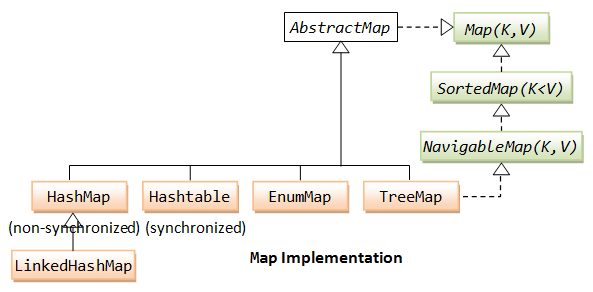

# 容器

Java中的容器包括 Collection 和 Map 两类，Collection 存储着对象的集合，而 Map 存储着键值对（两个对象）的映射表。这里主要讨论Map.

# Map为什么会出现

因为List这种数据结构，获取元素简单,可以直接通过索引下标，但是插入和删除操作复杂，需要移动内部的元素；链表这种数据结构，插入和删除操作简单，但是查找麻烦，只能一个一个地遍历。

有没有一种新的数据结构，插入数据简单，同时查找也简单？ 这个时候就出现了哈希表这种数据结构。 这是一种折中的方式，插入没链表快，查询没数组快。

# Map

# Map特点

Map这种容器存储的是键值对的映射,一个键值对被称为一个Entry(条目).

Map提供了三个集合视图: 键集，键值映射集(entry) 和 值集合

>基于哈希表(哈希函数/散列函数)实现,Map不能包含重复的key

Map不保证key的映射顺序，但它取决于实现(这里是不能保证,不是一定没有顺序,要取决于具体的实现)。例如，HashMap不保证映射的顺序，但TreeMap就可以保证.

# 常用实现类

- HashMap：基于哈希表实现的散列结构,使用拉链法(1.8达到阈值后使用红黑树解决冲突)解决冲突,底层采用数组+链表实现(线程不安全)
- HashTable：和 HashMap 类似(内部也是数组+链表)，只不过它是线程安全的.它是遗留类,比较老了，不应该再去使用它,jdk早就不更新了,现在可以使用 ConcurrentHashMap 来支持线程安全，并且 ConcurrentHashMap 的效率会更高，因为 ConcurrentHashMap 引入了分段锁.
- TreeMap：有序散列表，底层通过红黑树实现。
- LinkedHashMap：使用双向链表来维护元素的顺序，顺序为插入顺序或者最近最少使用（LRU）顺序。
- ConcurrentHashMap: 线程安全.

>AbstractMap类提供了Map接口的骨架实现，大多数Map具体类扩展了AbstractMap类并实现了所需的方法

# 哈希函数/散列函数

key通过一种函数f(k)得到元素的存放位置(哪个桶)，这个函数就称为散列函数/哈希函数.

对于不同的key，得到了同一地址，即k1 != k2，但是f(k1) = f(k2)。这种现象称为哈希冲突，jdk1.7采用拉链法解决冲突,1.8采用拉链法和红黑树解决冲突.

散列函数有好几种实现，分别有除留余数法,随机数法.

若对于关键字集合中的任一个关键字，经散列函数映象到地址集合中任何一个地址的概率是相等的，则称此类散列函数为均匀散列函数

# 什么样的类适合做Map的Key

Map使用hashCode和equals方法来实现get和put操作。所以可变类不适合Map做Map的key。因为如果hashCode或equals的值在put之后发生更改，则在get操作中将无法获得正确的值。因为Map是根据key的hashCode来计算value的位置的，如果key的hashCode变化了，将计算错误的位置.

