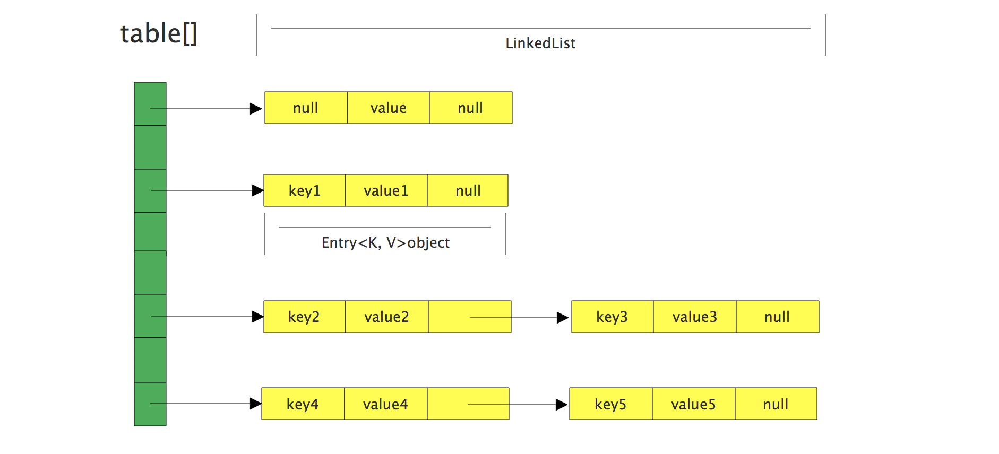
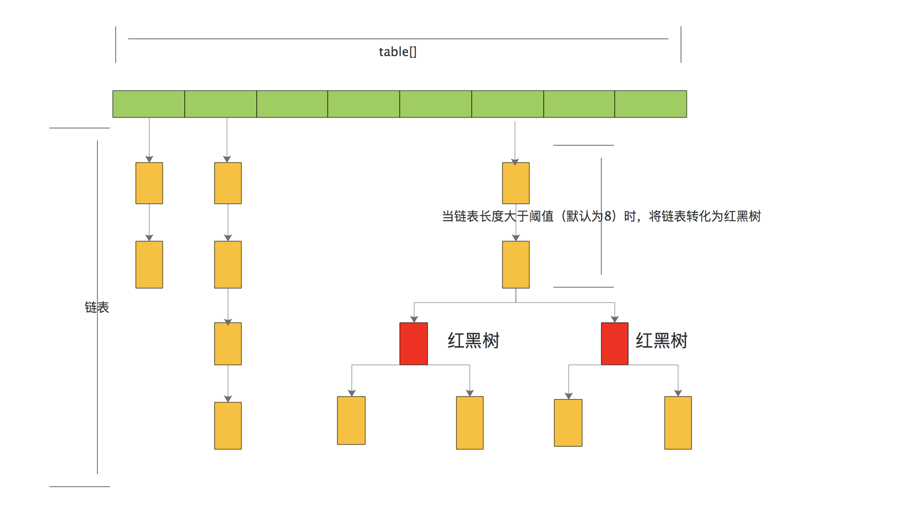

# HashMap

## HashMap的特点 

HashMap使用它的内部类 class Node<K，V>来存储映射,HashMap使用哈希算法来达到散列的目的，并在key上使用hashCode（）和equals（）方法进行get和put操作。

> HashMap继承了AbstractMap，实现了Map接口,一个key-value对，就是一个Entry,所有的Entry都是不可重复.key不允许重复(相同的key,即equals方法返回true的key，后者的value会覆盖前者)，value可重复.

* HashMap中的key和value可以为null
* HashMap内部的元素是无序的
* 如果key用自定义的类，那么自定义的类就必须重写equals方法和hashCode方法
* 如果添加两个相同的key,后面的会替换前面的
* HashMap 判断两个 key 相等的标准是：两个 key 通过 equals() 方法返回 true，hashCode 值也相等。
* 我们只需记住HashMap在Key上操作，并且key需要良好的hashCode实现和equals方法以避免发生错误.
* HashMap进行数组扩容时，需要重新计算每个元素在数组中的位置，耗性能。

# load factor(负载因子)的作用

用来控制数组存放数据的疏密程度,Map 在使用过程中不断的往里面存放数据，当数量达到了"桶容量*负载因子"的时候，
就需要扩容，而扩容这个过程涉及到 rehash、复制数据等操作，所以非常消耗性能。因此通常建议能提前预估 HashMap 的大小最好，尽量的减少扩容带来的性能损耗

- load Factor太大(loadFactor接近于1)，空间利用率高，查找元素效率低，链表的长度就越长。--时间因素
- load factor太小导致数组的利用率低,空间利用率低，存放的数据会很分散--空间因素
- loadFactor的默认值为0.75f是官方给出的一个比较好的临界值。较好的衡量了时间因素和空间因素.
- 负载因子越大代表空间利用充分，但是查询，搜索效率就降低，过小，空间利用率就降低，

# HashMap实现原理

## 以下基于 JDK1.7 分析

>HashMap是基于数组(数组需要连续内存.空间复杂度较高)和链表实现的,数组是HashMap的主体，链表实则是为了解决哈希(hash)冲突而存在的（拉链法解决哈希冲突）

所谓 “拉链法” 就是：将链表和数组相结合。也就是说创建一个数组，数组中每一格就是一个链表。
若遇到哈希冲突，则将冲突的值加到链表中即可。

### put 方法

>首先会将传入的 Key 做 `hash(哈希)` 运算(用key的hashcode做计算)，计算出在数组中下标位置(最简单的是通过取模运算计算出index)，如果这个index位置已经存放了其他元素，那么就会以链表的方式存放，新加入的元素放在链头，老的元素加入的放在链尾，如果数组上该位置没有元素，就直接放到该位置上。

由于在计算机中`位运算比取模运算效率高的多`，所以 HashMap 规定数组的长度为 `2^n` 。这样用 `2^n - 1` 做位运算与取模效果一致，并且效率还要高出许多。

由于数组的长度有限，所以难免会出现不同的 Key 通过运算得到的 index 相同，这种情况可以利用链表来解决，HashMap 会在 `table[index]`处形成链表，采用头插法将数据插入到链表中。

### get 方法

get 和 put 类似，也是将传入的 Key 计算出 index ，如果该位置上是一个链表就需要遍历整个链表，通过 `key.equals(k)` 来找到对应的元素。

## 以下基于 JDK1.8 分析

当 Hash 冲突严重时，在桶上形成的链表会变的越来越长，这样在查询时的效率就会越来越低；时间复杂度为 O(N)。因此 1.8 中重点优化了这个查询效率。

`JDK1.8` 中对 `HashMap` 进行了优化：当 `hash` 碰撞之后写入链表的长度超过了阈值(默认为8)并且 `table` 的长度不小于64(如果小于64，先进行扩容一次)时，链表将会转换为**红黑树**。以减少查找时间.

jdk1.7中，假设 `hash` 冲突非常严重，一个数组后面接了很长的链表，此时查找的时间复杂度就是 `O(n)` 。如果是红黑树，查询的时间复杂度就是 `O(logn)` 。大大提高了查询效率。

>但是，jdk1.8并未有修改HashMap之前的线程安全问题，我们都知道HashMap是线程不安全的，涉及到线程安全的时候，我们应该使用ConcurrentHashMap，

## 并发以及性能分析

HashMap的方法都没有synchronized，不是线程安全的,(Hashtable是线程安全的)

多线程场景下推荐使用 ConcurrentHashMap或使用Collections.synchronizedMap（）方法获取同步Map。

在并发环境下使用 `HashMap` 容易出现死循环。

并发场景发生扩容，调用 `resize()` 方法里的 `rehash()` 时，容易出现环形链表。这样当获取一个不存在的 `key` 时，计算出的 `index` 正好是环形链表的下标时就会出现死循环。

> 所以 HashMap 只能在单线程中使用，并且尽量的预设容量，尽可能的减少扩容。

