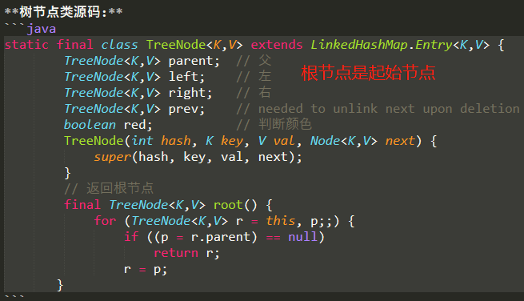

# JDK1.7 HashMap结构

    1.7基于数组(数组需要连续内存)+链表实现的,链表是为了解决哈希冲突(拉链法).拉链法采用头插法将数据插入到链表中.
    
    头插法: 把最新插入的链表的第一个位置.
    
    思考为什么使用数组Array,而不是使用链表LinkedList?
    答: 数组根据索引去寻找对应的桶的时间复杂度是O(1),是支持随机访问,linkedlist不支持随机访问,硬要随机访问的话,是O(N)的时间.效率比较低.

# JDK1.8 HashMap结构

jdk1.7中，当 Hash 冲突严重时，在桶上形成的链表会变的越来越长，链表的查询时间复杂度是O(N),这样查询时的效率就会越来越低。因此 1.8 使用链表+红黑树优化了查询效率.

    红黑树: 一种接近平衡的二叉搜索树.查找,插入,删除:平均时间复杂度都是O(logn)
    
    红黑树提高了效率10%~15%.

当哈希碰撞之后写入链表的长度超过了阈值(8)并且 `table` 的长度不小于64(如果小于64，先进行扩容一次)时，链表将会转换为红黑树(TREEIFY-把..变为树)。以减少查找时间.如果是红黑树，查询的时间复杂度就是 `O(logn)` 。大大提高了查询效率。

如果链表长度没有达到指定的长度就转成红黑树的话,红黑树本身的维护代价是相当高的,因为你插入一个数据的时候,可能会破坏红黑树的平衡,意味着每次就需要对红黑树进行左旋和右旋.以及重新着色.

    1.8除了对1.7查询效率的改进,还有一点就是对扩容时插入顺序的改进.

# 拉链法导致的链表过深，为什么不用二叉查找树代替而选择红黑树？为什么不一直使用红黑树？

之所以选择红黑树是为了解决二叉查找树的缺陷：二叉查找树在特殊情况下会变成一条线性结构（这就跟原来使用链表结构一样了，造成链表长度过长导致查询效率降低的问题），遍历查找会非常慢。而红黑树在插入新数据后会进行左旋、右旋、变色这些操作来保持平衡,解决了二叉搜索树的极端情况.

引入红黑树就是为了提高查询速度，解决链表过长导致查询效率太低的问题。

我们知道红黑树属于近似平衡的二叉搜索树，为了保持“平衡”是需要付出代价的，但是该代价所损耗的资源要比遍历线性链表要少。所以当长度大于8的时候，会使用红黑树；如果链表长度很短的话，根本不需要引入红黑树，引入反而会慢