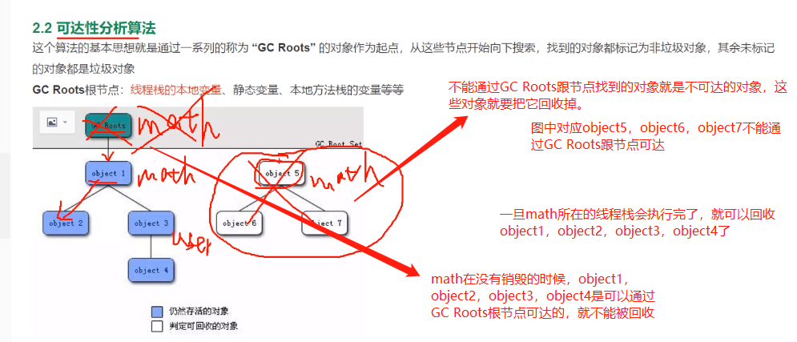
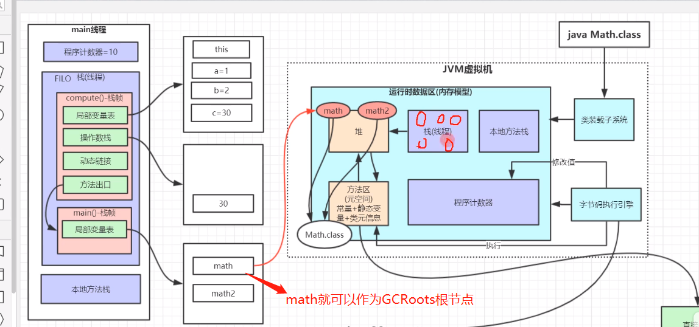

# 方法区(1.7之前的名称)

方法区在虚拟机启动的时候被创建。

字节码Class文件最终会被加载到方法区。主要包含类的静态常量，静态变量，已被虚拟机加载的类元信息.

>可利用参数 `-XX:PermSize -XX:MaxPermSize` 控制初始化方法区和最大方法区大小。

对这块区域进行垃圾回收的主要目的是对类的卸载.HotSpot 虚拟机把它当成永久代来进行垃圾回收

# 元数据区(1.8之后方法区的名字)

在 `1.8` 使用了一个元数据区域`Metaspace`代替了原来的方法区,来保存类加载之后的类元信息。

`PermSize` 和 `MaxPermSize` 已经不能使用了，在 JDK8 中配置这两个参数将会发出警告。

JDK 8 中将类元信息移到到了本地堆中(Native Heap)，将原有的永久代移动到了本地堆中成为 `MetaSpace` ,如果不指定该区域的大小，JVM 将会动态的调整。避免了在 1.7 中由于加载类过多从而出现 `java.lang.OutOfMemoryError: PermGen`。

但也不能无线扩展，因此可以使用 `-XX:MaxMetaspaceSize=10M`来控制最大元数据内存。这样当不停的创建类时将会占满该区域并出现 `OOM`。

```java
    public static void main(String[] args) {
        while (true){
            Enhancer  enhancer = new Enhancer() ;
            enhancer.setSuperclass(HeapOOM.class);
            enhancer.setUseCache(false) ;
            enhancer.setCallback(new MethodInterceptor() {
                @Override
                public Object intercept(Object o, Method method, Object[] objects, MethodProxy methodProxy) throws Throwable {
                    return methodProxy.invoke(o,objects) ;
                }
            });
            enhancer.create() ;

        }
    }
```
使用 `cglib` 不停的创建新类，最终会抛出:
```
Caused by: java.lang.reflect.InvocationTargetException
	at sun.reflect.GeneratedMethodAccessor1.invoke(Unknown Source)
	at sun.reflect.DelegatingMethodAccessorImpl.invoke(DelegatingMethodAccessorImpl.java:43)
	at java.lang.reflect.Method.invoke(Method.java:498)
	at net.sf.cglib.core.ReflectUtils.defineClass(ReflectUtils.java:459)
	at net.sf.cglib.core.AbstractClassGenerator.generate(AbstractClassGenerator.java:336)
	... 11 more
Caused by: java.lang.OutOfMemoryError: Metaspace
	at java.lang.ClassLoader.defineClass1(Native Method)
	at java.lang.ClassLoader.defineClass(ClassLoader.java:763)
	... 16 more
```

注意：这里的 OOM 伴随的是 `java.lang.OutOfMemoryError: Metaspace` 也就是元数据溢出。

# 堆(Heap)-垃圾回收的主战场

jvm堆区是是用来存放对象实例的，堆是垃圾收集器管理的主要区域。

收集器采用分代垃圾收集算法，所以Java堆还可以细分为：新生代和老年代

细致一点,young generation分为：Eden空间、From Survivor、To Survivor空间等

堆内部结构：年轻代 和 老年代

比如给堆初始分配堆大小为600M，默认情况下如果你不改默认参数，老年代会分配到2/3,年轻代为1/3


我们 new出来的对象，一般情况会放到年轻代中的Eden区，当然这个是一般情况，当Eden空间不够的时候，会触发minor GC。会去回收无引用的对象。




线程栈的本地变量就可以作为一种GC Roots根节点。

不能通过GC Roots跟节点找到的对象就是不可达的对象，这些对象就要把它回收掉。
