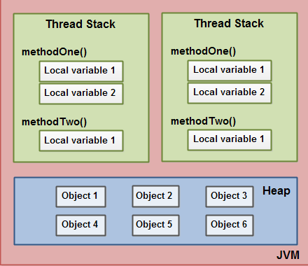
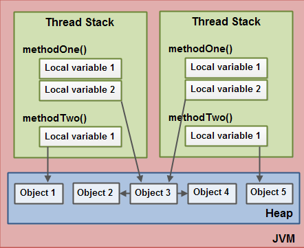

# Java内存模型

### Java内存模型内部原理

通常情况下，我们在研究JVM内存布局的时候，主要研究的就是Java虚拟机栈和堆(Heap)-(具体细分在`1.0_Java虚拟机运行时数据区.md`中)。这也是大多人将Java虚拟机内存粗分为栈内存和堆内存的原因。然后从另外一个角度，HotSpot虚拟机已经将Java虚拟机栈和本地方法栈合并了，和方法区也是堆内存的逻辑组成部分。因此这里我们也粗分为堆内存和栈内存.

>Java内存模型的逻辑视图:

每一个运行的线程都拥有自己的线程栈,线程栈包含了这个线程调用的方法当前执行点相关的信息。一个线程仅能访问自己的线程栈。一个线程创建的`原始类型的本地变量`对其它线程不可见，仅自己可见。

>所有原始类型(int,long..)的本地变量都存放在线程栈上，因此对其它线程不可见。

堆上包含在Java程序中创建的所有对象，如果一个对象被创建然后赋值给一个局部变量，或者用来作为另一个对象的成员变量的引用，这个对象任然是存放在堆上。

1. 一个本地变量可能是原始类型，在这种情况下，它总是“呆在”线程栈上。
2. 一个本地变量也可能是`指向一个对象的一个引用`。这种情况下，这个引用变量（本地变量）存放在线程栈上，但是对象本身存放在堆上。
3. 一个对象可能包含方法，这些方法可能包含本地变量。这些本地变量任然存放在线程栈上，即使这些方法所属的对象存放在堆上。
4. 一个对象的成员变量随着这个对象自身存放在堆上。不管这个成员变量是原始类型还是引用类型。
5. 静态成员变量跟随着类定义一起也存放在堆上
6. 存放在堆上的对象可以被所有持有对这个对象引用的线程访问。当一个线程访问一个对象时，它也可以访问这个对象的成员变量。如果两个线程同时调用同一个对象上的同一个方法，它们将会都访问这个对象的成员变量，但是每一个线程都拥有这个本地变量的私有拷贝。

