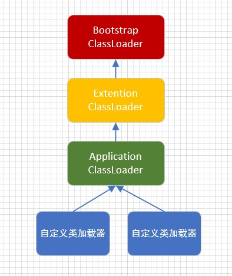

# 双亲委派模型（Parents Delegation Model）

双亲委派模型是Java加载类的机制.采用双亲委派模型的好处是`Java类`随着它的`类加载器`一起具备了一种带有优先级的层级关系，通过这种层级关系可以避免类的重复加载(也能避免类的混淆).



- Bootstrap ClassLoader(启动类加载器,使用 C++ 实现，是虚拟机自身的一部分): 负责将%JAVA_HOME%/lib目录中或-Xbootclasspath中参数指定的路径中的，并且是虚拟机识别的(仅按照文件名识别，如 rt.jar，名字不符合的类库即使放在 lib 目录中也不会被加载)类库加载到JVM中，启动类加载器无法被 Java 程序直接引用。
- Extension ClassLoader（扩展类加载器，使用 Java 实现，独立于虚拟机，继承自抽象类 java.lang.ClassLoader): 这个类加载器是由 ExtClassLoader（sun.misc.Launcher$ExtClassLoader）实现的。负责加载%JAVA_HOME%/lib/ext中的所有类库，或者被 java.ext.dir 系统变量所指定路径中的所有类库加载到内存中，开发者可以直接使用扩展类加载器。
- Application ClassLoader（应用程序加载器): 这个类加载器是由 AppClassLoader（sun.misc.Launcher$AppClassLoader）实现的，由于这个类加载器是 ClassLoader 中的 getSystemClassLoader() 方法的返回值，因此一般称为系统类加载器。它负责加载用户类路径（ClassPath）上所指定的类库，开发者可以直接使用这个类加载器，如果应用程序中没有自定义过自己的类加载器，一般情况下这个就是程序中默认的类加载器。

应用程序是由三种类加载器互相配合从而实现类加载，除此之外还可以加入自己定义的类加载器。

该模型要求除了顶层的Bootstrap ClassLoader(启动类加载器)之外，其它的类加载器都要有自己的父类加载器。

## 工作过程

一个类加载器首先将`类加载请求`转发到`父类加载器`，只有当`父类加载器`无法完成时才尝试自己加载。

## 为什么使用双亲委派模型?(双亲委派模型的好处)

我们举个例子。比如我们要加载java.lang.Object类，无论我们用哪个类加载器去加载Object类，这个加载请求最终都会委托给Bootstrap ClassLoader，这样就保证了所有加载器加载的Object类都是同一个类。如果没有双亲委派模型，那就乱了套了，完全可能搞出多个不同的Object类。

例如 java.lang.Object 存放在 rt.jar 中，如果编写另外一个 java.lang.Object 并放到 ClassPath 中，程序可以编译通过。由于双亲委派模型的存在，所以在 rt.jar 中的 Object 比在 ClassPath 中的 Object 优先级更高，这是因为 rt.jar 中的 Object 使用的是Bootstrap ClassLoader(启动类加载器)，而 ClassPath 中的 Object 使用的是Application ClassLoader（应用程序加载器)。rt.jar 中的 Object 优先级更高，那么程序中所有的 Object 都是这个 Object。

## 看看源码

以下是抽象类 java.lang.ClassLoader 的代码片段，其中的 loadClass() 方法运行过程如下：先检查类是否已经加载过，如果没有则让父类加载器去加载。当父类加载器加载失败时抛出 ClassNotFoundException，此时尝试自己去加载。

```java
public abstract class ClassLoader {
    // The parent class loader for delegation
    private final ClassLoader parent;

    // 加载类调用的loadClass方法
    public Class<?> loadClass(String name) throws ClassNotFoundException {
        return loadClass(name, false);
    }

    protected Class<?> loadClass(String name, boolean resolve) throws ClassNotFoundException {
        synchronized (getClassLoadingLock(name)) {
            // First, check if the class has already been loaded
            // 1. 首先判断了该类是否已加载.
            Class<?> c = findLoadedClass(name);
            if (c == null) {//类没有被加载
                try {
                    if (parent != null) {
                        // 2. 若没加载,则传给双亲加载器去加载,
                        c = parent.loadClass(name, false);
                    } else {
                        c = findBootstrapClassOrNull(name);
                    }
                } catch (ClassNotFoundException e) {
                    // ClassNotFoundException thrown if class not found
                    // from the non-null parent class loader
                }

                // 3. 若双亲加载器没能成功加载它,则自己用findClass()去加载.所以是个向上递归的过程.
                if (c == null) {//双亲加载器没有加载成功
                    // If still not found, then invoke findClass in order
                    // to find the class.
                    c = findClass(name);
                }
            }
            if (resolve) {
                resolveClass(c);
            }
            return c;
        }
    }

    // 自定义加载器时,需要重写findClass方法,因为是空的,没有任何内容:
    protected Class<?> findClass(String name) throws ClassNotFoundException {
        throw new ClassNotFoundException(name);
    }
}
```

## 自定义类加载器实现

程序中如果没有显式指定类加载器的话，默认是AppClassLoader来加载，它负责加载ClassPath目录中的所有类型，如果被加载的类型并没有在ClassPath目录中时，抛出java.lang.ClassNotFoundException异常。

自定义类加载器一般是继承ClassLoader，如果要符合双亲委派规范，则重写findClass方法；要破坏的话，重写loadClass方法。

以下代码中的 org.java.core.advanced.jvm.classloader.MyCustomClassLoader 是自定义类加载器，继承自 java.lang.ClassLoader，用于加载文件系统上的类。它首先根据类的全名在文件系统上查找类的字节代码文件（.class 文件），然后读取该文件内容，最后通过 defineClass() 方法来把这些字节代码转换成 java.lang.Class 类的实例。

自定义类加载器核心是重写 findClass() 方法。
