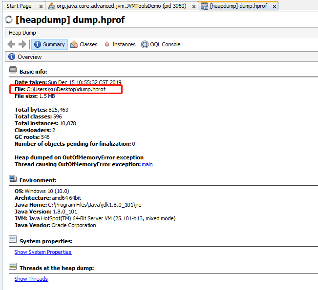

# jvisiualvm

    可以认为jvisualvm是jconsole的升级版.
    jvisualvm是一个综合性的分析工具，可以认为其整合了jstack、jmap、jinfo等众多调试工具的功能，并以图形界面展示.
    主要显示了cpu、内存使用、类加载信息、线程信息

    为什么有了图形化界面了还要jmap指令呢?

    正式的一个应用去部署运行的时候,一般都是在linux上,是没有界面的,所以一般是先使用jmap先把内存的信息给dump下来,
    然后拷贝这个dump文件然后到图形化界面中查看对象占用内存的信息.然后再进一步去分析程序.

    最重要的是jmap指令,要学会使用这个命令dump堆的信息.
    并且学会使用visualvm来查看内存信息.





# 安装运行

- [介绍](https://docs.oracle.com/javase/8/docs/technotes/guides/visualvm/intro.html)
- [发行](https://visualvm.github.io/releases.html)
- [下载](https://visualvm.github.io/download.html)

# 一个主机支持远程监控

    注意，一个主机如果希望支持远程监控，需要在启动时添加以下参数：

```
# 远程连接的端口
-Dcom.sun.management.jmxremote.port=1099
# 是否需要认证
-Dcom.sun.management.jmxremote.authenticate=false
# 是否是ssl的加密的
-Dcom.sun.management.jmxremote.ssl=false
```


    在连接后面添加一个1099，这是远程主机jmx监听的端口号，点击确定，就被添加到侧边栏变。


