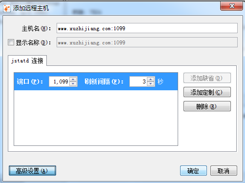
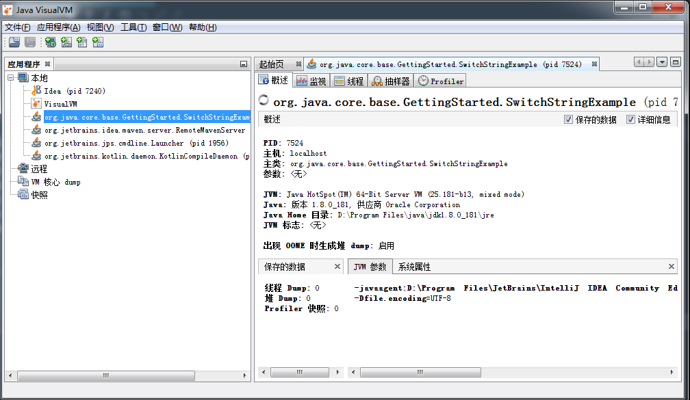

# jvisiualvm

可以认为jvisualvm是jconsole的升级版.jvisualvm是一个综合性的分析工具，可以认为其整合了jstack、jmap、jinfo等众多调试工具的功能，并以图形界面展示.

为什么有了图形化界面了还要jmap指令呢?

正式的一个应用去部署运行的时候,一般都是在linux上,是没有界面的,所以一般是先使用jmap先把内存的信息给dump下来,然后拷贝这个dump文件然后到图形化界面中查看对象占用内存的信息.然后再进一步去分析程序.

在oom的时候,自动dump内存信息

-XX:+HeapDumpOnOutOfMemoryError

最重要的是jmap指令,要学会使用这个命令dump堆的信息.
并且学会使用visualvm来查看内存信息.

## 启动Jvisiualvm

jvisualvm启动很简单，直接在命令行中输入"jvisualvm"即可。之后出现下图：

侧边框介绍：

* 本地：如果你本地有java进程启动了，那么在本地这个栏目就会显示。
* 远程：就是监控的远程主机

>由于本地和远程展示的监控界面都是相同的，这里直接介绍远程，远程监控回了，本地监控自然而然也会了。

## 一个主机支持远程监控

注意，一个主机如果希望支持远程监控，需要在启动时添加以下参数：

```
# 远程连接的端口
-Dcom.sun.management.jmxremote.port=1099
# 是否需要认证
-Dcom.sun.management.jmxremote.authenticate=false
# 是否是ssl的加密的
-Dcom.sun.management.jmxremote.ssl=false
```

>此外，-Dcom.sun.management.jmxremote  JDK5时，需要指定这个参数，开启JMX管理功能，JDK6之后，JMX管理默认开启，不需要指定

之后，右击"远程"-->"添加远程主机"，出现界面



在连接后面添加一个1099，这是远程主机jmx监听的端口号，点击确定，就被添加到侧边栏变。



jvisualvm分为四个选项卡：概述、监视、线程、抽样器，下面我们一一介绍：

## “概述 ”选项卡：

>默认显示的就是概述选项卡，其中的信息相当于我们调用了jinfo命令获得，其还包含了两个子选项卡：

- jvm参数栏：相当于我们调用jinfo -flags <pid>获得
- 系统属性栏：相当于我们调用jinfo -sysprops <pid>获得

## “监视”选项卡：

    主要显示了cpu、内存使用、类加载信息、线程信息等，这只是一个概要性的介绍，如下图：

右上角的"堆dump"会在远程主机上，dump一个内存映射文件，之所以不直接dump到本地，主要是因为这个文件通常比较大，直接dump到本地会很慢。dump完成之后，可以手工下载这个文件，通过"文件"->"装入"来进行分析，不过我们一般还是使用mat来进行分析，不会使用这个功能。

## “线程”选项卡：

线程选项卡列出了所有线程的信息，并使用了不同的颜色标记，右下角的颜色表示了不同的状态。点击右上角的线程dump会直接把线程信息dump到本地，相当于调用了jstack pid命令

## “抽样器 ”选项卡：

主要有"cpu"和"内存"两个按钮，读者可以分别点击一下，看一下显示效果