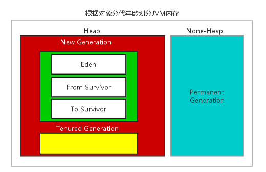

# JVM内存布局概述

Java虚拟机执行Java程序的过程中会把它所管理的内存划分为若干个不同的数据区域，
主要包括:

* 虚拟机栈(VM Stack)
* 本地方法栈(Native Method Stack)
* PC寄存器(Program counter)
* 方法区(Method  Area)
* 堆区(Heap)

这些数据区域中大致可以划分为2类:

1. 线程独享:虚拟机栈、本地方法栈、PC寄存器。这些数据区与线程一一对应的，这些与线程对应的数据区域会随着线程开始和结束而创建和销毁。
每个线程都有自己私有的虚拟机栈、本地方法栈、PC寄存器。
2. 线程共享:方法区、堆区。随着虚拟机启动而创建，随着虚拟机退出而销毁，并且为为进程的所有子线程共享.

### Java虚拟机栈

虚拟机栈中的元素叫做栈帧（Stack Frame），线程在调用java方法时，会为每个方法创建一个栈帧，
来存储局部变量表、操作数栈、动态链接、方法出口等信息。每个方法被调用和完成的过程，
都对应着一个栈帧从虚拟机栈上入栈和出栈的过程。虚拟机栈的生命周期和线程相同.

栈帧随着方法调用而创建，随着方法结束而销毁——无论方法是正常完成还是异常完成
（抛出了在方法内未被捕获的异常）都算作方法结束。在一条线程之中，只有目前正在执行的那个方法的栈帧是活动的。
这个栈帧就被称为是当前栈帧（ Current Frame），这个栈帧对应的方法就被称为是当前方法（ Current Method），
定义这个方法的类就称作当前类（ Current Class）
栈帧是线程本地私有的数据，不可能在一个栈帧之中引用另外一条线程的栈帧。

### 本地方法栈

Java虚拟机实现可能会使用到传统的栈（通常称之为“ C Stacks”）来支持 native 方法（指使用Java以外的其他语言编写的方法）的执行，
这个栈就是本地方法栈（ Native Method Stack）。这个栈一般会在线程创建的时候按线程分配，
用来存储线程调用本地方法时，本地方法的局部变量表等信息。
本地方法栈和虚拟机栈所发挥的作用是非常相似的，区别是虚拟机栈执行Java方法,而本地方法栈则为虚拟机使用的Native方法服务，
在sun hotspot 虚拟机中已经把两者合二为一了.

### 堆(Heap)

Java堆是被所有线程共享的一块内存区域，在虚拟机启动时创建。 此区域的唯一目的就是存放对象实例，
几乎所有对象的实例都在这分配内存。 Java堆是垃圾收集器管理的主要区域，因此很多时候也被称为GC堆。
Java 堆在虚拟机启动的时候就被创建，它存储了被自动内存管理系统（ 也即是常说的“ Garbage Collector（垃圾收集器）”）
所管理的各种对象，这些受管理的对象无需，也无法显式地被销毁。 Java 堆的容量可以是固定大小的，
也可以随着程序执行的需求动态扩展，并在不需要过多空间时自动收缩.

### 方法区

在Java虚拟机中，方法区（Method Area）是可供各条线程共享的运行时内存区域。
它存储了每一个类的结构信息，例如字段信息(字段名等)和方法信息(方法名，返回类型等)、
类变量(使用static修饰的变量，叫做类变量，类变量是所有对象共享，
所以保存在方法区中)，构造函数和普通方法的字节码内容等。
方法区在虚拟机启动的时候被创建。

## JVM对象分代内存划分与垃圾回收

前面的内容分析了JVM运行时的内存区域划分，并用代码进行了实际的讲解。下面我们从对象分代年龄的角度对JVM内存进行划分，这与JVM的垃圾回收息息相关

对象没有引用的时候称为垃圾，垃圾回收器就会进行垃圾回收。

有些对象会频繁的创建与销毁，例如我们在方法里面使用到局部变量，每次调用，方法里的局部变量就要经历创建与销毁的过程。

而另外一些对象可能会常驻内存，例如静态成员变量。

来自IBM的一组统计数据：

98％的java对象，在创建之后不久就变成了非活动对象；只有2％的对象，会在长时间一直处于活动状态。

如果能对这两种对象区分对待，那么会提高GC的效率。在sun jdk gc中（具体的说，是在jdk1.4之后的版本），提出了不同生命周期的GC策略。

 现在我们从另外一个角度对JVM的运行时内存进行划分：堆(Heap)堆和非堆(Non-heap)内存

 按照官方的说法：“Java 虚拟机具有一个堆，堆是运行时数据区域，所有类实例和数组的内存均从此处分配。堆是在 Java 虚拟机启动时创建的。”“在JVM中堆之外的内存称为非堆内存(Non-heap memory)”。

简单来说堆就是Java代码可及的内存，是留给开发人员使用的；

非堆就是JVM留给 自己用的，所以方法区、JVM内部处理或优化所需的内存(如JIT编译后的代码缓存)、每个类结构(如运行时常数池、字段和方法数据)以及方法和构造方法 的代码都在非堆内存中。

一、基于对象分代年龄的内存划分

从对象分代的角度来说，JVM的内存划分大致分为3块：分别是Permanent Generation（简称PermGen、持久代）、New Generation(又叫Young Generation，年轻代)和Tenured Generation（又叫Old Generation，年老代）。其中Permanent Generation位于non-heap区。New和Old是Java应用的Heap区，用来存放类的实例Instance的。我们在这里主要讨论的Heap区如何根据对象分代年龄进行划分。如下图所示:

Old区用于存放长寿的对象，在New区中经历了N次垃圾回收后仍然存活的对象，就会被放到Old区中；如那些与业务信息相关的对象，包括Http请求中的Session对象、线程、Socket连接，这类对象跟业务直接挂钩，因此生命周期比较长。

二、基于对象分代年龄的垃圾回收

基于回收类型的不同，我们将垃圾回收划分为：

Minor GC(又叫Young GC,Minor: 次要的，较小的，未成年人,年轻的)：回收New Generation内存空间(Eden、From Survivor、To Survivor);

Full GC：回收New Generation和Tenured Generation、PermGen内存空间

1 Minor GC/Young GC触发

当新对象生成，并且在Eden申请空间失败时，就会触发Minor GC，对Eden区域进行GC，清除非存活对象，并且把尚且存活的对象移动到Survivor区，然后整理Survivor的两个区。这种方式的GC是对New区的Eden区进行，不会影响到Old区。因为大部分对象都是从Eden区开始的，同时Eden区不会分配的很大，所以Eden区的Minor GC会频繁进行。因而，一般在这里需要使用速度快、效率高的算法，使Eden去能尽快空闲出来。

2 Full GC触发

Full GC要对整个Heap区进行回收，包括New、Old和PermGen，所以比Minor GC要慢，因此应该尽可能减少Full GC的次数。`在对JVM性能调优的过程中，很大一部分工作就是对于Full GC的调节`。有如下原因可能导致Full GC：

1. Tenured区被写满
2. PermGen区被写满
3. System.gc()被显示调用
4. 上一次GC之后Heap的各域分配策略动态变化

需要注意的是，Full GC与YoungGC是无法完全区分开来的，很多情况下，Full GC是由YoungGC导致的。例如在Eden Space中的对象经历过几次垃圾回收，依然还存活，就会移动到Tenured区，而如果此时Tenured区空间不够，就会出发垃圾回收，过程如下图所示：

对于Survivor区域，其实际上就是经历过几次垃圾回收依然没有被回收掉的对象(称之为幸存者)过渡到Tenured区的临时存储空间。
