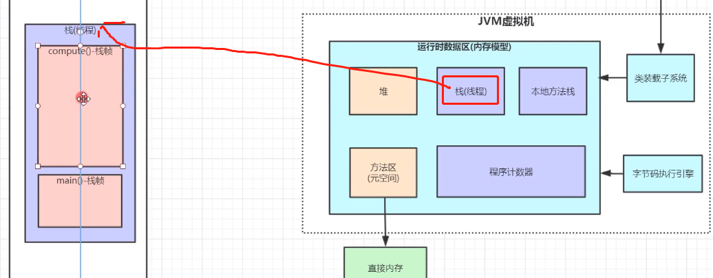

# 程序计数器

每个线程都有自己的程序计数器,用来存储当前线程要执行的下一条指令的地址,是一个非常小的内存空间，几乎可以忽略不记.

# 虚拟机栈(VM Stack)

---
    在线程创建时创建，它的生命期是跟随线程的生命期，线程结束栈内存也就释放，
    对于栈来说不存在垃圾回收问题，只要线程一结束该栈就结束.
    
    当一个线程开始运行的时候，jvm会给这个线程分配一块栈空间，
    我们把这块栈空间称为VM Stack,用来存放这个线程运行的数据
    
    线程中的每个方法对应一个栈帧，基本类型的变量+对象的引用变量都存放在栈帧中
    
    Exception in thread "main" java.lang.StackOverflowError
---

    虚拟机栈由栈帧组成，线程中的每个方法都会有自己的栈帧
    
    栈帧中包括局部变量表(栈帧的输入参数和输出参数以及方法内的变量)，操作数栈，方法出口等信息.

- "操作数栈" 就是计算过程中，"操作数" 临时存放的一块内存区域。
- "方法出口" 记录了当前栈帧对应的方法应该return到调用者的哪一行代码

    栈的大小和具体JVM的实现有关，通常在256K~756K之间,约等于1Mb左右
    
# 本地方法栈(Native Method Stack)

c语言的局部变量就是存放在本地方法栈中，每个线程都有自己的本地方法栈，这个也是线程独享的，如果调到native方法，jvm就会给这个线程分配一块本地方法栈。供你的本地变量的存放
