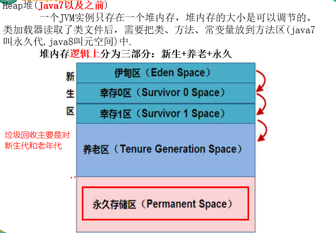
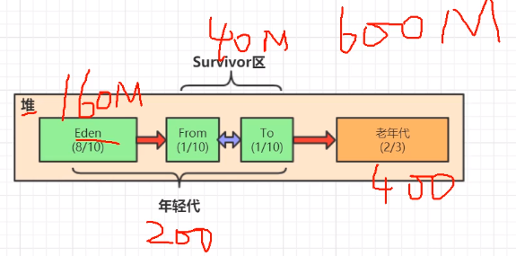
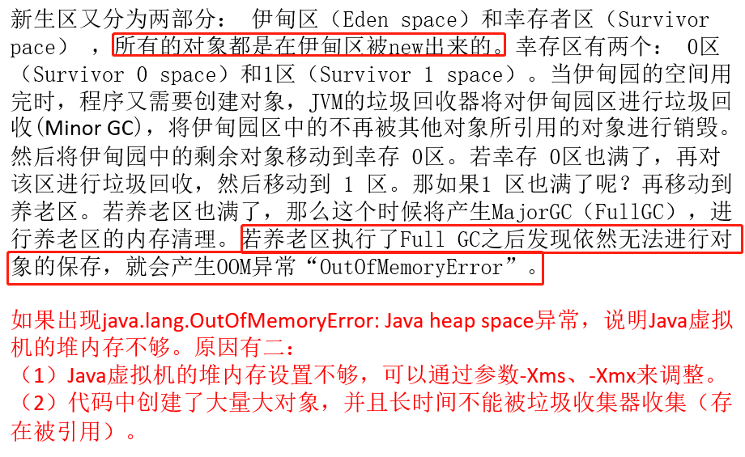
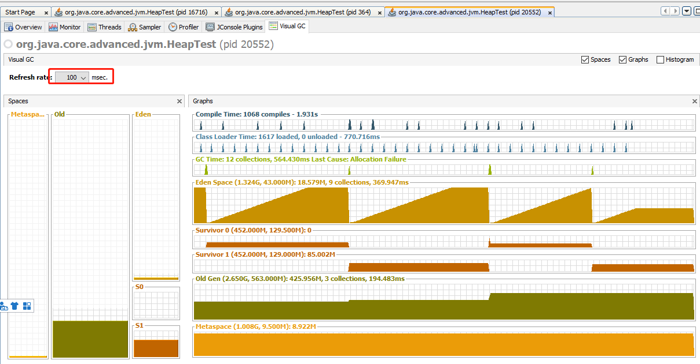

# 堆(Heap)-垃圾回收的主战场

    jvm堆区是是用来存放对象实例的，堆是垃圾收集器管理的主要区域。收集器采用分代垃圾回收

# 堆的逻辑组成

    基于对象分代年龄的划分

- Young Generation Space  新生区  Young/New
- Tenure generation space  养老区 Old/Tenure(终身的)

    注意: java7的永久代物理上使用的是堆内存的空间,java7的永久代所在空间叫Non-heap(非堆空间)
    java8的元空间物理上不再使用堆内存,而是直接使用堆外内存(物理内存).

    严格说: 永久代不属于堆的组成,虽然它占用了堆的物理空间.
    所以图片把永久代归为了堆的逻辑组成.

# MinorGC(YGC)和FullGC的过程

    young generation分为：

    - Eden区(伊甸园区,新生儿) 默认占用8/10
    - From Survivor(幸存者) 默认占用1/10
    - To Survivor 默认占用1/10
    
    谁空谁是to区.
    

    比如给堆初始分配600M，默认情况下如果你不改默认参数，老年代会分配到2/3,年轻代为1/3
    
    我们new出来的对象会放到Eden区(伊甸园，新生儿区)，当Eden空间不够的时候，会触发minor GC(YGC)
    

>spring中，通@Service，@Controller这些注解生成的bean会放到Ioc容器里面，这些bean最终就会被放到老年代。还有比如mysql的线程池等最终也会被放到老年代。

老年代总有一天也会被放满，就会触发Full GC(FGC),触发full gc会stop the world，java web应用程序，前端正常业务的线程全部被停止，程序会卡住。执行引擎会专门执行full gc进行垃圾收集。它会对整个堆里面无效的对象做了一个清理。

# Minor GC和Full GC比较

    Minor GC: 发生在新生代的垃圾收集，因为新生代的Java对象大多都具备朝生夕灭的特性，所以Minor GC非常频繁，
    新生代对象存活时间很短，因此MinorGC会相对频繁的执行，执行的速度一般也会比较快(因为使用复制算法)

    Full GC: 对整个堆进行整理，包括Young、Tenured和Perm(对不同区域的回收使用不同的回收算法,采用不同的垃圾回收器)。Full GC因为需要对整个对进行回收(需要回收的空间比较大,所以慢)，所以比Minor GC要慢（慢10倍以上）

# 对象的分代年龄

    分代年龄是存放在对象头中

    java8对象的年龄不能超过15岁,java8给定死了.