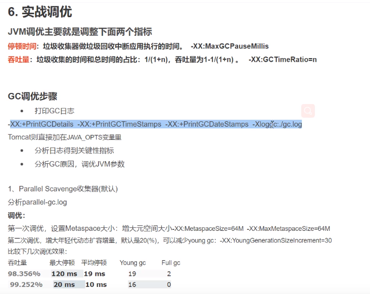
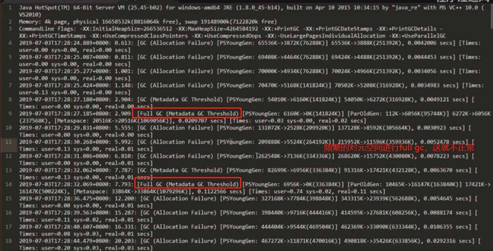
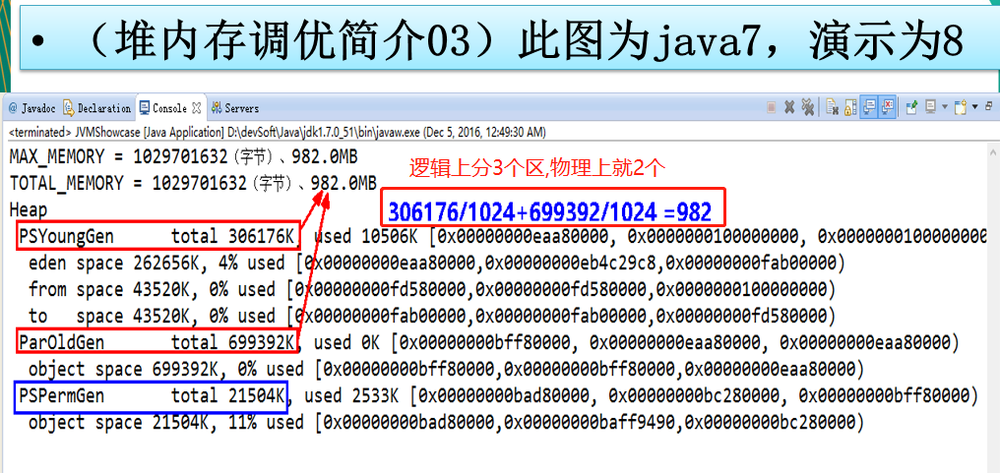
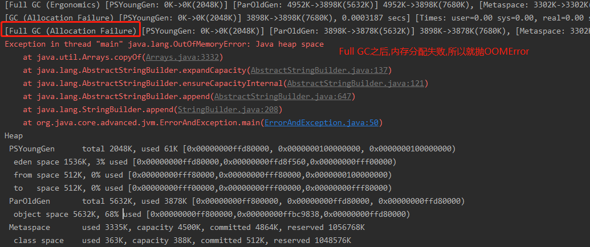

# jvm调优主要是调什么

    在对JVM调优的过程中，很大一部分工作就是对于FullGC的调节,应该尽可能减少Full GC的次数.

    jvm的调优中,很大一部分工作就是为了减少因为full gc导致的卡顿，让full gc的次数越少越好，
    让full gc执行的时间尽量的短，这样stop the world的时间会越短。

    要把jvm调优学好，要会分析gc日志。通过在程序启动过程中，加几个参数，
    就会把你的进程在底层执行的一些gc垃圾收集时候的日志 全部打印出来，这个日志文件可以通过参数指定.
    
    你要做jvm调优，肯定要知道gc到底是在哪个时间点发生的，或者说它发生的频率是多少，这些东西就需要你去分析gc日志。

    minor gc对程序的stw的时间实际上非常短，我们主要调优的是full gc，当然如果minor gc次数也比较多，也是需要调优的。
    
    full gc我们一般是要求几个小时，甚至是几天几周做一次才算是合理，如果频繁的full gc，对你的程序影响肯定很大。

    图中，full gc是由于元空间满了导致，因为我们的程序在启动的时候要加载大量的类，如果你从来不设置jvm元空间参数的值，默认值是很小的，
    那么在程序运行过程中不断的往元空间中加载类，当然会把元空间放满，就会触发full gc。这种情况下，
    可以根据各种命令，在程序启动后去看一下，到底元空间用了多少。那么完全可以，预先分配这么大的元空间，
    就不会出现由于元空间不足导致大量的full gc。这样程序启动肯定会快很多。

    很多书上的文字描述并不是很好，也看不明白，写这个书的人本来就不是给你准备的。

# 堆内存调优

    示例: org.java.core.advanced.jvm.HeadAdjustDemo
    VM参数:   -Xms1024m -Xmx1024m -XX:+PrintGCDetails

    示例: org.java.core.advanced.jvm.Throwable.ErrorAndException

# SpringBoot微服务的生产部署和参数调优

    java -server jvm的各种参数 -jar XXX.jar/XXX.war
    
    针对这一个具体的微服务来进行jvm和gc调优,用在这里,这才是真正重要的优化.
