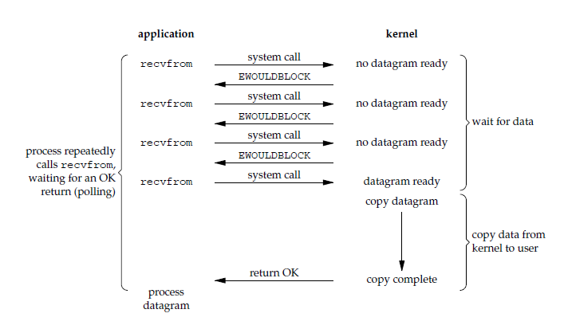
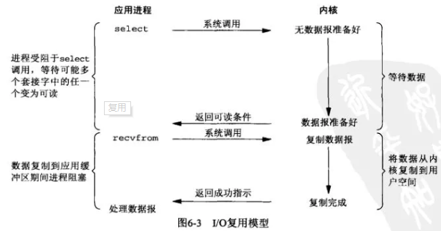

# 1. IO模型

## Java中的IO模型和操作系统的IO模型

Java中提供的IO有关的API，其实依赖操作系统层面的IO操作实现的。Java中的IO模型和操作系统层面的IO模型是两个不同层面的IO模型.

可以把Java中的BIO、NIO和AIO理解为是Java语言对操作系统的各种IO模型的封装。程序员在使用这些API的时候，不需要关心操作系统层面的知识，`也不需要根据不同操作系统编写不同的代码`。只需要使用Java的API就可以了。

比如在Linux 2.6以后，Java中NIO和AIO都是通过epoll来实现的.而在Windows上，AIO是通过IOCP来实现的。

## Linux中的5中IO模型 

在《UNIX网络编程：卷一》第六章——I/O复用。书中向我们提及了5种类UNIX下可用的I/O模型：

- 阻塞式 I/O:blocking IO
- 非阻塞式 I/O:nonblocking IO
- I/O 多路复用（select，poll，epoll）:IO multiplexing
- 信号驱动式 I/O（SIGIO）:signal driven IO
- 异步 I/O（POSIX的aio_系列函数）:asynchronous IO

## 到底什么是IO

在操作系统层面到底什么样的过程可以叫做是一次IO呢？

拿读取磁盘文件为例，我们要读取的文件是存储在磁盘上的，我们的目的是把它读取到内存中。文件会先被读取到内核空间的缓存区，然后从内核空间的缓存区拷贝到用户空间。

一个输入操作通常包括两个阶段：

- 等待数据准备好
- 从内核向进程复制数据

对于一个套接字上的输入操作，第一步通常涉及等待数据从网络中到达。当所等待数据到达时，它被复制到内核中的某个缓冲区。第二步就是把数据从内核缓冲区复制到应用进程缓冲区。

## 阻塞IO模型

 阻塞 I/O表现为进程或线程等待某个条件，如果条件不满足，则一直等下去。条件满足，则进行下一步操作。
 


应用进程通过系统调用 recvfrom 接收数据，但由于内核还未准备好数据报，应用进程被阻塞，直到数据从内核缓冲区复制到应用进程缓冲区中才返回，应用进程才能结束阻塞状态。

应该注意到，在阻塞的过程中，其它进程还可以执行，因此阻塞不意味着整个操作系统都被阻塞。因为其它进程还可以执行，所以不消耗 CPU 时间，这种模型的整体 CPU 利用率效率会比较高。


## 非阻塞IO模型

应用进程执行系统调用之后，在数据还没有到达内核缓冲区之前，内核会返回一个错误码。应用进程可以继续执行，不会被阻塞,但是需要不断的执行系统调用来获知内核数据准备有没有准备好，这种方式称为轮询（polling）。如果某一次轮询发现数据已经准备好了，那就把数据拷贝到用户空间中。


应用进程通过 recvfrom 调用不停的去和内核交互，直到内核准备好数据。如果没有准备好，内核会返回error，应用进程在得到error后，过一段时间再发送recvfrom请求。在两次发送请求的时间段，进程可以先做别的事情。(也就是应用进程需要不时的关注内核数据是否准备好，这样就延申出了我们可以信号驱动IO，也就是不用我们不断的检查，而是内核准备好后主动通知用户进程)

和阻塞IO比，进程在等待内核数据的时候，可以做些其他事情，增加时间的利用率。



## IO复用模型

使用 select 或者 poll 系统调用`等待多个注册好的IO`的数据，并且可以等待多个套接字中的任何一个变为可读。如果所有被监听的IO需要的数据都没有准备好时，select调用进程会阻塞。当某一个套接字可读时,select调用就会返回，之后进程再使用 recvfrom 把数据从内核复制到进程中。

它可以让单个进程具有处理多个 I/O 事件的能力。又被称为 Event Driven I/O，即事件驱动 I/O。


多个IO可以注册到同一个管道(Channel)上，这个管道会统一和内核进行交互。当管道中的某一个请求需要的数据准备好之后，进程再把对应的数据拷贝到用户空间中。

如果一个 Web 服务器没有 I/O 复用，那么每一个 Socket 连接都需要创建一个线程去处理。如果同时有几万个连接，那么就需要创建相同数量的线程。相比于多进程和多线程技术，I/O 复用不需要进程线程创建和切换的开销，系统开销更小。



## 信号驱动IO模型

应用进程在读取文件时通知内核，如果某个 socket 的某个事件发生时，请向我发一个信号。在收到信号后，信号对应的处理函数会进行后续处理。


应用进程预先向内核注册一个信号处理函数，然后用户进程立即返回，并且不阻塞，应用进程可以继续执行,也就是说等待数据阶段应用进程是非阻塞的, 当内核数据准备就绪时会发送一个SIGIO信号给进程，`应用进程收到之后,在信号处理程序中调用 recvfrom 将数据从内核复制到应用进程`

相比于非阻塞IO，再次提高了时间利用率，不用去不断的检查内核数据是否准备好了.


## 为什么以上四种都是同步的

我们说阻塞IO模型、非阻塞IO模型、IO复用模型和信号驱动IO模型都是同步的IO模型。原因是因为: `将数据从内核缓冲区复制到应用进程缓冲区的阶段，应用进程会阻塞， 而异步 I/O：这个拷贝过程用户进程不会被阻塞。`

信号驱动难道不是异步的么？ 信号驱动，内核是在数据准备好之后通知进程，然后进程再通过recvfrom操作进行数据拷贝。`可以认为数据准备阶段是异步的，但是，数据拷贝操作是同步的。`所以，整个IO过程也不能认为是异步的。

>钓鱼的报警器一响，只能说明鱼儿已经咬钩了，但是还没有真正的钓上来。使用带有报警器的鱼竿钓鱼，往上拉鱼竿的过程是同步的，钓鱼等待的过程是异步的。

## 异步IO模型

应用进程把IO请求传给内核后，完全由内核去操作文件拷贝。内核完成相关操作后，会发信号告诉应用进程本次IO已经完成。


应用进程执行 aio_read 系统调用会立即返回，应用进程可以继续执行，不会被阻塞，内核会在所有操作完成之后向应用进程发送信号。这个才叫做整个过程都是异步。


>异步 I/O 与信号驱动 I/O 的区别在于，异步 I/O 的信号是通知应用进程 I/O 完成，而信号驱动 I/O 的信号是通知应用进程可以开始 I/O。

## 5种IO模型的对比

非阻塞式 I/O 、信号驱动 I/O 和异步 I/O 在第一阶段不会阻塞。


[来源](https://mp.weixin.qq.com/s?__biz=Mzg3MjA4MTExMw==&mid=2247484746&amp;idx=1&amp;sn=c0a7f9129d780786cabfcac0a8aa6bb7&source=41#wechat_redirect)

# 2、I/O 复用

select/poll/epoll 都是 I/O 多路复用的具体实现，select 出现的最早，之后是 poll，再是 epoll。

## select

```c
# 有三种类型的描述符类型：readset、writeset、exceptset，分别对应读、写、异常条件的描述符集合。f
# timeout 为超时参数，调用 select 会一直阻塞直到有描述符的事件到达或者等待的时间超过 timeout。

# 成功调用返回结果大于 0，出错返回结果为 -1，超时返回结果为 0。
int select(int n, fd_set *readfds, fd_set *writefds, fd_set *exceptfds, struct timeval *timeout);
```

## 比较

### 1. 功能

select 和 poll 的功能基本相同，不过在一些实现细节上有所不同。

- select描述符类型使用数组实现，默认只能监听 1024 个描述符(数组大小为1024),而 poll 的描述符类型使用链表实现，没有描述符数量的限制；
- poll 提供了更多的事件类型

### 2. 速度

select 和 poll 速度都比较慢。

- select 和 poll 每次调用都需要将全部描述符从应用进程缓冲区复制到内核缓冲区。
- select 和 poll 的返回结果中没有声明哪些描述符已经准备好，所以如果返回值大于 0 时，应用进程都需要使用轮询的方式来找到 I/O 完成的描述符。

### 3. 可移植性

几乎所有的系统都支持 select，但是只有比较新的系统支持 poll。

## epoll

- epoll 只需要`将描述符从进程缓冲区向内核缓冲区拷贝一次，并且进程不需要通过轮询来获得事件完成的描述符。`
- epoll 仅适用于 Linux OS。
- epoll 比 select 和 poll 更加灵活而且没有描述符数量限制。
- epoll 对多线程编程更有友好，一个线程调用了 epoll_wait() 另一个线程关闭了同一个描述符也不会产生像 select 和 poll 的不确定情况。

## 应用场景

很容易产生一种错觉认为只要用 epoll 就可以了，select 和 poll 都已经过时了，其实它们都有各自的使用场景。

### 1. select 应用场景

select 的 timeout 参数精度为 1ns，而 poll 和 epoll 为 1ms，因此 select 更加适用于实时性要求比较高的场景，比如核反应堆的控制。

select 可移植性更好，几乎被所有主流平台所支持。

### 2. poll 应用场景

poll 没有最大描述符数量的限制，如果平台支持并且对实时性要求不高，应该使用 poll 而不是 select。

### 3. epoll 应用场景

只需要运行在 Linux 平台上，有大量的描述符需要同时轮询，并且这些连接最好是长连接。

需要同时监控小于 1000 个描述符，就没有必要使用 epoll，因为这个应用场景下并不能体现 epoll 的优势。

需要监控的描述符状态变化多，而且都是非常短暂的，也没有必要使用 epoll。因为 epoll 中的所有描述符都存储在内核中，造成每次需要对描述符的状态改变都需要通过 epoll_ctl() 进行系统调用，频繁系统调用降低效率。并且 epoll 的描述符存储在内核，不容易调试。
