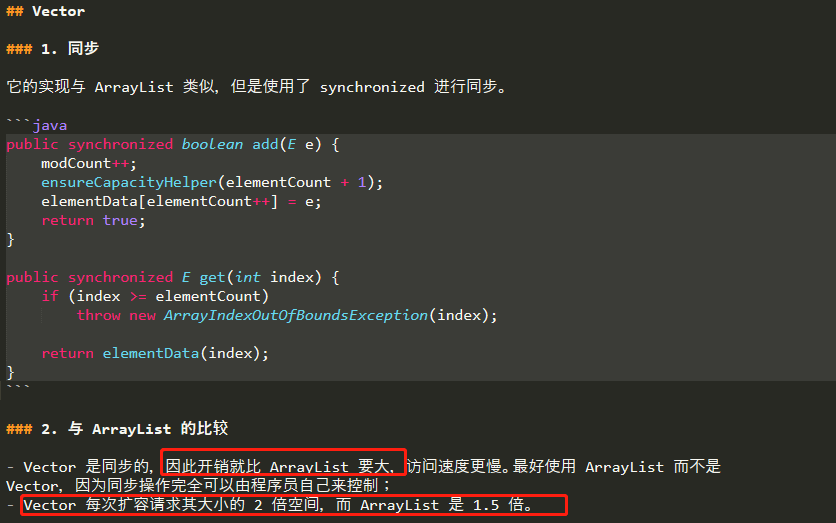

# List

## 重要的实现类

- ArrayList：存储有序可重复的元素的集合,支持通过下标索引来访问元素.内部维护了一个动态数组.当数组满了，再次插入数据到ArrayList当中的时候，ArrayList会自动扩容.使用ArrayList能够精确的控制每一个元素插入的位置.(线程不安全)

- Vector：一种古老的实现类,和 ArrayList 类似，内部方法使用了synchronized关键字，是线程安全的

- LinkedList：基于双向链表实现，只能顺序一个个的访问,不能通过下标索引访问元素，但可以高效的插入和删除元素。LinkedList还可以用作栈、队列和双向队列。

## 在合适的场景使用合适类型的List

如果一堆对象,可以按照索引下标0,1,2这样的形式来组织的话,可以考虑使用ArrayList,此时通过索引查找元素的速度极快,O(1)的时间复杂度.

如果一堆对象不可以通过下标的形式组织的话,就没必要使用ArrayList,因为查找效率比较低,也是需要一个个比对,而且更重要的是,插入和删除效率也低,而且内存分配的时候需要分配连续的内存(因为ArrayList是基于数组的),这个时候可以考虑LinkedList.

# Arraylist与LinkedListd对比

    1. 都不是多线程安全的
    2. Arraylist底层使用的是Object数组；LinkedList底层使用的是双向链表
    3. ArrayList 采用数组存储，所以插入和删除元素的时间复杂度受元素位置的影响,时间复杂度为O(n)
    LinkedList采用链表存储，所以插入/删除元素时间复杂度不受元素位置的影响，都是近似O(1)
    4. 是否支持快速随机访问(看是否实现了RandomAccess接口):  LinkedList 不支持高效的随机元素访问，
    而 ArrayList 支持
    5. 适用场景: LinkedList添加和删除元素的效率要高于ArrayList，更适用于频繁的插入和实现操作。
    ArrayList适用于搜索操作比较频繁的场景.
    6. 内存空间占用：ArrayList的空间浪费主要体现在在list列表的结尾会预留一定的容量空间，
    而LinkedList的空间花费则体现在它的每一个元素都需要消耗比ArrayList更多的空间（因为要存放直接后继和直接前驱以及数据）

# Vector和ArrayList对比

# List的遍历方式选择

    三种遍历方式:
    1. 用普通的for循环依据下标来遍历
    2. 使用增强for循环遍历(这个List必须要实现Iterable接口)
    3. 使用Iterator来遍历

    实现了RandomAccess接口的list，可以使用1/2/3
    未实现RandomAccess接口的List，剋使用2/3

    注意: 大size的List，千万不要使用普通for循环
    
    示例: org.java.core.base.collection.list.ListTraversalDemo
