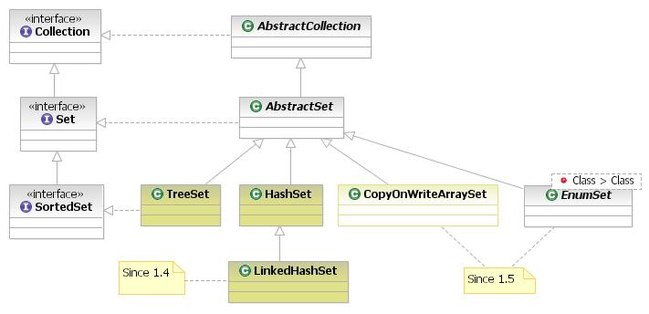
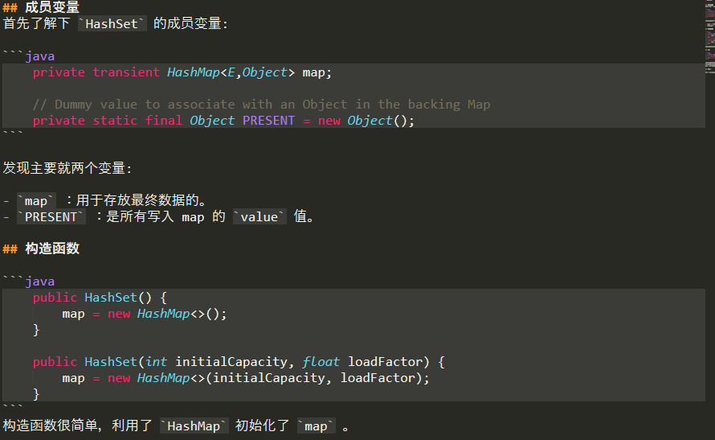

# HashSet

    AbstractSet提供了Set接口的骨干实现，以减少实现Set的工作量。

# HashSet特点

- 不允许存储重复元素,元素是无序的(因为HashMap存放键值对是无序的),允许为null值,不能通过索引访问元素.
- HashSet内部使用HashMap，HashSet集合内部所有的操作都是基于HashMap完成的
- 不是线程安全的,可以使用Collections.synchronizedSet方法以性能为代价获取线程安全的HashSet
- HashSet使用HashMap存储元素，因此对象应该提供hashCode(）和equals(）方法的良好实现
- 不支持有序性操作。并且失去了元素的插入顺序信息，也就是说使用 Iterator 遍历 HashSet 得到的结果不是插入顺序。

# HashSet底层数据结构是什么?

    内部结构是HashMap

# HashSet的add方法是如何利用内部的HashMap存储元素的?

    add()方法传入的参数作为HashMap的key,值是一个内部固定的叫PRESENT的Object类型的对象.

# HashSet内部实现 

# 多线程的安全性

    由于HashSet其实本质上就是HashMap，所以是线程不安全的，多线程并发会出现问题
    
    会在扩容的时候形成环形链表。导致在查询key的时候在环形链表上导致死循环,进而导致CPU使用率飙升

    这个HashSet初始化时如果没有指定大小，仅仅只是默认值，那么在大量的并发写入时候会导致频繁的扩容，
    在java7的条件下可能会形成环形链表。导致这个e.next永远不为空，导致死循环.

    换为ConcurrentHashMap同时把value写成固定的null一样可以达到HashSet的效果

    初始化 ConcurrentHashMap的大小尽量大一些，避免频繁的扩容
