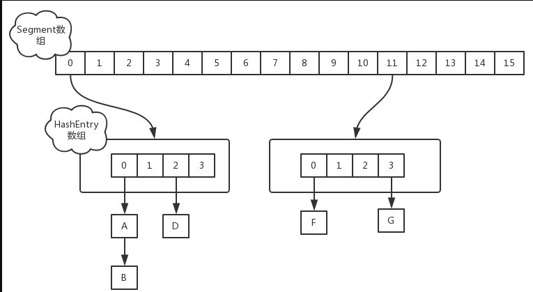
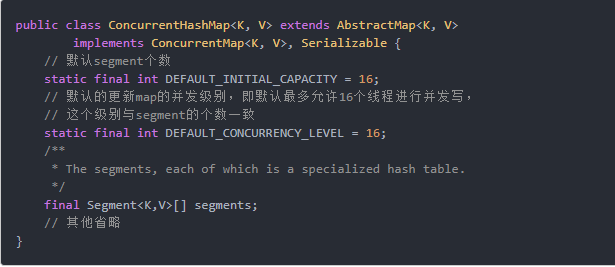
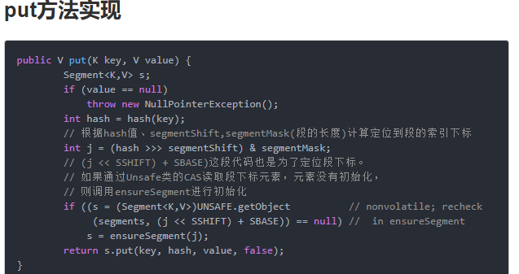
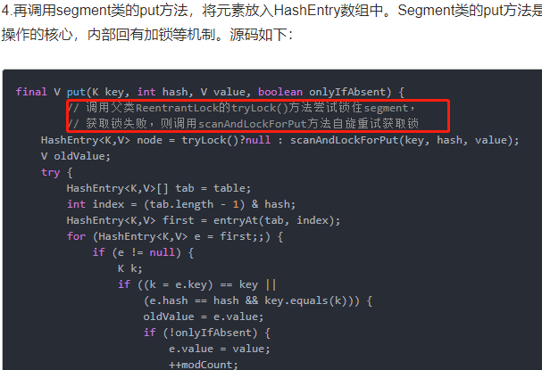
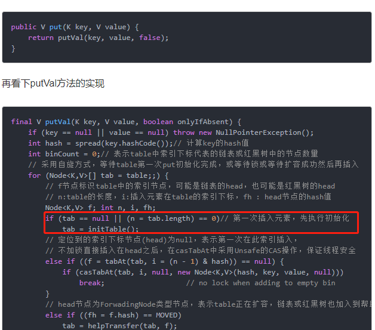
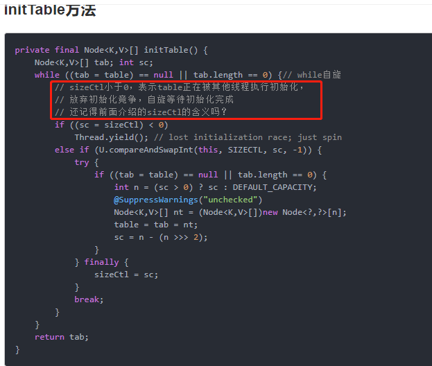
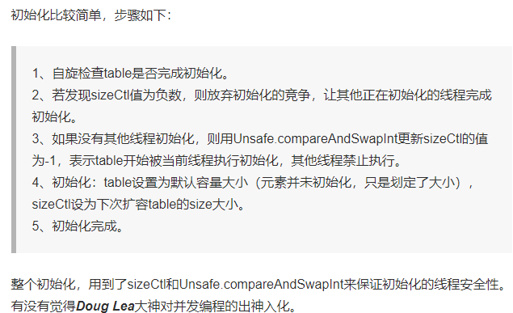
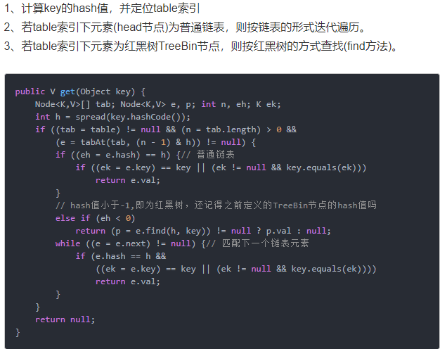

# ConcurrentHashMap

- ConcurrentHashMap是HashMap的线程安全版本
- 线程安全的有ConcurrentHashMap，ConcurrentSkipListMap，HashTable,但是HashTable是过时的类库，所以在并发中使用最多的是是ConcurrentHashMap和ConcurrentSkipListMap
- ConcurrentHashMap在并发的开发中使用频率高

# 1.7的ConcurrentHashMap实现原理

* ConcurrentHashMap 采用了分段锁,一个ConcurrentHashMap中包含一个Segment数组.
* 锁的粒度从整个ConcurrentHashMap降低到了每个Segment段上,因为Segment是继承了ReentrantLock,所以每个Segment就是一个锁.
* Segment数组中一个Segment元素中包含一个HashEntry数组(使用volatile修饰保证可见性).
* 当修改修改时，首先要获得是哪个Segment，然后拿到这个Segment中的HashEntry数组，然后在定位到HashEntry数组中某一个桶,每个桶上都是一个链表.

1.7的`ConcurrentHashMap`采用了分段锁技术，其中 `Segment` 继承于 `ReentrantLock`。不会像 `HashTable` 直接使用synchronized，支持 Segment 数组大小的线程并发.

## put 方法-1.7

put 操作需要加锁处理。

## get 方法-1.7

`ConcurrentHashMap` 的读性能非常高效的，因为整个过程都不需要加锁,并用Unsafe.getObjectVolatile方法读取元素(注意这个是保证可见性的读取方法,不是一个CAS方法)，这个方法保证读取对象永远是最新的.

只需要将 `Key` 通过 `Hash` 之后定位到具体的 `Segment` ，再通过一次 `Hash` 定位到具体的HashEntry元素。由于 `HashEntry` 数组中的元素是用 `volatile` 关键词修饰的，保证了内存可见性(并不能保证并发的安全)，所以每次获取时都是最新值

## size 方法-1.7

在执行 size 操作时，需要遍历所有 Segment 然后把 count 累计起来。

在执行 size 操作时先尝试不加锁计算2次，如果两次不加锁计算得到的结果一致，那么可以认为并发过程中计算的值正确,结束计算,并返回.

尝试次数使用 RETRIES_BEFORE_LOCK 定义，该值为 2，retries 初始值为 -1，因此尝试次数为 3。

如果前两次计算不一致,则进行第三次计算,第三次计算的时候会强制锁住所有的 segment,重新计算.

# JDK1.8 实现

- 1.8 在 1.7 的数据结构上做了大的改动，1.8 抛弃了 Segment 分段锁(ReentrantLock),
- 抛弃了ReentrantLock 改为了(synchronized+CAS)来保证并发更新的安全性,数据结构跟HashMap1.8的结构类似，数组+链表+红黑树(在链表长度超过值时将链表转换为红黑树).
- 3.size方法优化，增加了CounterCell内部类，用于并行计算每个桶中元素的数量.

>这样可以看出在新版的 JDK 中对 synchronized 优化是很到位的,相较ReentrantLock，性能不并差

>底层采用数组+链表+红黑树的存储结构,采用红黑树之后可以保证查询效率`logn`.

## put 方法-1.8

## get 方法-1.8

## 常见问题

其实这块也是面试的重点内容，通常的套路是：

1. 谈谈你理解的 HashMap，讲讲其中的 get put 过程。
2. 1.8 做了什么优化？
3. 是线程安全的嘛？
4. 不安全会导致哪些问题？
5. 如何解决？有没有线程安全的并发容器？
6. ConcurrentHashMap 是如何实现的？ 1.7、1.8 实现有何不同？为什么这么做？

# 好的文章

- [https://www.jianshu.com/p/85d158455861](https://www.jianshu.com/p/85d158455861)
- [https://www.jianshu.com/p/47c1be88a88e](https://www.jianshu.com/p/47c1be88a88e)