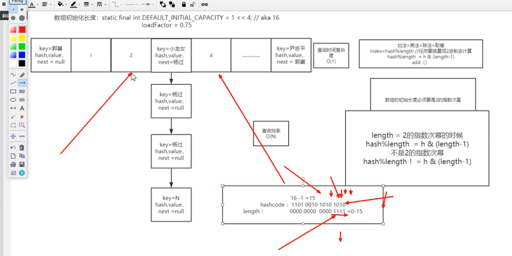

# 为什么hashmap的初始容量是2的指数次幂呢?(也就是hashmap数组的初始长度必须是2的指数次幂?)

    The default initial capacity must be a power of two.

    如果你初始化HashMap的时候,传入的长度不是2的指数次幂,那么HashMap会帮你转成2的指数次幂

    比如你传入13,那么会转成最接近13并且大于13的2的指数次幂,也就是16.

    13 -> 16,   7 -> 8,   5 -> 8,     3 -> 4

>但是你有没有想过,为什么要转换成2的指数次幂呢?

    因为我们定位到数组中的某一个位置,而不能数组越界.
    位运算是基于2进制的,位运算的结果最后定位的桶的位置要在length内,不能越界,所以必须是2的指数次幂.
    
    位运算不越界,等价于取模: hash%length = hashcode & (length - 1)
    

>你有没有想过,我们通过取余就可以计算出数组下标的位置,为什么非要通过位运算呢?

不用取模是因为"取模运算效率比较低".位运算的效率高于取模运算.(取模仍然要换算成二进制来进行计算,这个过程是多余的,也就是取模效率比较低).所以使用位运算,

    而且后续的数组的扩容rehash的时候,需要进行元素的移动,元素的移动每次都要计算下标的位置,这个会大大影响效率.直接用位运算,效率会高很多.