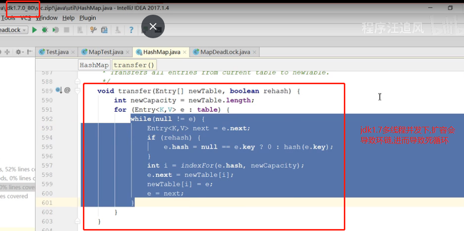
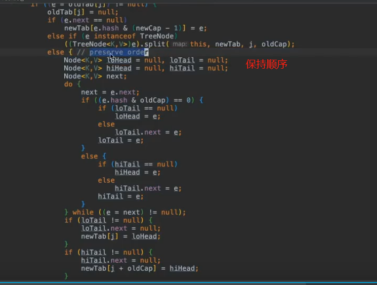

# 1.7-多线程并发扩容可能会导致环(死循环或者叫死锁)

    因为在链表上寻找元素的终止条件就是某一个元素的next=null,但是如果变成了环,就会一直死循环下去.cpu占用100%.

    导致问题的原因是由于头插法导致的,比如在原始数组上下标为3的位置上,有一条链,链上有2个元素,顺序分别是3,然后是7,
    那么,等迁移到新的扩容后的数组上的时候,顺序就会变成7,然后是3,这个是造成环的重要原因.

    总结: 1.7的扩容是低效,而且线程不安全.

[详细过程](https://coolshell.cn/articles/9606.html)

# 1.8的扩容分析

1.7在多线程扩容的情况下,可能会出现环链,1.8优化了扩容的过程.

    假如总容量是16,那么数组的索引是从0~15,假设当前索引为3的位置有2个元素.
    桶  : 0 1 2   3     4     5              16  8   4   2   1
    元素:         3                          0   0   0   1   1   ->     3
    元素:        19                          1   0   0   1   1   ->     19
                                     16          1   1   1   1   和16&  结果都是3
                                     32      1   1   1   1   1   和32&  结果是3和3+16
    
    如果扩容了,扩成32,要把上面的19和3分别和32进行&运算,分别放到了低位3的位置,和高位3+16的位置.
    
    一条链上的元素转移的时候,转移到高位和低位的概率都是是50%.所以理论上jdk1.8的resize方法可以把元素更加均匀分散.
    
    同时,迁移过去的元素,在链表上的顺序没有变化,所以1.8不会产生环链.解决了1.7的问题
    
    同时1.8把一条链上的元素进行了拆分,链表的长度更短了,查询效率也会提高.

# 1.7和1.8resize效率总结

    注意,不论是1.7还是1.8,一个Entry的hash值计算过后就保存在了Entry的成员变量里面,所以resize的时候,就不用计算了.
    只需要根据这个hash做&运算定位在新数组中的下标的位置即可.
    
    不论是1.7还是1.8,如果元素太多的话,resize的效率非常低
    这个时候,就要考虑在创建hashmap的时候就指定合适的容量,避免resize降低效率
    相当于用空间换时间.避免未来的频繁的resize带来的性能问题.

# 面试题: 如果 HashMap 的大小超过了负载因子（load factor）定义的容量怎么办？

    新创建一个数组,大小为的两倍,把所有元素都迁移到新的map中.这个过程叫作rehashing(re哈希).

    不论是1.7,还是1.8,新的索引的位置只可能在两个地方，一个是原下标的位置，另一种是在下标为 <原下标+原容量> 的位置